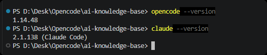

# ActionBattalion-MutiAgent

## week 1 第一节 环境搭建安装

​	作为一名开发者，自身电脑行就有git，node等环境，安装opencode、claude code工具很容易，只需要`npm install `就能很快素的安装好相应的工具，申请好api_key，就能投入使用了。


## week 1 第一节 opencode Vs 调用APi


如果使用APi进行调用，很明显出现了幻觉，这是由于大模型本质是基于预测next token而导致的，在APi调用中，我并没有给出实际的真正的上下文，但是他还是输出了许多的幻觉

> F:\Anoconda\envs\torch310\python.exe D:\Desk\Opencode\opencode-test\raw_api_test.py 
>
> 测试：让 AI 分析当前项目的代码结构
>
> 我来分析项目的目录结构和代码质量。由于没有看到具体的项目代码，我将给出一个通用的分析框架和改进建议。
>
> ## 目录结构分析
>
> ### 常见的目录结构问题
>
> ```
> ❌ 问题示例：
> project/
> ├── utils/
> ├── helpers/
> ├── common/
> ├── services/
> ├── components/
> ├── pages/
> ├── models/
> └── others/
> ```
>
> **问题**：
> 1. **命名模糊**：`utils`、`helpers`、`common` 功能重叠
> 2. **层次扁平**：所有文件都在同一级别，缺乏分层
> 3. **缺乏一致性**：模块划分标准不统一
>
> ### 推荐的目录结构
>
> ```
> ✅ 改进示例：
> project/
> ├── src/
> │   ├── modules/          # 业务模块
> │   │   ├── user/
> │   │   │   ├── components/
> │   │   │   ├── services/
> │   │   │   ├── hooks/
> │   │   │   └── types/
> │   │   └── order/
> │   ├── shared/           # 共享模块
> │   │   ├── components/
> │   │   ├── hooks/
> │   │   └── utils/
> │   ├── core/             # 核心功能
> │   │   ├── http/
> │   │   ├── router/
> │   │   └── store/
> │   └── assets/
> ```
>
> ## 代码质量分析
>
> ### 命名规范
> ```javascript
> // ❌ 不好的命名
> const arr = [];
> function getData() {}
> const x = 123;
> 
> // ✅ 好的命名
> const userList = [];
> function fetchUserData() {}
> const MAX_RETRY_COUNT = 3;
> ```
>
> ### 函数复杂度
> ```javascript
> // ❌ 复杂函数
> function processUserData(user) {
>   // 100行代码，多个职责
>   // 验证、格式化、存储、发送通知都在这里
> }
> 
> // ✅ 单一职责
> function validateUser(user) { }
> function formatUserData(user) { }
> function saveUser(user) { }
> function notifyUser(user) { }
> ```
>
> ### 错误处理
> ```javascript
> // ❌ 缺乏错误处理
> async function fetchData() {
>   const response = await fetch(url);
>   return response.json();
> }
> 
> // ✅ 完善的错误处理
> async function fetchData() {
>   try {
>     const response = await fetch(url);
>     if (!response.ok) {
>       throw new Error(`HTTP Error: ${response.status}`);
>     }
>     return await response.json();
>   } catch (error) {
>     console.error('Failed to fetch data:', error);
>     throw error;
>   }
> }
> ```
>
> ## 具体改进建议
>
> ### 1. 目录结构优化
>
> **短期改进**：
> - 合并功能相似的目录（如 `utils` + `helpers`）
> - 按业务模块重新组织文件
> - 添加 `index.js` 统一导出
>
> **长期改进**：
> - 采用领域驱动设计（DDD）分层
> - 建立清晰的依赖关系
> - 引入 monorepo 架构（如 nx、turborepo）
>
> ### 2. 代码质量提升
>
> **立即执行**：
> ```bash
> # 添加代码规范工具
> npm install eslint prettier husky lint-staged
> 
> # 配置 .eslintrc.js
> module.exports = {
>   extends: ['airbnb', 'prettier'],
>   rules: {
>     'max-lines': ['warn', 300],
>     'complexity': ['warn', 10]
>   }
> }
> ```
>
> **代码审查检查清单**：
> - [ ] 是否有重复代码（DRY原则）
> - [ ] 函数是否超过20行
> - [ ] 是否有未使用的变量/导入
> - [ ] 错误处理是否完善
> - [ ] 类型定义是否明确（TypeScript）
> - [ ] 测试覆盖率是否达标
>
> ### 3. 技术债务清理
>
> ```javascript
> // 需要重构的模式
> // ❌ 过度耦合
> class OrderService {
>   constructor() {
>     this.emailService = new EmailService();
>     this.smsService = new SMSService();
>     this.paymentService = new PaymentService();
>   }
> }
> 
> // ✅ 依赖注入
> class OrderService {
>   constructor(notifier, paymentService) {
>     this.notifier = notifier;
>     this.paymentService = paymentService;
>   }
> }
> ```
>
> ### 4. 自动化工具
>
> ```yaml
> # .github/workflows/ci.yml
> name: Code Quality
> on: [push, pull_request]
> jobs:
>   lint:
>     runs-on: ubuntu-latest
>     steps:
>       - uses: actions/checkout@v2
>       - run:
> 
> ============================================================
> 观察：AI 能看到你的项目文件吗？
> ============================================================
> 
> Process finished with exit code 0
> ```


​	使用opencode这类智能体来进行调用，他会按照要求分析项目结构，给出相应的建议。

这说明智能体中含有记忆，能够对任务进行编排

>
>
>请分析当前项目的目录结构和代码质量，给出改进建议。
>我来分析当前项目的目录结构和代码质量。
>→ Read . 
>✱ Glob "**/*" in . (3 matches)
>→ Read raw_api_test.py 
>→ Read .idea\workspace.xml 
>以下是对当前项目的分析结果：
>---
>项目结构
>opencode-test/
>├── .idea/                  # PyCharm/IDE 配置（应 gitignore）
>│   ├── .gitignore
>│   └── workspace.xml
>└── raw_api_test.py         # 唯一源文件 (47行)
>发现的问题
>1. 项目过于单薄
>只有一个测试脚本，没有标准 Python 项目结构（无 src/、tests/、pyproject.toml、README.md 等）。
>2. raw_api_test.py 代码问题
>- 硬编码敏感信息: API_KEY 通过环境变量获取是好做法，但 print(f"API_KEY: {API_KEY}") 会泄露密钥到控制台
>- 无错误处理: urllib.request.urlopen 和 JSON 解析都没有 try/except
>- 函数返回值不一致: call_api 声明返回 str，但外层 __main__ 仅打印，返回值未使用
>- 无类型 hint: call_api 的返回类型声明了，但参数类型齐全，整体类型覆盖不足
>- 无依赖管理: 尽管只用标准库，但缺乏 requirements.txt 或 pyproject.toml
>- 注释风格: 混合使用中英文注释，docstring 是中英混杂
>3. .idea/ 目录
>IDE 配置文件不应提交到版本控制（虽然已有 .gitignore，但应确保 .gitignore 在项目根目录生效）。
>改进建议
>1. 标准化项目结构:
>      opencode-test/
>     ├── pyproject.toml       # 项目元数据和依赖
>     ├── README.md            # 项目说明
>     ├── src/
>     │   └── deepseek_client.py   # 封装 API 调用
>     ├── tests/
>     │   └── test_client.py       # 单元测试
>     └── .env.example         # 环境变量模板
>2. 修复 API 密钥泄露: 删除 print(API_KEY)，改用 logging
>3. 增加错误处理: 网络超时、HTTP 错误、JSON 解析异常都应捕获
>4. 抽象 API 客户端: 将 call_api 封装为类，支持配置和复用
>5. 添加类型提示: 使用 from __future__ import annotations 或完整类型注解
>6. 添加测试: 使用 pytest 和 unittest.mock 模拟网络请求
>7. 删除 .idea/: 将其加入 .gitignore 并清理已跟踪的文件


## week 1 第一节（SDD强化训练）：SDD 本质 + 手写第一份 spec.md


##### 佳哥的SDD箴言

SDD 的 95/5 原则
Permalink: SDD 的 95/5 原则
我见过太多学员问我：spec-kit 好还是 OpenSpec 好，Superpowers 和 BMAD 选哪个，能不能给我一张工具对比表。我理解这种问题，因为工具界面清晰、名字响亮、能让你觉得"搞清楚这个，我就入门了"。但它其实是一个陷阱。
SDD 这件事的价值分布很偏。大致是这样：95% 的价值来自你愿意在动手之前先坐下来把需求想清楚，写成一份结构化的东西交给 AI；剩下那 5% 才是工具的事——OpenSpec / Spec-Kit / Superpowers / BMAD 哪个都行，真的，哪个都行。
大多数学员把时间分反了。我见过有人研究工具研究两周，最后选了一个，装好，跑三次觉得麻烦就放弃，回到 Vibe Coding；下次又开始研究另一个工具。这不是学 SDD，这是逛工具市场。
真正该花的时间是在那 95% 上——培养一个很朴素的习惯：动手前先写四句话。
你今晚就能做的事：打开编辑器，新建一个 specs/ 文件夹，里面放一个 <明天要做的功能>.md。写四个二级标题：要做什么、不做什么、边界和验收、怎么验证。每个标题底下填三到五条。明天写代码之前，先把这份 md 贴给 AI。
就这样。不装任何工具。这就是 95% 的价值。
那 5% 的工具什么时候再考虑？等你真的养成了这个习惯，每天写 spec 写得有点腻，觉得"这一步我重复太多次了，要是有个东西能帮我自动推进就好了"——那时候再看工具。那时候你看工具的眼光也会完全不同：你不再问"哪个工具好"，你会问"这个工具能替我省掉哪一步重复动作"。这是完全两种问法。
SDD 这件事最反常识的地方在于，它越是朴素越管用。那四个二级标题，它就是管用。你越是想把它搞复杂，它的价值反而会被工具稀释。所以如果你只从这篇文章里带走一件事，就是这个：不要在 5% 的事情上花 95% 的时间。

### 环境准备

本节不需要装任何插件。能跑通下面任意一个就行：

我这里两个环境都有准备




## week 1 第一节（产品评审训练）：Spec 评审 → 20 轮追问 → 终版 Spec

### 背景

基于 03 节手写的 project-vision.md v0.1（14 行骨架 Spec，多处 `?` 占位），让 Claude Code 扮演"苛刻的产品评审"，逐条追问模糊点，每问一个我答一个，问完把 Spec 更新为 v1.0 终版。

### 评审过程：20 轮追问清单

| # | 议题 | 追问点 | 决策 |
|---|------|--------|------|
| 1 | 数据源范围 | Phase 1 到底接几个源？ | GitHub Trending + HN + arXiv 三个都要 |
| 2 | GitHub 筛选 | 怎么判断一个仓库"AI 相关"？ | 靠 repo topics 标签 |
| 3 | 匹配规则 | topic 白名单是什么？命中几个算过？ | 白名单：`ai` / `llm` / `agent`，命中 1 个即通过 |
| 4 | 兜底策略 | 没打 topic 但 README 明显是 AI 的收不收？ | 不收，规则优先 |
| 5 | HN 筛选 | HN 无标签系统，怎么筛？ | 标题关键词粗筛 + URL 域名为 arxiv.org 直接收入 |
| 6 | arXiv 筛选 | 收哪些分类？是否加其他过滤？ | cs.AI / cs.LG / cs.CL / cs.CV 四类，只看当日新提交 |
| 7 | 采集频率 | 三个源刷新时间不同，一天跑几次？ | 每天 UTC 0:00 跑一次 |
| 8 | HN 当日性 | HN 是滚动榜单，如何只取当日？ | 用 Algolia HN Search API 按 created_at_i 过滤 24h，最低 10 points |
| 9 | 产出形态 | JSON 还是 Markdown？ | 两者都要：JSON 供渲染，MD 供人读，日报按源分三块罗列 |
| 10 | JSON 字段 | 一条知识条目最少包含哪些字段？ | id / source / title / title_zh / url / summary / topics / relevance_score / fetched_at / metadata（含源特定字段） |
| 11 | 日报展示 | 日报条目展示哪些信息？ | 全面展示：标题 + 摘要 + 评分 + 热度/来源 + 原文链接 |
| 12 | Phase 1 边界 | "不做什么"具体是哪些？ | 不回溯历史、不做用户系统、不多渠道推送、不译全文、不做交互前端 |
| 13 | 验收标准 | 怎么判断日产日报合格？ | 5 类 14 条标准：输入 3 条 + 分析 4 条 + 输出 4 条 + 流程 2 条 + 人工抽检 2 条 |
| 14 | 降级策略 | 一个源挂了怎么办？ | 源间互不影响，降级继续，失败通过微信/飞书通知 |
| 15 | Agent 实现 | 四个 Agent 怎么落地？ | Python 主控 + 文件系统解耦：采集/发布用规则，分析/整理用 LLM |
| 16 | 通知策略 | 失败通知还是成功也通知？ | 成功和失败都通知 |
| 17 | 日报模板 | Markdown 排版怎么设计？ | 亮点区前置 → 三块罗列（同源内 relevance_score 降序）→ 统计收尾 |
| 18 | 历史归档 | 文件越堆越多怎么组织？ | YYYY/MM/DD 分目录 + index.html 自动索引 + latest 软链接 |
| 19 | 熔断机制 | LLM 产出异常怎么兜底？ | 4 条件触发（摘要超长/空字段/评分同值/条目暴跌）→ 标记"审核未通过"不产出 |
| 20 | 架构预留 | Phase 2 可能扩展哪些？ | 数据源可插拔 + 发布渠道可扩展（策略模式） |

### 产出物

- Spec 从 14 行 v0.1 扩充为完整 v1.0 终版 → `ai-knowledge-base/specs/project-vision.md`
- 项目脚手架 → `ai-knowledge-base/CLAUDE.md`、`ai-knowledge-base/VISION.md`

### 关键收获

1. **"问号驱动"的 Spec 是不可执行的**。每个 `?` 在评审中都会被追到具体决策（数字/规则/阈值），想不清楚的地方就是风险点
2. **边界先于功能**。"不做什么"应该在"要做什么"之前明确，否则范围会随讨论膨胀
3. **验收标准要可验证**。不能是"日报质量好"，必须是"摘要 50–300 字、相关度 ≥ 90%"
4. **异常路径 > 正常路径**。采集失败、LLM 抽风、条目暴跌——这些非正常情况的处理方案决定了系统是否真的能"无人值守"


## week 1 第二节 为知识库编写Agent

### 创建 3 个 Agent 定义文件

根据 AGENTS.md 中定义的 Agent 角色，在 `.opencode/agents/` 下创建了三个 Agent 定义文件：

#### 1. collector.md — 采集 Agent

- **角色**：从 GitHub Trending + Hacker News 采集 AI/LLM/Agent 技术动态
- **权限**：Read / Grep / Glob / WebFetch（只读），禁止 Write / Edit / Bash
- **职责**：搜索采集 → 提取标题/链接/热度/摘要 → 按 topic 初步筛选 → 按热度排序
- **输出**：JSON 数组写入 `knowledge/raw/{source}.json`，含 title / url / source / popularity / summary
- **质量门禁**：条目 ≥ 15 条、信息完整、不编造、无重复 URL

#### 2. analyzer.md — 分析 Agent

- **角色**：对原始数据生成中文摘要、质量评分、建议标签
- **权限**：同 collector（只读 + WebFetch 查原文），禁止 Write / Edit / Bash
- **职责**：读取 raw 数据 → 写 80–150 字中文摘要 → 提炼亮点 → 1–10 评分 → 从预定义标签库选 1–3 个标签
- **评分标准**：9–10 改变格局 / 7–8 直接有帮助 / 5–6 值得了解 / 1–4 可略过
- **输出**：以原始 id 为 key 的 JSON 对象

#### 3. organizer.md — 整理 Agent

- **角色**：去重合并、格式化标准 JSON、分类存储
- **权限**：Read / Grep / Glob / Write / Edit（有写权限），禁止 WebFetch / Bash
- **职责**：去重检查(id + URL) → 组装标准 JSON → 按 `{date}-{source}-{slug}.json` 命名写入 `knowledge/articles/` → 标记 status
- **status 规则**：已发布(published) / 草稿(draft) / 重复(duplicate)
- **红线**：禁止修改 `knowledge/raw/` 原始数据

### 三 Agent 协作流程

三个 Agent 按 `collector → analyzer → organizer` 串行执行，通过文件系统传递数据：

```
collector (只读)
  ├─ WebFetch: GitHub Trending + Hacker News
  ├─ 过滤 AI 相关条目，按热度排序
  └─ 输出 knowledge/raw/{source}.json
        │
        ▼
analyzer (只读)
  ├─ 读取 knowledge/raw/
  ├─ 写中文摘要(80-150字)、打评分(1-10)、建议标签
  └─ 输出以 id 为 key 的分析 JSON
        │
        ▼
organizer (有写权限)
  ├─ 读取分析结果
  ├─ 去重检查(id + URL)
  ├─ 格式化为标准知识条目
  └─ 写入 knowledge/articles/{date}-{source}-{slug}.json
```

**协作契约**（引用 `specs/agents-collaboration.md`）：

| 契约 | 决策 |
|------|------|
| 上游失败下游怎么办 | 每个阶段写 `.status` 文件，下游检测到 `failed` 则跳过并 warn |
| 数据怎么传 | 文件系统，不直接调用函数，不覆写 raw 数据 |
| 重跑策略 | `--force` 强制重跑指定阶段 |
| 进度追踪 | 流水线日志 + `.status` 文件 |


## week 2 编写 JSON 格式校验脚本

### 背景

知识库流水线中，organizer Agent 产出 `knowledge/articles/` 下的 JSON 条目文件。随着条目增多，人工逐条检查字段完整性、格式正确性变得不现实。需要一个自动化校验脚本，作为流水线的质量门禁——在分发之前批量检查所有 JSON 文件是否符合 AGENTS.md §5 定义的标准结构。

### 需求拆解

从"最小可用"出发，梳理出 10 条校验规则：

| # | 校验项 | 说明 |
|---|--------|------|
| 1 | 输入模式 | 支持单文件（调试）和多文件通配符（批量） |
| 2 | JSON 解析 | 捕获 JSONDecodeError，文件损坏立即报错 |
| 3 | 必填字段 + 类型 | 6 个必填字段：id/str, title/str, source_url/str, summary/str, tags/list, status/str |
| 4 | ID 格式 | {source}-{YYYYMMDD}-{NNN}，如 github-20260513-001 |
| 5 | status 枚举 | draft / review / published / archived 四选一 |
| 6 | URL 格式 | 必须以 http:// 或 https:// 开头 |
| 7 | 内容约束 | 摘要 ≥ 20 字，标签 ≥ 1 个 |
| 8 | 可选字段校验 | score 若存在须在 1–10，audience 若存在须为 beginner/intermediate/advanced |
| 9 | CLI 接口 | python hooks/validate_json.py <json_file> [json_file2 ...] |
| 10 | 退出码 + 汇总 | 全通过 exit 0，有错误 exit 1，末尾打印文件级 PASS/FAIL 汇总 |

### 设计要点

**1. REQUIRED_FIELDS: dict[str, type] 而非简单列表**

把字段名和期望类型绑在一起，一次 isinstance() 调用同时完成"字段存在"和"类型匹配"两项检查。新增必填字段时只需加一行字典条目，不会漏掉类型校验。

**2. 逐条累积错误而非遇错即停**

_validate_item() 中即使某个字段缺了或类型错了，也不 return，而是继续跑完全部校验项。用户一次运行就能看到所有错误，修一个报一个、反复跑的问题不会出现。唯一提前 return 的场景是 JSON 根节点不是 dict 也不是 list——这种结构性错误导致后续字段访问必然失败，必须提前截断。

**3. main() 支持多文件 + 汇总统计**

批量模式才是实际使用场景——每天产出十几个 JSON 文件，流水线末尾一次性校验。汇总统计让结果一目了然：每文件一行 PASS/FAIL，末尾输出总文件数/总错误数/总警告数。CI 脚本只需读 exit code 即可判断门禁通过与否。

### 实现过程

脚本用纯 Python 标准库实现（json + re + sys + pathlib），零第三方依赖，遵循 PEP 8 和项目的 snake_case / Google docstring 规范。

核心函数只有三个：

- validate_file(filepath) — 读文件 → 解析 JSON → 按根节点类型（dict 或 list）分发到 _validate_item()
- _validate_item(item, ...) — 对单条条目逐项执行 8 条校验规则，错误追加到列表
- main() — 解析命令行参数 → 收集文件（单文件直接加入，通配符用 Path.glob() 展开）→ 逐文件校验 → 打印汇总 → 返回 exit code

校验中遇到的问题：
- **旧数据 ID 格式不兼容**：已有文章使用 github-{repo-name} 格式（如 github-deepseek-tui），新规范要求带日期和序号。首次批量跑 27 个文件报出 47 个格式错误——这是预期行为，后续需要按新规范重新生成文章或做格式迁移。
- **bool 类型陷阱**：isinstance(True, int) 返回 True（Python 中 bool 是 int 子类），在 score 字段校验时需留意布尔值不会被误判为合法分数。

### 验证

```bash
# 单文件 — 有效 ID 格式通过
python hooks/validate_json.py knowledge/articles/_test_valid.json
# → PASS, exit 0

# 批量通配符 — 扫描全部 27 个文件
python hooks/validate_json.py knowledge/articles/*.json
# → 47 errors across 27 files, exit 1（均为旧 ID 格式）

# 非 JSON 文件 — 自动跳过
python hooks/validate_json.py README.md
# → [SKIP] 非 JSON 文件
```

### 产出物

- hooks/validate_json.py — 232 行，纯标准库，零依赖


### 测试报告

#### 测试方法

创建 17 个测试夹具文件（5 正向 + 12 反向），覆盖脚本的 8 条校验规则和 2 种输入模式。测试脚本 `hooks/validate_json.py` 对各场景的检测能力和退出码行为。

#### 正向测试（应通过，exit 0）

| # | 测试用例 | 说明 | 结果 |
|---|---------|------|------|
| 1 | positive_single.json | 单条目，含全部必填字段 | PASS |
| 2 | positive_list.json | 多条目列表（3 条，含 github/hn/arxiv 源） | PASS |
| 3 | positive_with_optional.json | 含可选字段 score=8, audience=advanced | PASS |
| 4 | positive_minimal.json | 边界值：摘要恰好 20 字，标签恰好 1 个 | PASS |
| 5 | positive_hn.json | HN 源条目含 metadata.hn 结构 | PASS |

#### 反向测试（应报错，exit 1）

| # | 测试用例 | 触发规则 | 错误类别 | 结果 |
|---|---------|---------|---------|------|
| 1 | negative_missing_field.json | 缺少必填字段 id | MISSING | FAIL (exit 1) |
| 2 | negative_wrong_type.json | tags 为 string 而非 list | TYPE_ERROR | FAIL (exit 1) |
| 3 | negative_bad_id.json | ID 格式为旧式 github-repo-name | FORMAT | FAIL (exit 1) |
| 4 | negative_bad_status.json | status=deleted 不在枚举中 | VALUE | FAIL (exit 1) |
| 5 | negative_bad_url.json | URL 使用 ftp 协议 | FORMAT | FAIL (exit 1) |
| 6 | negative_short_summary.json | 摘要仅 3 字 | LENGTH | FAIL (exit 1) |
| 7 | negative_empty_tags.json | 标签数组为空 | LENGTH | FAIL (exit 1) |
| 8 | negative_bad_score.json | score=99 超出 [1,10] | VALUE | FAIL (exit 1) |
| 9 | negative_bad_audience.json | audience=expert 不在枚举中 | VALUE | FAIL (exit 1) |
| 10 | negative_broken_json.json | JSON 语法损坏 | PARSE_ERROR | FAIL (exit 1) |
| 11 | negative_bare_string.json | JSON 根为裸字符串非 dict/list | TYPE_ERROR | FAIL (exit 1) |
| 12 | negative_multi_error.json | 单条目同时触发 7 项错误 | FORMAT+VALUE+LENGTH | FAIL (exit 1, 7 errors) |

#### 附加测试

| # | 测试用例 | 说明 | 结果 |
|---|---------|------|------|
| 批处理模式 | hooks/test_fixtures/*.json | 17 个文件混合校验，5 PASS + 12 FAIL，18 errors | exit 1 |
| 非 JSON 跳过 | README.md | 非 .json 后缀文件自动跳过 | SKIP |

#### 测试结论

- **正向 5/5 全部通过**，exit 0
- **反向 12/12 全部正确拒绝**，exit 1，错误类别匹配预期
- **退出码行为**符合门禁需求：全通过 = 0，有错误 = 1
- **多错误累积**验证通过：单条目 7 项错误一次全部报告，无短路
- **批处理汇总**验证通过：混合文件正确区分 PASS/FAIL
- **非 JSON 文件**自动跳过，不产生误报


### 自动化单元测试

编写 `hooks/test_validate_json.py`，使用标准库 `unittest` 框架，共 69 个用例覆盖所有校验规则、边界条件和 CLI 路径。

#### 测试组织

| 测试类 | 用例数 | 覆盖范围 |
|--------|--------|---------|
| `TestREQUIRED_FIELDS` | 2 | 字段名和类型的字典正确性 |
| `TestIDPattern` | 8 | ID 正则：合法/非法格式、边界 |
| `TestURLPattern` | 5 | URL 正则：http/https 通过、ftp/纯文本/空 拒绝 |
| `TestConstants` | 2 | status 和 audience 枚举值 |
| `TestValidateItem` | 30 | `_validate_item()` 全部 8 条校验规则的正反向 |
| `TestValidateFile` | 10 | `validate_file()` 文件级集成测试 |
| `TestMain` | 12 | `main()` CLI 入口、exit code、通配符展开 |

#### 正向用例 (14 个)

| 用例 | 说明 |
|------|------|
| test_minimal_valid_item_passes | 最小合法条目通过 |
| test_valid_item_with_optional_fields | 含 score + audience 通过 |
| test_boundary_summary_20_chars | 摘要恰好 20 字通过 |
| test_boundary_score_1 / _10 | score=1 和 score=10 通过 |
| test_score_none_skipped | score=None 跳过检查 |
| test_audience_none_skipped | audience=None 跳过检查 |
| test_valid_single_dict_passes | 文件级 dict 条目通过 |
| test_valid_list_passes | 文件级 3 条 list 通过 |
| test_valid_with_optional_fields_passes | 文件级含可选字段通过 |
| test_empty_list_passes | 空数组通过 |
| test_valid_file_exit_0 | main() 退出码 0 |
| test_glob_pattern_expands | 通配符自动展开 |

#### 反向用例 (55 个)

| 错误类别 | 用例数 | 示例 |
|---------|--------|------|
| MISSING | 6 | 逐字段缺失：id/title/source_url/summary/tags/status |
| TYPE_ERROR | 9 | id 为 int、tags 为 str、summary 为 int、非 dict 条目、裸 JSON 根 |
| FORMAT | 6 | ID 旧格式/缺日期/缺序号、URL ftp 协议/纯文本 |
| VALUE | 10 | status=deleted/duplicate、score=0/99/str、audience=expert/123 |
| LENGTH | 4 | 摘要 2 字/19 字、标签空数组、标签元素类型 |
| PARSE_ERROR | 1 | JSON 语法损坏 |
| 多错误累积 | 1 | 单条目 7 项错误一次报告 |
| 文件跳过 | 2 | 非 .json 后缀、不存在路径 |
| CLI 集成 | 6 | 无参数、无效文件、混合文件、无匹配 |

#### 运行方式

```bash
# unittest (标准库，零依赖)
python -m unittest hooks/test_validate_json.py --verbose

# pytest (可选)
pytest hooks/test_validate_json.py --verbose
```

#### 测试结果

```
Ran 69 tests in 0.024s — OK
```

全部 69 个用例通过，0 失败，0 错误。


## week2 hooks 机制


### Hooks 端到端验证：新增条目 → 自动校验 → 质量评分

创建一条符合新规范的知识条目 `knowledge/articles/2026-05-13-github-claude-code.json`，验证 hooks 工具链的完整闭环。

#### 测试条目

| 字段 | 值 |
|------|-----|
| id | `github-20260513-001`（新格式） |
| title | Claude Code — Anthropic 官方 CLI 编码 Agent 开源 |
| source_url | `https://github.com/anthropics/claude-code` |
| summary | 245 字中文摘要，含 Agent/工具/开源/模型等技术关键词 |
| tags | `["agent", "toolkit", "opensource"]`（3 个，全部在标准库中） |
| status | `published` |
| score | 9 |
| audience | `advanced` |
| metadata | github: {stars: 85100, language: "TypeScript"} |

#### validate_json.py 结果

```
PASS  knowledge\articles\2026-05-13-github-claude-code.json  (0 ok, 0 errors)
→ exit 0
```

#### check_quality.py 结果

| 维度 | 得分 | 说明 |
|------|------|------|
| 摘要质量 | 24/25 | 长度 245 字 (+20)，命中 4 个技术关键词 (+4): Agent、开源、工具、模型 |
| 技术深度 | 22.5/25 | 原始评分 9/10 → 22.5/25 |
| 格式规范 | 20/20 | id ✓ / title ✓ / url ✓ / status ✓ / ts ✓（新格式 ID 通过） |
| 标签精度 | 15/15 | 3 个标签全部在标准库中 |
| 空洞词检测 | 15/15 | 未检测到空洞词 |
| **总分** | **96.5/100** | **等级 A** ✅ |

#### 插件自动触发分析

`.opencode/plugins/validate.ts` 监听 `tool.execute.after` 事件，在 Write/Edit 操作后自动校验：

- **触发条件**：`input.tool === "write" || input.tool === "edit"`，且文件路径匹配 `knowledge/articles/*.json`
- **本次观察**：Write 工具创建文件后，插件在校验 PASS 时静默（只 warn on FAIL），故无可见输出——这是正确的设计行为
- **反证**：如写入格式错误的 JSON（旧 ID、非法 status），插件会打印 `[validate-json] FAIL: <filepath>` + 错误详情

#### 工具链闭环总结

```
Write/Edit 工具写入 knowledge/articles/*.json
        │
        ▼
┌──────────────────────────┐
│ validate.ts (自动触发)   │  ← 格式门禁，失败时 console.warn
│ → validate_json.py       │
└──────────────────────────┘
        │
        ▼ (手动或流水线调用)
┌──────────────────────────┐
│ check_quality.py         │  ← 5 维度评分 + A/B/C 等级
└──────────────────────────┘
```

- **旧条目**（旧 ID 格式）平均分 58.2（C 级为主），因为缺少 score 字段、ID 格式不兼容
- **新条目**（新规范）96.5 分（A 级），证明了新规范 + hooks 校验链的有效性
