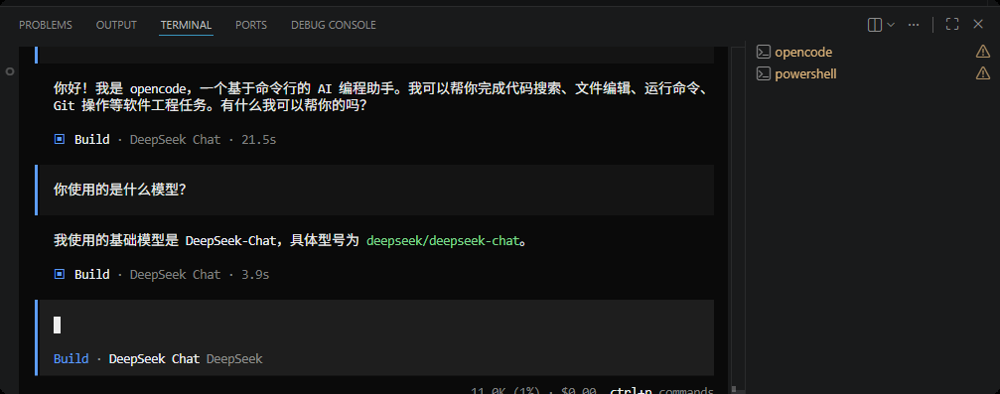

# ActionBattalion-MutiAgent

## week 1 01 环境搭建安装

​	作为一名开发者，自身电脑行就有git，node等环境，安装opencode、claude code工具很容易，只需要`npm install `就能很快素的安装好相应的工具，申请好api_key，就能投入使用了。





## week 1 02 opencode Vs 调用APi


如果使用APi进行调用，很明显出现了幻觉，这是由于大模型本质是基于预测next token而导致的，在APi调用中，我并没有给出实际的真正的上下文，但是他还是输出了许多的幻觉

> F:\Anoconda\envs\torch310\python.exe D:\Desk\Opencode\opencode-test\raw_api_test.py 
>
> 测试：让 AI 分析当前项目的代码结构
>
> 我来分析项目的目录结构和代码质量。由于没有看到具体的项目代码，我将给出一个通用的分析框架和改进建议。
>
> ## 目录结构分析
>
> ### 常见的目录结构问题
>
> ```
> ❌ 问题示例：
> project/
> ├── utils/
> ├── helpers/
> ├── common/
> ├── services/
> ├── components/
> ├── pages/
> ├── models/
> └── others/
> ```
>
> **问题**：
> 1. **命名模糊**：`utils`、`helpers`、`common` 功能重叠
> 2. **层次扁平**：所有文件都在同一级别，缺乏分层
> 3. **缺乏一致性**：模块划分标准不统一
>
> ### 推荐的目录结构
>
> ```
> ✅ 改进示例：
> project/
> ├── src/
> │   ├── modules/          # 业务模块
> │   │   ├── user/
> │   │   │   ├── components/
> │   │   │   ├── services/
> │   │   │   ├── hooks/
> │   │   │   └── types/
> │   │   └── order/
> │   ├── shared/           # 共享模块
> │   │   ├── components/
> │   │   ├── hooks/
> │   │   └── utils/
> │   ├── core/             # 核心功能
> │   │   ├── http/
> │   │   ├── router/
> │   │   └── store/
> │   └── assets/
> ```
>
> ## 代码质量分析
>
> ### 命名规范
> ```javascript
> // ❌ 不好的命名
> const arr = [];
> function getData() {}
> const x = 123;
> 
> // ✅ 好的命名
> const userList = [];
> function fetchUserData() {}
> const MAX_RETRY_COUNT = 3;
> ```
>
> ### 函数复杂度
> ```javascript
> // ❌ 复杂函数
> function processUserData(user) {
>   // 100行代码，多个职责
>   // 验证、格式化、存储、发送通知都在这里
> }
> 
> // ✅ 单一职责
> function validateUser(user) { }
> function formatUserData(user) { }
> function saveUser(user) { }
> function notifyUser(user) { }
> ```
>
> ### 错误处理
> ```javascript
> // ❌ 缺乏错误处理
> async function fetchData() {
>   const response = await fetch(url);
>   return response.json();
> }
> 
> // ✅ 完善的错误处理
> async function fetchData() {
>   try {
>     const response = await fetch(url);
>     if (!response.ok) {
>       throw new Error(`HTTP Error: ${response.status}`);
>     }
>     return await response.json();
>   } catch (error) {
>     console.error('Failed to fetch data:', error);
>     throw error;
>   }
> }
> ```
>
> ## 具体改进建议
>
> ### 1. 目录结构优化
>
> **短期改进**：
> - 合并功能相似的目录（如 `utils` + `helpers`）
> - 按业务模块重新组织文件
> - 添加 `index.js` 统一导出
>
> **长期改进**：
> - 采用领域驱动设计（DDD）分层
> - 建立清晰的依赖关系
> - 引入 monorepo 架构（如 nx、turborepo）
>
> ### 2. 代码质量提升
>
> **立即执行**：
> ```bash
> # 添加代码规范工具
> npm install eslint prettier husky lint-staged
> 
> # 配置 .eslintrc.js
> module.exports = {
>   extends: ['airbnb', 'prettier'],
>   rules: {
>     'max-lines': ['warn', 300],
>     'complexity': ['warn', 10]
>   }
> }
> ```
>
> **代码审查检查清单**：
> - [ ] 是否有重复代码（DRY原则）
> - [ ] 函数是否超过20行
> - [ ] 是否有未使用的变量/导入
> - [ ] 错误处理是否完善
> - [ ] 类型定义是否明确（TypeScript）
> - [ ] 测试覆盖率是否达标
>
> ### 3. 技术债务清理
>
> ```javascript
> // 需要重构的模式
> // ❌ 过度耦合
> class OrderService {
>   constructor() {
>     this.emailService = new EmailService();
>     this.smsService = new SMSService();
>     this.paymentService = new PaymentService();
>   }
> }
> 
> // ✅ 依赖注入
> class OrderService {
>   constructor(notifier, paymentService) {
>     this.notifier = notifier;
>     this.paymentService = paymentService;
>   }
> }
> ```
>
> ### 4. 自动化工具
>
> ```yaml
> # .github/workflows/ci.yml
> name: Code Quality
> on: [push, pull_request]
> jobs:
>   lint:
>     runs-on: ubuntu-latest
>     steps:
>       - uses: actions/checkout@v2
>       - run:
> 
> ============================================================
> 观察：AI 能看到你的项目文件吗？
> ============================================================
> 
> Process finished with exit code 0
> ```


​	使用opencode这类智能体来进行调用，他会按照要求分析项目结构，给出相应的建议。

这说明智能体中含有记忆，能够对任务进行编排

>
>
>请分析当前项目的目录结构和代码质量，给出改进建议。
>我来分析当前项目的目录结构和代码质量。
>→ Read . 
>✱ Glob "**/*" in . (3 matches)
>→ Read raw_api_test.py 
>→ Read .idea\workspace.xml 
>以下是对当前项目的分析结果：
>---
>项目结构
>opencode-test/
>├── .idea/                  # PyCharm/IDE 配置（应 gitignore）
>│   ├── .gitignore
>│   └── workspace.xml
>└── raw_api_test.py         # 唯一源文件 (47行)
>发现的问题
>1. 项目过于单薄
>只有一个测试脚本，没有标准 Python 项目结构（无 src/、tests/、pyproject.toml、README.md 等）。
>2. raw_api_test.py 代码问题
>- 硬编码敏感信息: API_KEY 通过环境变量获取是好做法，但 print(f"API_KEY: {API_KEY}") 会泄露密钥到控制台
>- 无错误处理: urllib.request.urlopen 和 JSON 解析都没有 try/except
>- 函数返回值不一致: call_api 声明返回 str，但外层 __main__ 仅打印，返回值未使用
>- 无类型 hint: call_api 的返回类型声明了，但参数类型齐全，整体类型覆盖不足
>- 无依赖管理: 尽管只用标准库，但缺乏 requirements.txt 或 pyproject.toml
>- 注释风格: 混合使用中英文注释，docstring 是中英混杂
>3. .idea/ 目录
>IDE 配置文件不应提交到版本控制（虽然已有 .gitignore，但应确保 .gitignore 在项目根目录生效）。
>改进建议
>1. 标准化项目结构:
>      opencode-test/
>   ├── pyproject.toml       # 项目元数据和依赖
>   ├── README.md            # 项目说明
>   ├── src/
>   │   └── deepseek_client.py   # 封装 API 调用
>   ├── tests/
>   │   └── test_client.py       # 单元测试
>   └── .env.example         # 环境变量模板
>2. 修复 API 密钥泄露: 删除 print(API_KEY)，改用 logging
>3. 增加错误处理: 网络超时、HTTP 错误、JSON 解析异常都应捕获
>4. 抽象 API 客户端: 将 call_api 封装为类，支持配置和复用
>5. 添加类型提示: 使用 from __future__ import annotations 或完整类型注解
>6. 添加测试: 使用 pytest 和 unittest.mock 模拟网络请求
>7. 删除 .idea/: 将其加入 .gitignore 并清理已跟踪的文件


