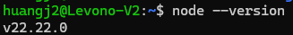
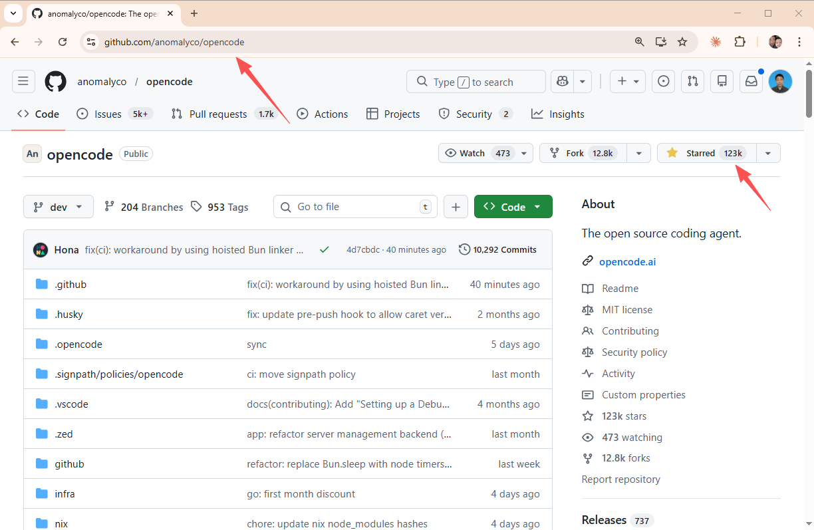
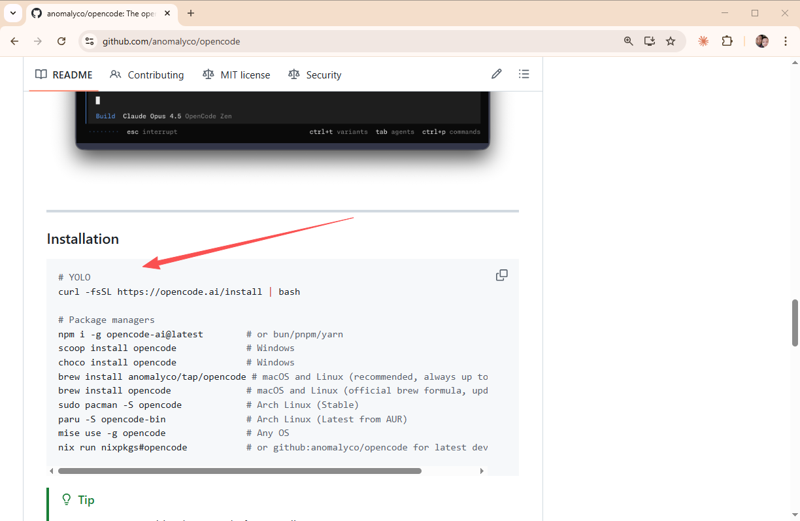
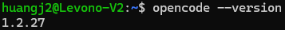
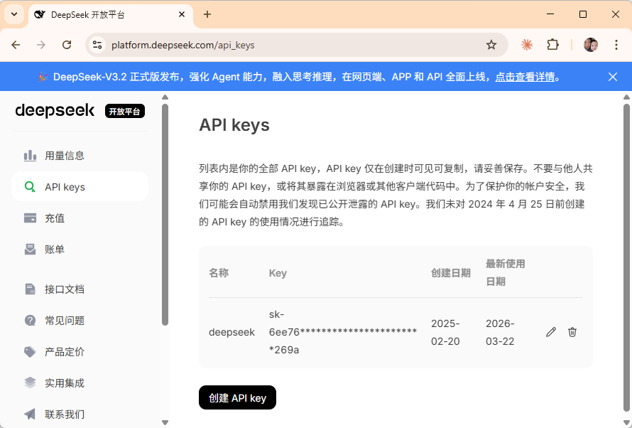
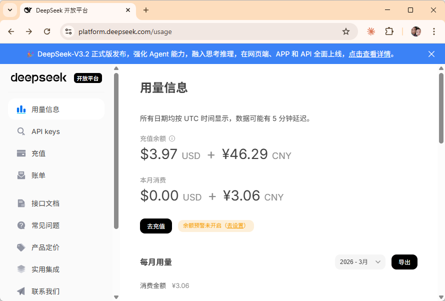
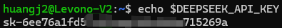
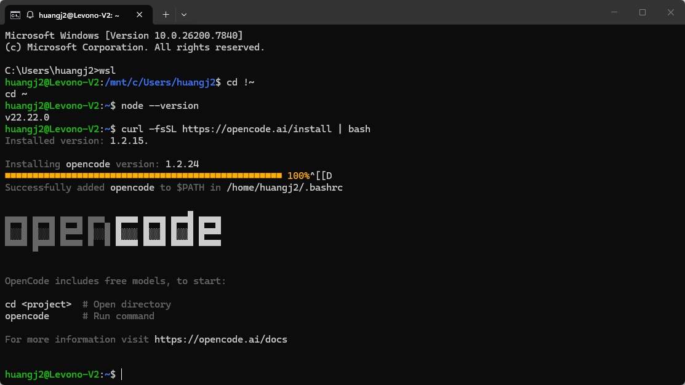
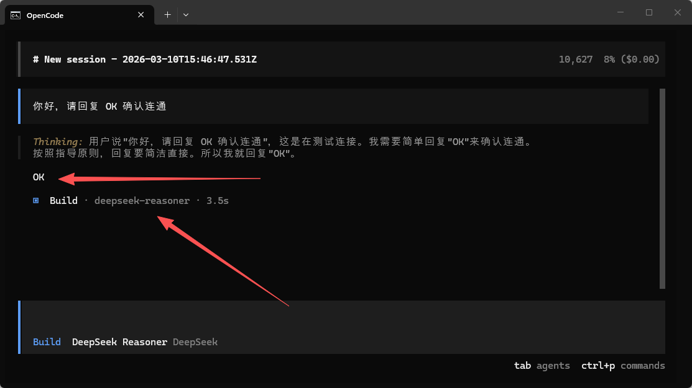

>**目标**：OpenCode 启动成功 + AI 对话测试通过

---
## 1.1 安装 Node.js

OpenCode 基于 Node.js，首先通过 node --version 确认你的系统已安装 Node.js 18+。




>**提示**：一般的 Linux都已经有 Node 了，如果没有，最好去[官网](https://nodejs.org/en)查看最新的安装步骤。

**macOS 用户：**

```plain
# 使用 Homebrew 安装
brew install node

# 验证版本
node --version
```
**Linux / WSL 用户：**
```plain
# Ubuntu / Debian
curl -fsSL https://deb.nodesource.com/setup_22.x | sudo -E bash -
sudo apt install -y nodejs

# 验证版本
node --version
```
**Windows 用户：**
推荐使用 WSL2 环境，安装步骤同 Linux。如果不想用 WSL，也可以从 [Node.js 官网](https://nodejs.org/zh-cn) 下载 Windows 安装包。


---

## 1.2 安装 OpenCode

[OpenCode](https://github.com/anomalyco/opencode)是开源 AI 编程终端工具（MIT 协议），兼容 Claude Code 扩展机制。







>提示：最好去官网查看最新的安装步骤。

**方法 1：npm 全局安装（推荐）**

```plain
npm install -g opencode-ai@latest
```
**方法 2：一键安装脚本**
```plain
curl -fsSL https://opencode.ai/install | bash
```
如果遇到权限问题，macOS/Linux 用户可以加 `sudo`：
```plain
sudo npm install -g opencode-ai@latest
```


安装完成后验证：

```plain
opencode --version
```




**参考资源：**

* OpenCode 官方文档：[https://opencode.ai/docs/](https://opencode.ai/docs/)

* OpenCode GitHub 仓库：[https://github.com/nicepkg/opencode](https://github.com/nicepkg/opencode)

* 安装问题排查：[https://opencode.ai/docs/troubleshooting](https://opencode.ai/docs/troubleshooting)


---

## 1.3 注册国产模型 API Key

选择一个国产模型注册 API Key。推荐 DeepSeek，最便宜且效果好。

### 方案 A：DeepSeek（推荐）

**价格**：¥1/百万 tokens（约 ¥0.001/千 tokens），是最便宜的高质量模型。

1. 打开 [https://platform.deepseek.com/](https://platform.deepseek.com/)

2. 点击「注册」，使用手机号注册账号

   1. 注册成功后进入控制台，点击左侧「API Keys」

   2. 点击「创建 API Key」按钮

   3. 给 Key 起个名字（如 `opencode`），点击确认

   4. **立即复制**生成的 API Key（格式：`sk-xxxxxxxx`）


⚠️ 注意：API Key 只会显示一次，务必立即复制保存！

1. 充值：左侧「费用」→「充值」，充 ¥5-10 即可用很久



**参考资源：**

* DeepSeek API 文档：[https://api-docs.deepseek.com/](https://api-docs.deepseek.com/)

* DeepSeek 注册教程（含截图）：搜索「DeepSeek API 注册教程」

### 方案 B：智谱 GLM（有免费额度）

1. 打开 [https://open.bigmodel.cn/](https://open.bigmodel.cn/)

2. 注册账号（手机号）

3. 新用户有免费额度，适合零成本试用

4. 进入「API Keys」→ 创建并复制 API Key

### 方案 C：阿里云 Qwen

1. 打开 [https://bailian.console.aliyun.com/](https://bailian.console.aliyun.com/)

2. 注册/登录阿里云账号

3. 开通百炼服务

4. 获取 DashScope API Key


---

## 1.4 配置环境变量

将 API Key 写入你的 shell 配置文件：

```plain
# 如果你用 zsh（macOS 默认）
echo 'export DEEPSEEK_API_KEY="sk-你的key"' >> ~/.zshrc
source ~/.zshrc

# 如果你用 bash（Linux 默认）
echo 'export DEEPSEEK_API_KEY="sk-你的key"' >> ~/.bashrc
source ~/.bashrc
```
验证环境变量已设置：
```plain
echo $DEEPSEEK_API_KEY
# 应该输出你的 API Key
```


---

## 1.5 首次启动 OpenCode

```plain
# 创建一个测试目录
mkdir ~/opencode-test && cd ~/opencode-test

# 启动 OpenCode
opencode
```
OpenCode 启动后，你会看到一个交互式终端界面。



在对话框中输入：

```plain
你好，请回复 OK 确认连通
```
如果 AI 回复了 OK，恭喜，环境配置成功！



>**注意**：Open Code是比较容易安装成功的，但如果 Open Code 安装真的遇到问题，可以使用 Cursor、通义灵码、Trae、Claude Code、Cline等任意工具来完成这个行动营，虽然我没有全部用过，但我个人觉得 AI 辅助开发的道理一定都是相通的。


---

## 1.6 环境配置自查清单

逐项确认，必须**全部打勾**哈!

```plain
☐ Node.js 18+ 已安装（node --version 有输出）
☐ OpenCode 已安装（opencode --version 有输出）
☐ 国产模型 API Key 已获取
☐ 环境变量已配置（echo $DEEPSEEK_API_KEY 有输出）
☐ OpenCode 首次启动成功
☐ AI 对话测试通过（回复了 OK）

---
```


**完成！** 环境搭好了，进入实操 2 做对比实验。

