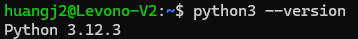
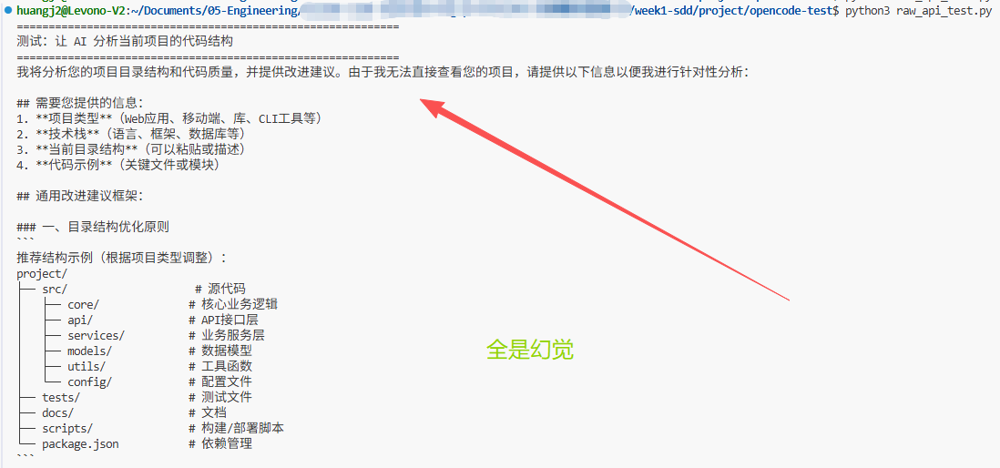
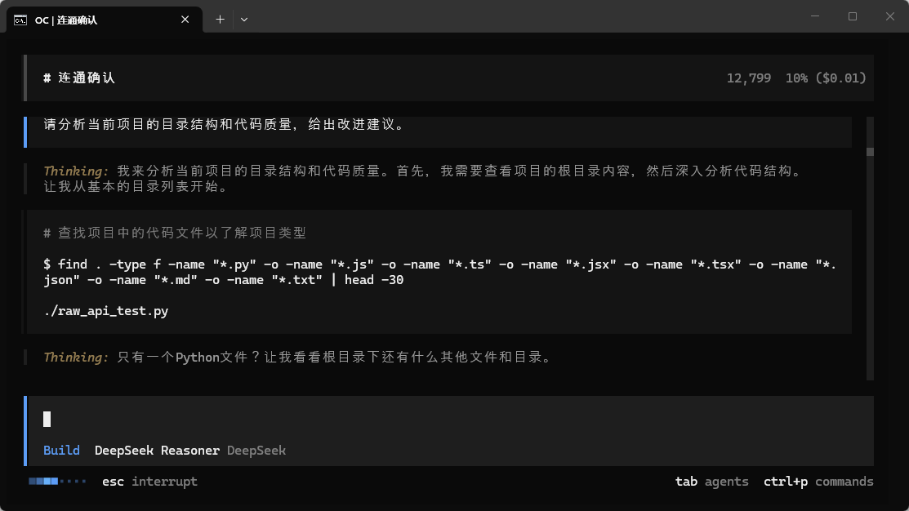
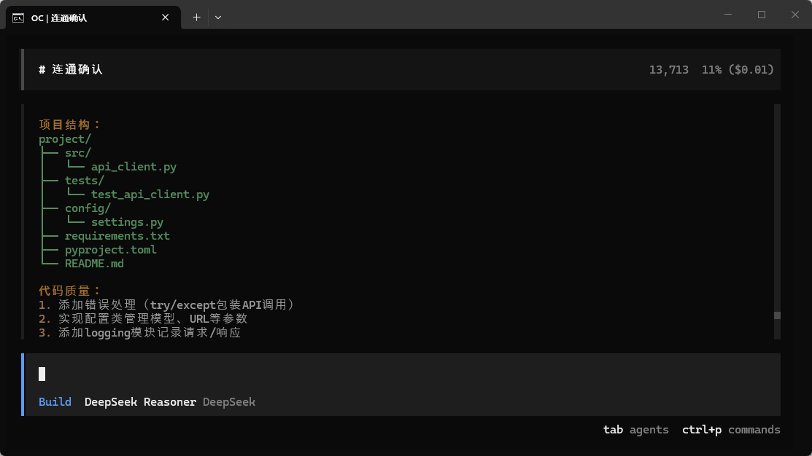

>目标：对比实验完成 + 200 字体会文档

---
## 2.1 准备工作

确认 Python 3 可用 （如何安装Python不赘述了）：

```plain
python3 --version
# 需要 3.10+
```


## 2.2 裸 API 调用（无状态推理）

创建测试脚本：

```plain
cd ~/opencode-test
```
用任意编辑器创建 `raw_api_test.py`，内容如下：
```plain
"""
裸 API 调用测试 — 直接调用 DeepSeek API
体验「无状态推理」：模型不知道项目背景，不能读写文件
"""
import os
import json
import urllib.request

API_KEY = os.environ.get("DEEPSEEK_API_KEY", "")  sk-725c67b2122242f69e032cadd82485f5
API_URL = "https://api.deepseek.com/chat/completions"

def call_api(prompt: str) -> str:
    """直接调用 DeepSeek API"""
    data = json.dumps({
        "model": "deepseek-chat",
        "messages": [{"role": "user", "content": prompt}],
        "max_tokens": 1000,
    }).encode("utf-8")

    req = urllib.request.Request(
        API_URL,
        data=data,
        headers={
            "Content-Type": "application/json",
            "Authorization": f"Bearer {API_KEY}",
        },
    )

    with urllib.request.urlopen(req) as resp:
        result = json.loads(resp.read().decode())
        return result["choices"][0]["message"]["content"]

if __name__ == "__main__":
    # 测试：让它分析一个项目
    print("=" * 60)
    print("测试：让 AI 分析当前项目的代码结构")
    print("=" * 60)

    response = call_api(
        "请分析当前项目的目录结构和代码质量，给出改进建议。"
    )
    print(response)

    print("\n" + "=" * 60)
    print("观察：AI 能看到你的项目文件吗？")
    print("=" * 60)
```
运行脚本：
```plain
python3 raw_api_test.py
```
裸 API 调用的输出——AI 会说「请提供代码」或「我无法访问文件」之类的话]
**观察要点：**

* AI 能看到你的项目文件吗？→ **不能**

* AI 知道你用什么技术栈吗？→ **不知道**

* AI 能执行命令、读写文件吗？→ **不能**

这就是「无状态推理」——模型是一个孤立的函数，输入文本，输出文本，仅此而已。

---

## 2.3 OpenCode 编排（有状态）

现在用 OpenCode 问**完全相同的问题**：

```plain
cd ~/opencode-test
opencode
```
在 OpenCode 对话框中输入：
```plain
请分析当前项目的目录结构和代码质量，给出改进建议。
```







OpenCode 能分析项目的输出——它会读取文件、列出目录结构、给出具体建议。


**观察要点：**

* AI 能看到你的项目文件吗？→ **能**（它会用 Glob/Read 工具扫描目录）

* AI 知道文件内容吗？→ **知道**（它会读取文件内容）

* AI 能给出具体建议吗？→ **能**（基于实际文件内容）


这就是「有状态编排」——同一个模型，加了编排器之后，它能读文件、能搜索、能分析，变成了一个有感知能力的系统。

---

## 2.4 写对比体会

创建文件 `comparison.md`，写 200 字的对比体会。参考模板：

```plain
# 裸 API vs OpenCode 对比体会

## 实验过程
- 裸 API 调用：[描述你观察到的现象]
- OpenCode 编排：[描述你观察到的现象]

## 关键差异
- [差异 1：是否能读文件]
- [差异 2：是否有上下文感知]
- [差异 3：建议是否具体]

## 我对「无状态推理」和「有状态编排」的理解
[用自己的话总结]
```
>作业：请提交你写的对比体会文档
>
>


---

## 核心收获

||裸 API 调用|OpenCode 编排|
|:----|:----|:----|
|本质|无状态推理|有状态编排|
|能否看文件|❌|✅|
|能否执行命令|❌|✅|
|上下文感知|❌|✅|
|类比|打电话问路|开着导航走|

**关键洞察**：模型是同一个模型（DeepSeek），差别在于编排器赋予了它“感知”和“行动”的能力。

---

**完成！** 你已亲手体验了无状态推理和有状态编排的差异。


作业

