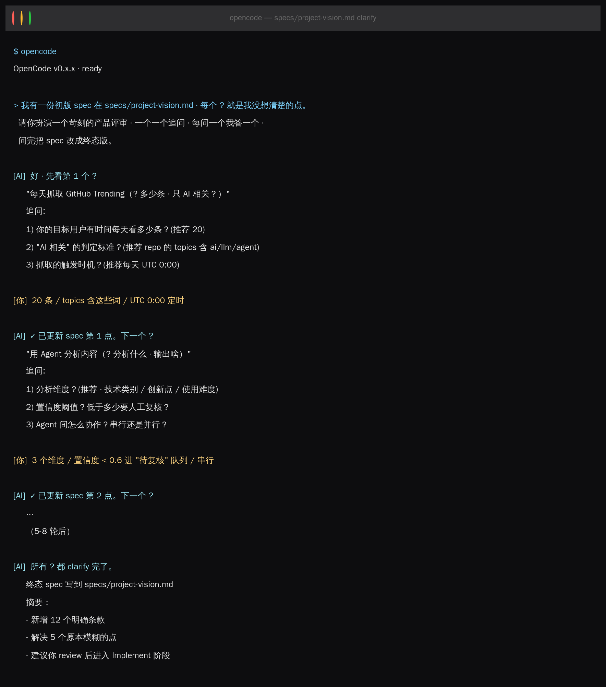
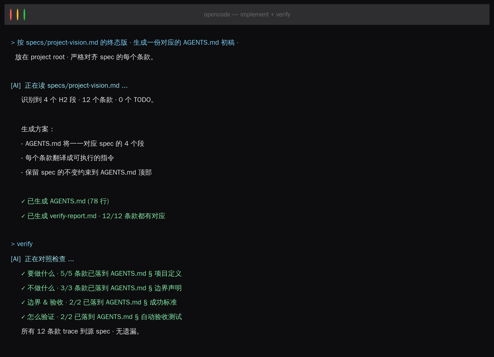

AI 编程范式的三级跃迁我们已经听过：Prompt → Context → Harness。


但有好几个同学在群里和课程留言里面反馈：“规范很重要，但我还是会直接给 AI 发一段话让它干活。究竟咱们怎么开始用 SDD？”


这一节就是答案。不装任何工具，我们只用 Claude Code / OpenCode 本身，就能手写一份能跑的 spec。


## 预备阅读

* [SDD 的 95/5 原则](https://github.com/huangjia2019/sdd-in-action/blob/master/week1/advance/01-SDD%E7%9A%8495-5%E5%8E%9F%E5%88%99.md)

链接（打不开链接需科学上网）：[https://github.com/huangjia2019/sdd-in-action/blob/master/week1/advance/01-SDD](https://github.com/huangjia2019/sdd-in-action/blob/master/week1/advance/01-SDD%E7%9A%8495-5%E5%8E%9F%E5%88%99.md#sdd-%E7%9A%84-955-%E5%8E%9F%E5%88%99)


## 本节目标

给 [ai-knowledge-base/v1-skeleton](https://github.com/huangjia2019/ai-knowledge-base) 写一份项目愿景 spec，决定这个知识库到底要做什么、不做什么、怎么判断成功。这份 spec 最终会变成 `AGENTS.md` 的“项目定义”段（第 2 节会重写它）。


ai-knowledge-base超链接在这里（打不开链接需科学上网）[https://github.com/huangjia2019/ai-knowledge-base](https://github.com/huangjia2019/ai-knowledge-base)


## 环境准备

本节不需要装任何插件。能跑通下面任意一个就行：

```plain
claude --version     # Claude Code
opencode --version   # OpenCode（开源推荐）
```


## 双路并行

这个双路并行的设计是为了比较自己和AI聊和有SDD思想/工具做指导的差异。

### A 路 · Vibe · 5 分钟

复制给 AI：

```plain
你是一位技术产品经理。我在做一个 AI 知识库系统，
自动抓 GitHub Trending / Hacker News / arXiv 的 AI 相关内容，
用 Agent 协作完成采集→分析→整理→发布。
请帮我写一份项目愿景文档。
```
AI 预计会给你一份 200 字的散文。看起来挺好——但你没有任何掌控，请再看B路。
### B 路 · SDD 闭环 · 30 分钟

按三阶段走：**Specify → Clarify → Implement**。

#### 阶段 1 · Specify（10 分钟）

不开 AI。先在 `specs/project-vision.md` 按 4 个 H2 手写：

```plain
# AI 知识库 · 项目愿景 v0.1

## 要做什么
- 每天抓取 GitHub Trending（? 多少条 · 只 AI 相关？）
- 用 Agent 分析内容（? 分析什么 · 输出啥）
- 输出知识条目（? JSON 还是 Markdown · 字段有哪些）

## 不做什么

## 边界 & 验收

## 怎么验证
```
故意留 3-5 个 `?`。这些是下阶段给 AI 质询的靶子。
#### 阶段 2 · Clarify（10 分钟）

这个是模拟Step by Step的 AI 辅助 SDD 设计哈。



AI 的每个追问都会给“推荐答案”。你可以接受、改成自己的，或说“你决定”放权给 AI 自主决定 。

#### 阶段 3 · Implement（10 分钟）



## A vs B 对比

|维度|A 路线|B 路线|
|:----|:----|:----|
|时间|5 min|30 min|
|产出|一份散文|spec + AGENTS.md + verify 报告|
|走偏概率|高|低|
|两周后记得|难|易（spec 在 git 里）|

B 路多花的 25 分钟不是“额外开销”，是把调试 2000 行代码的成本，提前投入在了澄清需求的阶段。


## 完成了啥？

* `specs/project-vision.md`（完成版）

* `AGENTS.md` 初稿（可合并进 ai-knowledge-base/v1-skeleton/）

* 一次完整的 Specify → Clarify → Implement 闭环经历


## 下一节

第 2 节  Memory 工程 ，我们将引入 **grill-me**，把 AGENTS.md 从“能用”升级到“AI 能严格执行”。

