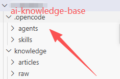
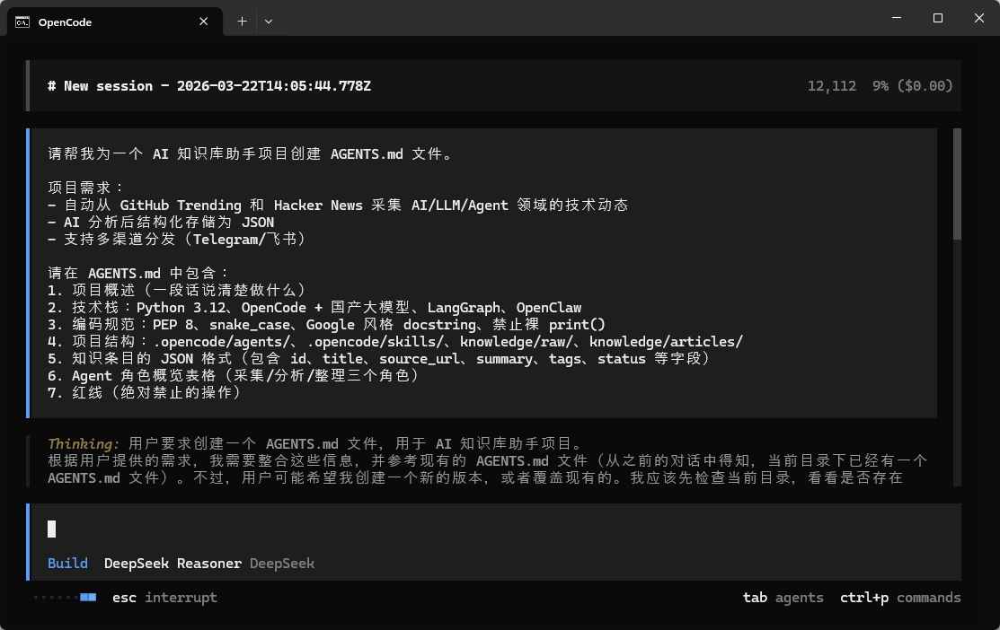
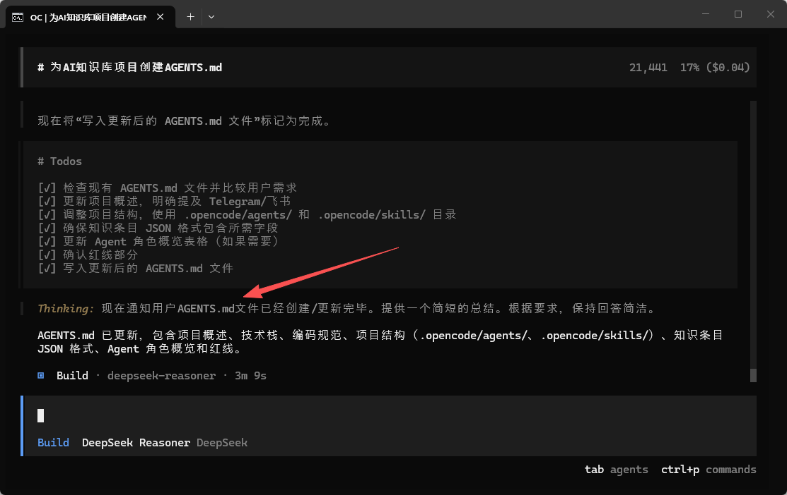
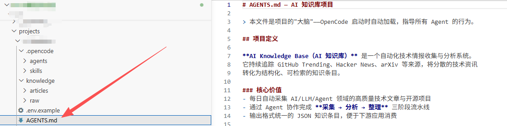
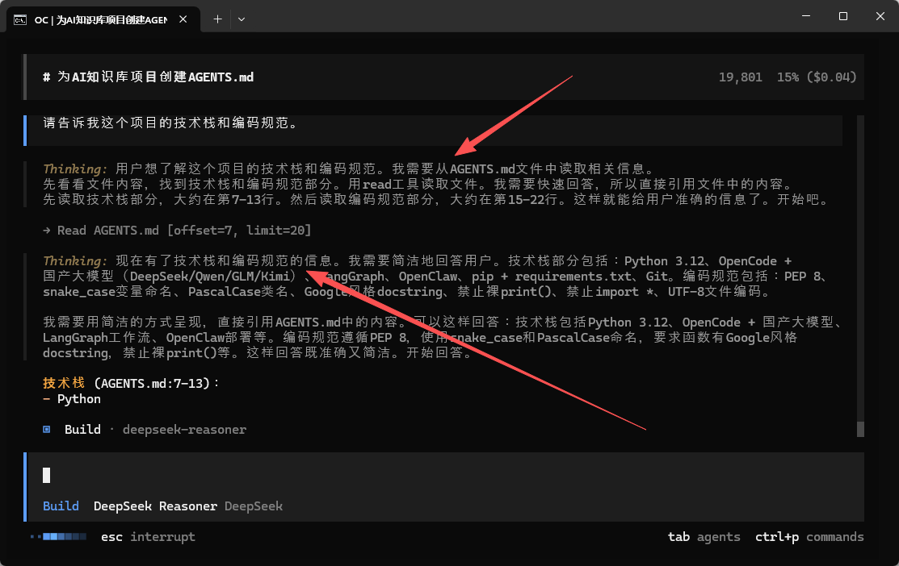

>**目标**：AGENTS.md 编写完成 + OpenCode 验证加载成功

---

## 1.1 创建项目目录

```plain
# 创建知识库项目目录
mkdir -p ~/ai-knowledge-base
cd ~/ai-knowledge-base

# 初始化 Git
git init

# 创建基本目录结构
mkdir -p .opencode/agents .opencode/skills knowledge/raw knowledge/articles
```





---

## 1.2 用 AI 编程工具生成 AGENTS.md

>以下内容可以用 **OpenCode**、**Claude Code**、**Cursor**、**Trae** 或**通义灵码**等任意 AI 编程工具生成。没有这些工具也可以手动创建。
**提示词：**

```plain
请帮我为一个 AI 知识库助手项目创建 AGENTS.md 文件。

项目需求：
- 自动从 GitHub Trending 和 Hacker News 采集 AI/LLM/Agent 领域的技术动态
- AI 分析后结构化存储为 JSON
- 支持多渠道分发（Telegram/飞书）

请在 AGENTS.md 中包含：
1. 项目概述（一段话说清楚做什么）
2. 技术栈：Python 3.12、OpenCode + 国产大模型、LangGraph、OpenClaw
3. 编码规范：PEP 8、snake_case、Google 风格 docstring、禁止裸 print()
4. 项目结构：.opencode/agents/、.opencode/skills/、knowledge/raw/、knowledge/articles/
5. 知识条目的 JSON 格式（包含 id、title、source_url、summary、tags、status 等字段）
6. Agent 角色概览表格（采集/分析/整理三个角色）
7. 红线（绝对禁止的操作）
```



**生成的代码：**（参考实现，你生成的版本可能略有不同）

```plain
# AGENTS.md — AI 知识库助手项目规范

## 项目概述
个人 AI 知识库助手系统。自动从技术信息源（GitHub Trending、Hacker News）
采集内容，AI 分析后结构化存储，支持多渠道分发。

## 技术栈
- 语言: Python 3.12
- AI 编排: OpenCode + 国产大模型（DeepSeek/Qwen/GLM/Kimi）
- 工作流: LangGraph（第 3 周引入）
- 部署: OpenClaw（第 4 周引入）
- 依赖管理: pip + requirements.txt
- 版本控制: Git

## 编码规范
- 遵循 PEP 8 规范
- 变量命名: snake_case
- 类名: PascalCase
- 所有函数必须有 docstring（Google 风格）
- 禁止裸 print()，使用 logging 或写入文件
- 禁止 import *
- 文件编码统一 UTF-8

## 项目结构
```
ai-knowledge-base/
├── AGENTS.md                  — 项目规范（本文件）
├── opencode.json              — OpenCode 配置
├── .opencode/
│   ├── agents/                — Agent 角色定义文件
│   │   ├── collector.md
│   │   ├── analyzer.md
│   │   └── organizer.md
│   └── skills/                — 可复用技能包
│       ├── github-trending/SKILL.md
│       └── tech-summary/SKILL.md
├── knowledge/
│   ├── raw/                   — 原始采集数据（JSON）
│   └── articles/              — 结构化知识条目（JSON）
├── pipeline/                  — 自动化流水线（Week 2）
├── workflows/                 — LangGraph 工作流（Week 3）
└── openclaw/                  — OpenClaw 部署配置（Week 4）
```

## 内容规范
- 摘要语言: 中文
- 摘要长度: 不超过 100 字
- 技术术语保留英文原文（如 LangGraph、Agent、Token）
- 评分标准: 1-10 分，9-10 改变格局，7-8 直接有帮助，5-6 值得了解

## 知识条目格式

每条知识以 JSON 文件存储在 `knowledge/articles/` 目录下：

```json
{
  "id": "2026-03-01-github-openclaw",
  "title": "OpenClaw: 开源 AI Agent 运行时",
  "source": "github-trending",
  "source_url": "https://github.com/example/project",
  "collected_at": "2026-03-01T10:00:00Z",
  "summary": "一句话中文摘要（不超过 100 字）",
  "analysis": {
    "tech_highlights": ["多 Agent 路由", "50+ 平台支持"],
    "relevance_score": 9
  },
  "tags": ["agent", "runtime", "open-source"],
  "status": "draft"
}
```

**必填字段**：id, title, source_url, summary, tags, status
**status 可选值**：draft / reviewed / published

## Agent 角色概览

| 角色 | 文件 | 职责 |
|------|------|------|
| 采集 Agent | .opencode/agents/collector.md | 从外部源采集技术动态 |
| 分析 Agent | .opencode/agents/analyzer.md | 深度分析和价值评估 |
| 整理 Agent | .opencode/agents/organizer.md | 去重、格式化、归档 |

## 红线（绝对禁止）
- 不编造不存在的项目或数据
- 不在日志中输出 API Key 或敏感信息
- 不执行 rm -rf 等危险命令
- 不修改 AGENTS.md 本身（除非明确要求）
```


>**理解代码**：如果你对 AGENTS.md 的结构有疑问，可以让 AI 编程工具解释：
>`请解释 AGENTS.md 中各部分的作用：`
>`1. 为什么需要"红线"部分？`
>`2. "知识条目格式"这段 JSON 定义有什么用？`
>`3. AGENTS.md 和普通的 README.md 有什么区别？`

---

## 1.3 验证 OpenCode 加载 Memory

启动 OpenCode，验证它是否自动读取了 AGENTS.md：

```plain
cd ~/ai-knowledge-base
opencode
```
在对话框中输入：
```plain
请告诉我这个项目的技术栈和编码规范。
```




**验证要点（逐一检查）：**

|检查项|AI 应该回答|实际回答？|
|:----|:----|:----|
|语言|Python 3.12||
|编码规范|PEP 8||
|命名风格|snake_case||
|日志规范|禁止裸 print()||
|目录结构|知道 .opencode/agents/, .opencode/skills/, knowledge/||

如果全部正确，说明 **Memory 加载成功**。

>**没有 OpenCode？** 如果你使用其他工具（Cursor/Trae/通义灵码），可以把 AGENTS.md 的内容粘贴到对话框中，然后问同样的问题来验证 AI 是否理解了项目规范。Claude Code 用户可以将文件命名为 `CLAUDE.md`，效果相同。

---

## 提交到 Git

```plain
cd ~/ai-knowledge-base
git add AGENTS.md .opencode/
git commit -m "feat: add AGENTS.md project memory file"

---
```


**完成！** AGENTS.md 就是项目的「员工手册」，进入实操 2 看看有它和没它的差别。

