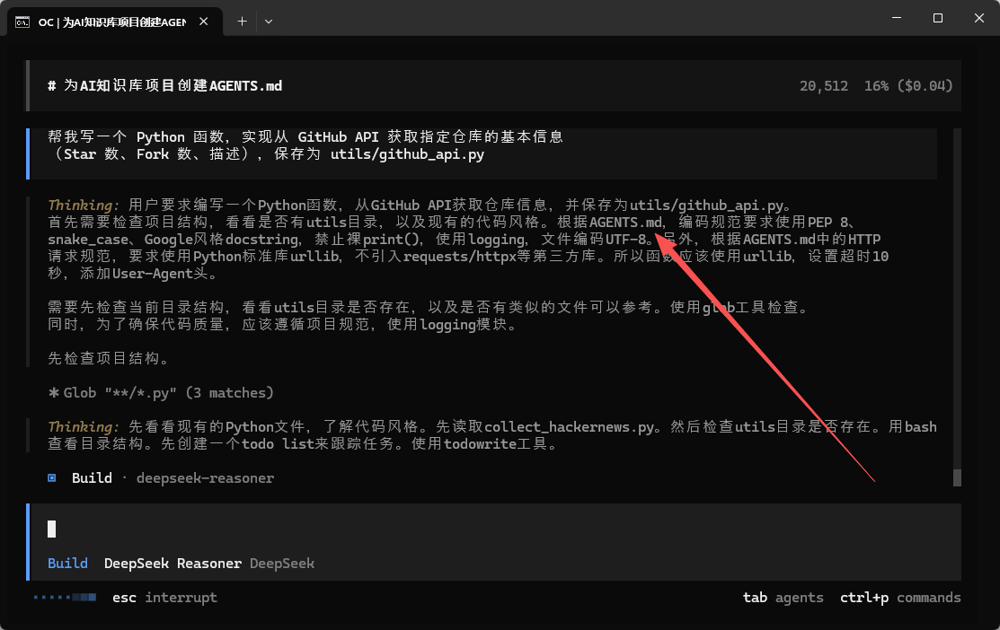
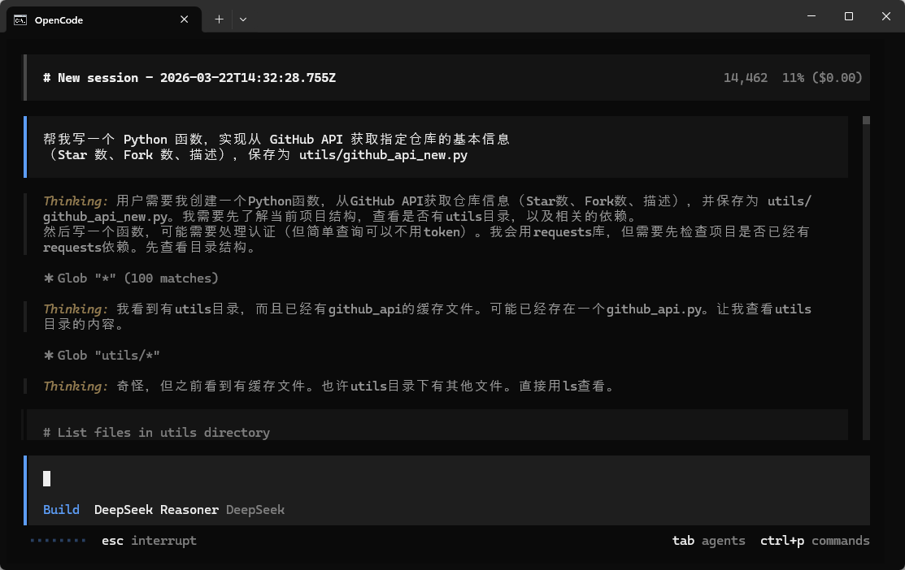

>**目标**：对比实验完成 + 对比记录文档

---
## 步骤 1：有 Memory 状态下生成代码


确保 AGENTS.md 存在，启动 AI 编程工具：

```plain
cd ~/ai-knowledge-base
opencode
```
**提示词：**
```plain
帮我写一个 Python 函数，实现从 GitHub API 获取指定仓库的基本信息
（Star 数、Fork 数、描述），保存为 utils/github_api.py
```




**观察并记录：**

|检查项|期望（有 Memory）|实际|
|:----|:----|:----|
|命名风格|snake_case||
|有没有 docstring|有（Google 风格）||
|有没有用 print()|不用，用 logging||
|文件放在哪个目录|按项目结构放置||


---

## 步骤 2：临时移除 Memory

```plain
# 临时重命名 AGENTS.md（当然，如果有的AI Coder足够聪明，也可能会参考这个备份文件）
mv AGENTS.md AGENTS.md.bak
# 同时也要删除或重命名utils/github_api.py否则会相互影响。
```
重新启动 AI 编程工具，输入**完全相同的提示词**：
```plain
帮我写一个 Python 函数，实现从 GitHub API 获取指定仓库的基本信息
（Star 数、Fork 数、描述），保存为 utils/github_api_new.py
```

此时，不再基于AGENTS.md的规则来创建程序。


**观察并记录：**

|检查项|无 Memory 实际表现|
|:----|:----|
|命名风格|（可能 camelCase 或混合）|
|有没有 docstring|（可能没有）|
|有没有用 print()|（可能直接 print）|


---

## 步骤 3：恢复 Memory

```plain
mv AGENTS.md.bak AGENTS.md
```
>千万别忘了恢复！后续实操都依赖它。

---

## 步骤 4：记录对比结果


**提示词：**

```plain
请帮我创建一个 memory_comparison.md 文件，用表格对比"有 Memory"和"无 Memory"
两种情况下 AI 生成代码的差异，包含：命名风格、docstring、日志方式、错误处理、
文件位置五个维度，并写一段结论。
```
**理解代码：**
>如果你对 Memory 的作用有疑问，可以让 AI 编程工具解释： "AGENTS.md 是怎么影响 AI 生成代码的风格的？它是在什么时机被读取的？"

---

## 核心收获

Memory（AGENTS.md）就像给 AI 发了一本“员工手册”：

* **有手册**：AI 按规范行事，产出一致、可预测

* **没手册**：AI 自由发挥，每次产出不一样

这就是「声明式配置」的威力——用一个文件声明“要什么”，不用每次口头交代。


---

**完成！** 你已亲手验证了 Memory 的价值。

