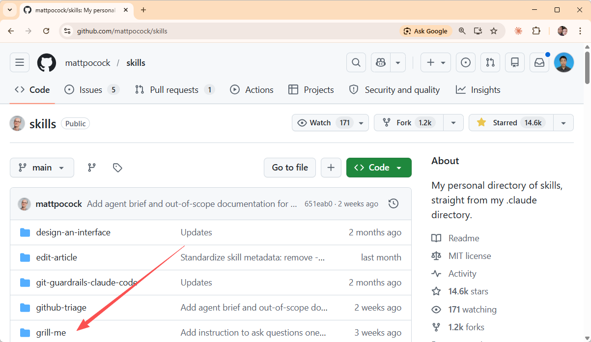
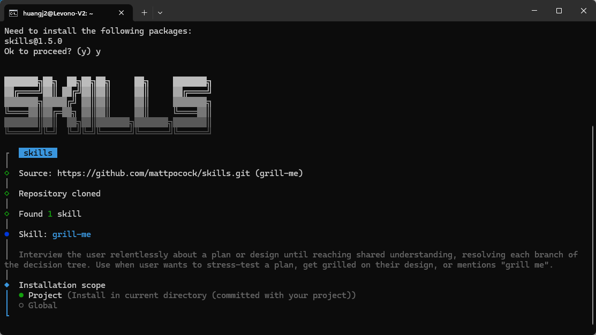
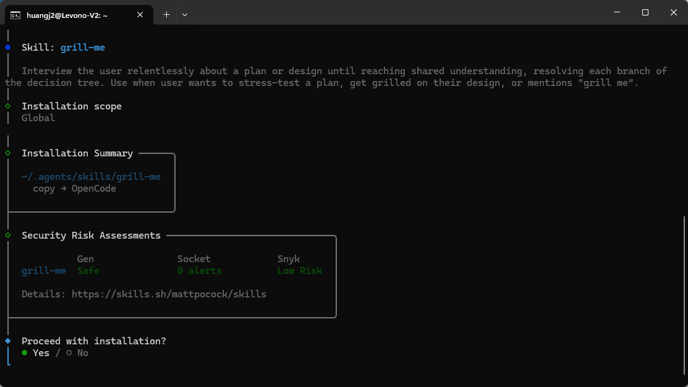
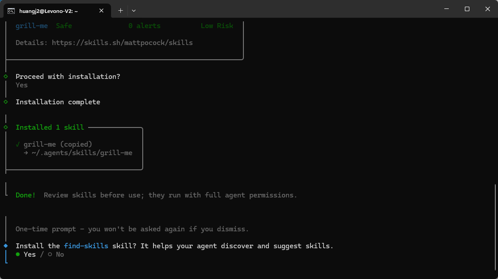
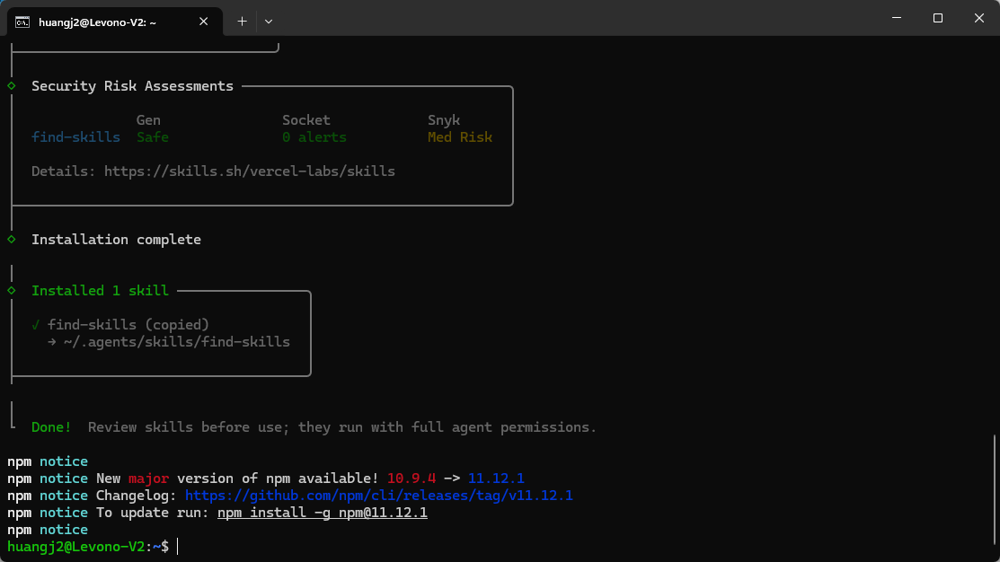
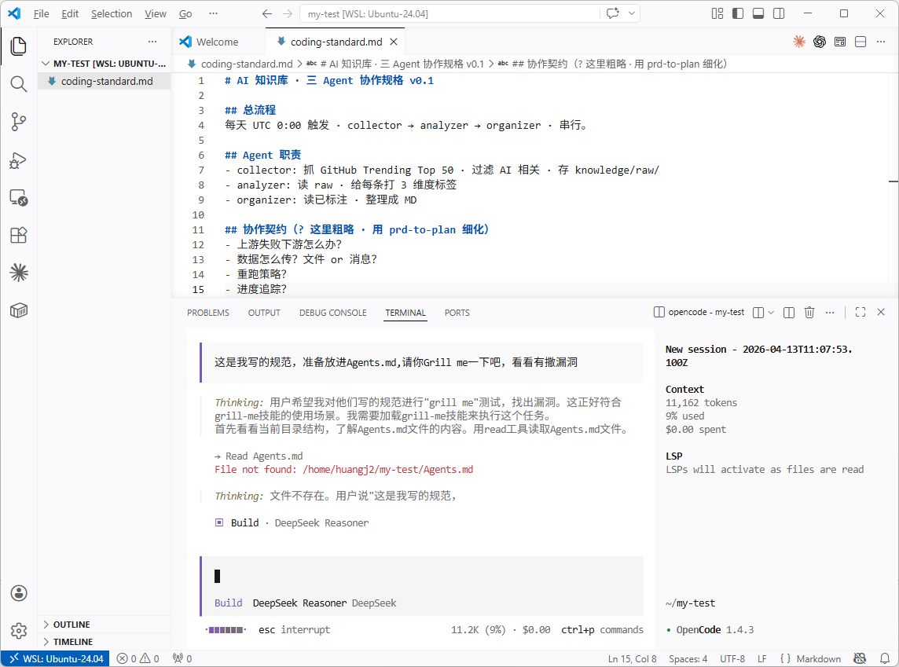
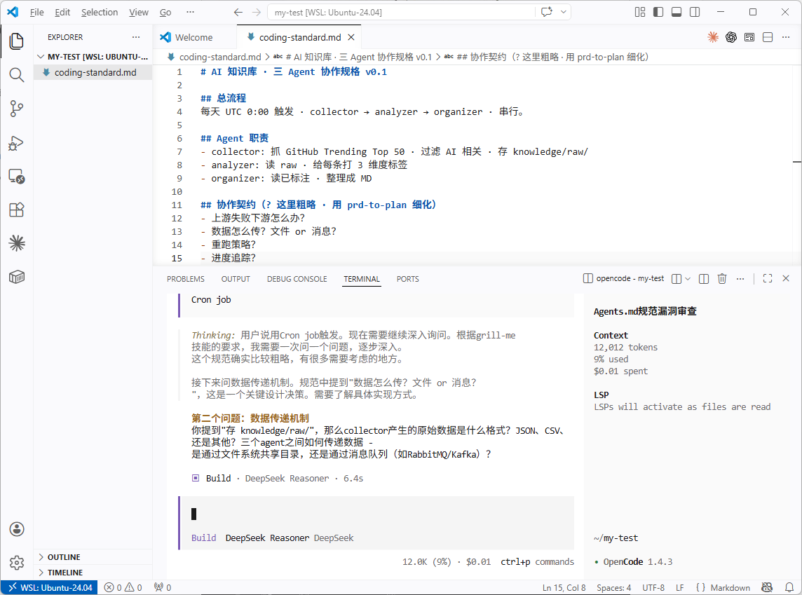
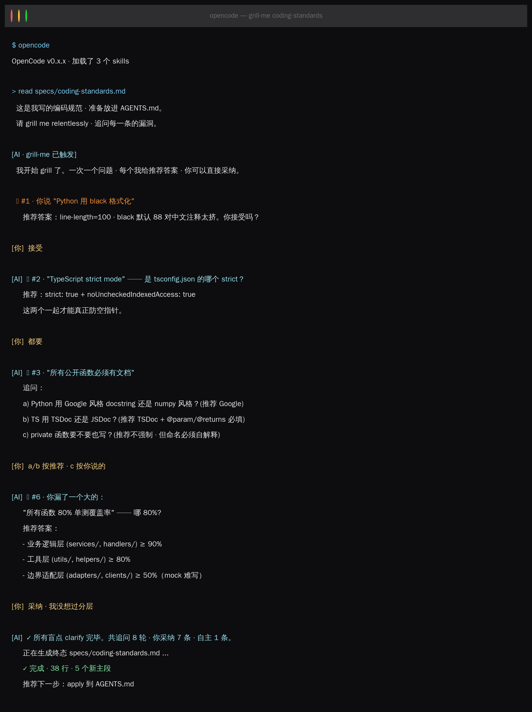
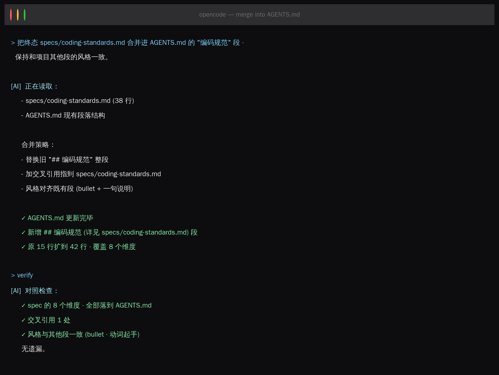

又有真实问题：“课程里面的 Skills、Subagents 啥的我看懂了，挺清晰的，但让我从零写自己项目的，我不知道该写什么。”


这是 SDD 经典场景，你缺的不是模板，是**一个会追问你的对手**。我通常会说所有的东西其实都是**Agent和我共创**的，的确如此。




本节装 **grill-me**（6 行 Markdown · 来自 Matt Pocock 的开源技能集）。装完，AI 会变成面试官，一条条拷问你的 AGENTS.md 里的模糊点。


## 环境准备

### Claude Code

```plain
npx skills@latest add mattpocock/skills/grill-me -a claude-code
ls ~/.claude/skills/grill-me/SKILL.md
```
### OpenCode（推荐）

```plain
npx skills@latest add mattpocock/skills/grill-me -a opencode
ls ~/.opencode/skills/grill-me/SKILL.md
```






装完重启 CLI。skill 靠 SKILL.md 里的 `description` 字段自动触发，不需要 `/skill` 前缀——你只要说“grill me on my AGENTS.md”，AI 就会启用它。


## 本节目标

用 grill-me 从第 1 节的 AGENTS.md 初稿出发，追问出一段完整的 coding standards（编码规范段）。这段最后会变成 `AGENTS.md § 编码规范`。


## 双路并行

这个双路并行的设计是为了比较自己和 AI 聊和有 SDD 思想/工具做指导的差异。

### A 路 · Vibe · 5 分钟

复制给 AI：

```plain
帮我给 AI 知识库项目写一段 AGENTS.md 的编码规范。
Python + TypeScript 双技术栈。
```
AI 给你 15 行规范，看起来规整。但下周同事抱怨“AI 生成的 Python 行宽混乱”时，你发现规范里根本没写行宽。A 路输在**没想到的就漏了**。
### B 路 · SDD + grill-me · 25 分钟

#### 阶段 1 · Specify（5 分钟）

在 `specs/coding-standards.md` 写你能想到的：

```plain
# AI 知识库 · 编码规范 v0.1

## 要做什么
- Python 用 black 格式化
- TypeScript strict mode
- 所有公开函数必须有文档

## 不做什么
- 不用任何魔法字符串
- 不允许 TODO 提交到 main

## 边界 & 验收
- 单测覆盖率 ≥ 80%

## 怎么验证
- CI 上跑 lint + 单测
```
故意留粗糙——这是给 grill-me 下饭的。

#### 阶段 2 · Clarify（15 分钟）


具体触发grill-me技能的截图。









#### 阶段 3 · Implement（5 分钟）

讨论之后，把最终思路写入AGENTS.md。任务完成



## A vs B 对比

|维度|A 路|B 路|
|:----|:----|:----|
|时间|5 min|25 min|
|覆盖维度|~5|~15|
|发现盲点|0|3-4|
|改需求成本|全重写|改 spec 一条即可|

grill-me 的价值不是直接帮你写，是帮你发现你没想到的。

## 完成清单

* `specs/coding-standards.md`

* `AGENTS.md` 的 `## 编码规范` 段

* 第一次体验 skill 自动触发


## 下一节

第 3 节 Sub-Agents 角色分工，单个 AI 会追问你了。但 ai-knowledge-base 有 3 个 Agent，它们之间要协作，谁给谁什么信号？下节引入 **prd-to-plan**。

