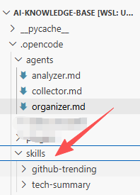
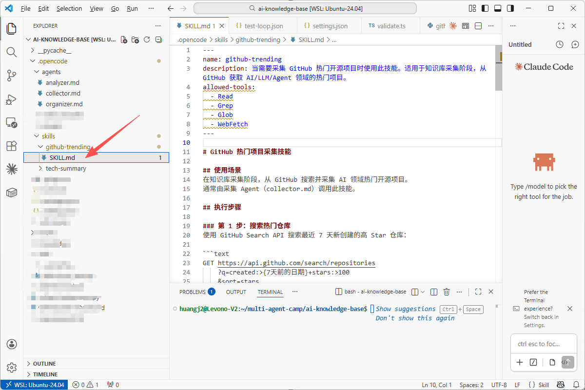
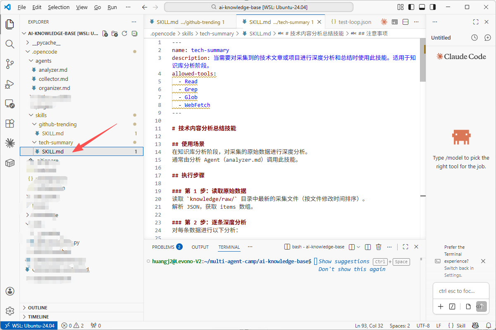

>**目标**：.opencode/skills/ 下 2 个 SKILL.md 文件编写完成

---

## 步骤 1：创建 Skill 目录结构

```plain
cd ~/ai-knowledge-base
mkdir -p .opencode/skills/github-trending .opencode/skills/tech-summary

---
```

## 步骤 2：用 AI 编程工具生成 github-trending Skill

>以下代码可以用 **OpenCode**、**Claude Code**、**Cursor**、**Trae** 或**通义灵码**等任意 AI 编程工具生成。
**提示词：**

```plain
请帮我创建 .opencode/skills/github-trending/SKILL.md 文件。

格式要求：
- 头部用 YAML frontmatter（name, description, allowed-tools）
- 正文用 Markdown，包含：使用场景、执行步骤（7步）、注意事项、输出格式

内容要求：
- name: github-trending
- description: 当需要采集 GitHub 热门开源项目时使用此技能
- allowed-tools: Read, Grep, Glob, WebFetch
- 7个执行步骤：搜索热门仓库(GitHub API) → 提取信息 → 过滤(纳入AI/LLM/Agent，排除Awesome列表) → 去重 → 撰写中文摘要(公式：项目名+做什么+为什么值得关注) → 排序取Top15 → 输出JSON到knowledge/raw/github-trending-YYYY-MM-DD.json
- JSON结构包含：source, skill, collected_at, items数组(name, url, summary, stars, language, topics)
```
**生成的代码：**

```plain
---
name: github-trending
description: 当需要采集 GitHub 热门开源项目时使用此技能。适用于知识库采集阶段。
allowed-tools:
  - Read
  - Grep
  - Glob
  - WebFetch
---

# GitHub 热门项目采集技能

## 使用场景
在知识库采集阶段，从 GitHub 搜索并采集 AI 领域热门开源项目。

## 执行步骤

### 第 1 步：搜索热门仓库
GET https://api.github.com/search/repositories?q=created:>{7天前日期}+stars:>100&sort=stars&order=desc&per_page=30

### 第 2 步：提取仓库信息
提取 name, full_name, html_url, description, stargazers_count, language, topics

### 第 3 步：过滤
纳入：AI/ML/LLM/Agent 相关、开发者工具、框架重大更新
排除：Awesome 列表、纯教程、Star 刷量、无 README

### 第 4 步：去重
按 full_name 去重，只保留一条

### 第 5 步：撰写中文摘要
公式：[项目名] + 做什么 + 为什么值得关注

### 第 6 步：排序取 Top 15
按 Star 数降序排列

### 第 7 步：输出 JSON
路径：knowledge/raw/github-trending-{YYYY-MM-DD}.json

## 注意事项
- GitHub API 未认证限频 10 次/分钟
- 摘要必须是中文
- 不编造不存在的仓库
```

**理解代码：**

>如果你对 SKILL.md 格式有疑问，可以让 AI 编程工具解释：“SKILL.md 的 YAML frontmatter 中 description 字段如何触发语义匹配？allowed-tools 是硬性限制还是建议？”


---

## 步骤 3：用 AI 编程工具生成 tech-summary Skill

**提示词：**

```plain
参考 .opencode/skills/github-trending/SKILL.md 的格式，
帮我创建 .opencode/skills/tech-summary/SKILL.md。

- name: tech-summary
- description: 当需要对采集的技术内容进行深度分析总结时使用此技能
- allowed-tools: Read, Grep, Glob, WebFetch
- 4个执行步骤：
  1. 读取 knowledge/raw/ 最新采集文件
  2. 逐条深度分析（摘要<=50字、技术亮点2-3个用事实说话、评分1-10附理由、标签建议）
  3. 趋势发现（共同主题、新概念）
  4. 输出分析结果 JSON
- 评分标准：9-10改变格局, 7-8直接有帮助, 5-6值得了解, 1-4可略过
- 约束：15个项目中9-10分不超过2个
```

**理解代码：**

>如果你对两个 Skill 的分工有疑问，可以让 AI 编程工具解释：“github-trending 和 tech-summary 这两个 Skill 的输入输出关系是什么？为什么要拆成两个而不是一个？”

---

## 步骤 4：验证和提交

```plain
# 确认文件存在
ls .opencode/skills/github-trending/SKILL.md
ls .opencode/skills/tech-summary/SKILL.md

# 验证 YAML 头部
head -6 .opencode/skills/github-trending/SKILL.md
head -6 .opencode/skills/tech-summary/SKILL.md

# 提交
git add .opencode/skills/
git commit -m "feat: add github-trending and tech-summary skill definitions"

---
```


## 核心理解

||Agent（角色）|Skill（能力）|
|:----|:----|:----|
|回答的问题|「我是谁？」|「怎么干？」|
|文件位置|.opencode/agents/*.md|.opencode/skills/*/SKILL.md|
|包含内容|身份、职责、权限|步骤、标准、输入输出|
|类比|岗位说明书|操作手册（SOP）|

---


**完成！** 2 个 Skill 封装就绪，进入实操 2 跑通完整流程。

