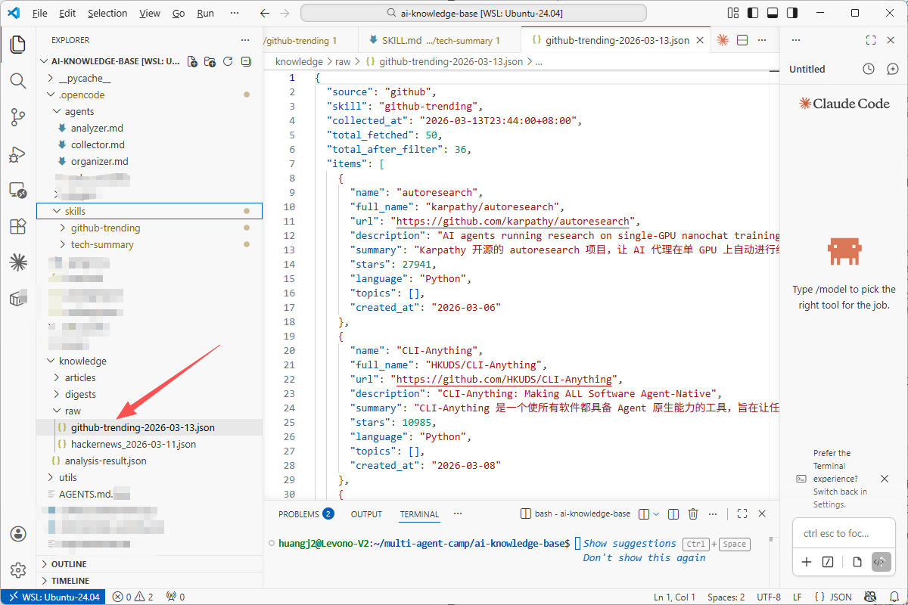
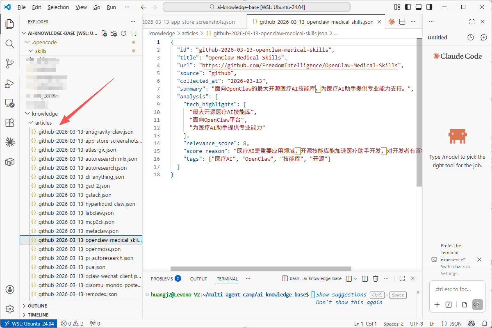

>**目标**：采集→分析→整理 三步跑通 + 知识条目产出，**这是第 1 周最关键的实操环节。**

---

## 步骤 1：采集（Agent + Skill 联合）

>以下操作可以用 **OpenCode**、**Claude Code**、**Cursor**、**Trae** 或**通义灵码**等任意 AI 编程工具完成。
```plain
cd ~/ai-knowledge-base
opencode
```
**提示词：**

```plain
@collector 请调用 github-trending 技能，按照 .opencode/skills/github-trending/SKILL.md 的 7 个步骤，采集本周 AI 领域的 GitHub 热门项目。
搜索完成后把 JSON 数据保存到 knowledge/raw/github-trending-今天日期.json
```
**理解代码：**
>如果你对 Agent + Skill 的联合使用有疑问，可以让 AI 编程工具解释：“Agent 和 Skill 是如何配合工作的？Agent 定义角色和权限，Skill 定义具体步骤，对吗？”
验证产出：

```plain
ls knowledge/raw/
python3 -c "
import json, glob
files = sorted(glob.glob('knowledge/raw/github-trending-*.json'))
if files:
    data = json.load(open(files[-1]))
    print(f'采集条目数: {len(data.get(\"items\", []))}')
    for item in data.get('items', [])[:3]:
        print(f'  - {item.get(\"name\")}: {item.get(\"stars\", \"?\")} stars')
else:
    print('未找到采集文件')
"
```




**检查清单：**

|检查项|期望值|
|:----|:----|
|JSON 文件存在|是|
|items 条数 >= 10|是|
|每条有 name + url + summary（中文）|是|

---


## 步骤 2：分析（Agent + Skill 联合）

**提示词：**

```plain
@analyzer 请调用 tech-summary 技能，读取 knowledge/raw/ 中最新的采集数据，
按照 .opencode/skills/tech-summary/SKILL.md 的 4 个步骤进行深度分析。
输出分析结果。
```
**检查清单：**
|检查项|期望值|
|:----|:----|
|每条有摘要（不超过 50 字）|是|
|每条有技术亮点（2-3 个，用事实）|是|
|评分有区分度 + 附理由|是|
|有趋势发现|是|

---

## 步骤 3：整理归档

**提示词：**

```plain
@organizer 将上面的分析结果整理为标准知识条目：
1. 与 knowledge/articles/ 已有条目做去重检查
2. 格式化为标准 JSON（包含 id, title, source_url, summary, tags, status 字段）
3. 每个条目单独存为 knowledge/articles/{date}-{source}-{slug}.json
```

验证产出：

```plain
ls knowledge/articles/
ls knowledge/articles/*.json 2>/dev/null | wc -l

---
```


## 步骤 4：V1 产出汇总

完成三步后，你的项目结构应该是：

```plain
ai-knowledge-base/
├── AGENTS.md                              ← 项目规范（Memory）
├── .opencode/
│   ├── agents/
│   │   ├── collector.md                   ← 采集 Agent
│   │   ├── analyzer.md                    ← 分析 Agent
│   │   └── organizer.md                   ← 整理 Agent
│   └── skills/
│       ├── github-trending/SKILL.md       ← 采集技能
│       └── tech-summary/SKILL.md          ← 分析技能
└── knowledge/
    ├── raw/
    │   └── github-trending-2026-03-XX.json  ← 原始数据
    └── articles/
        ├── xxx.json                       ← 知识条目 1
        └── ...                            ← 更多条目
```
**理解代码：**
>如果你对整体架构有疑问，可以让 AI 编程工具解释： "请画一张流程图，说明 AGENTS.md、.opencode/agents/、.opencode/skills/、knowledge/ 这四个部分之间的关系。"

---

## 提交到 Git

```plain
cd ~/ai-knowledge-base
git add .
git commit -m "feat: complete V1 - agents, skills, and first batch of knowledge"

---
```


## 核心回顾

**V1 架构四要素**：

* **Memory**（AGENTS.md）= 规范

* **Sub-Agents**（.opencode/agents/*.md）= 角色

* **Skills**（.opencode/skills/*/SKILL.md）= 操作手册

* **知识数据**（knowledge/）= 产出

下周会把这个手动系统升级为**全自动流水线** —— Hooks + MCP + CI/CD。

---

**完成！** V1 完整流程跑通——你的 AI 知识库有了第一批结构化数据。

