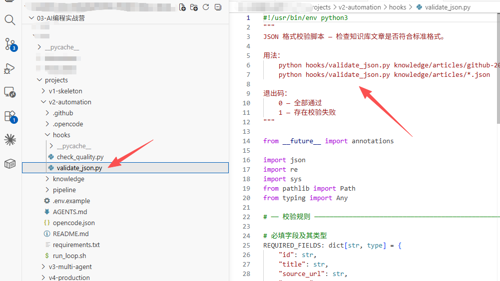
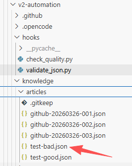
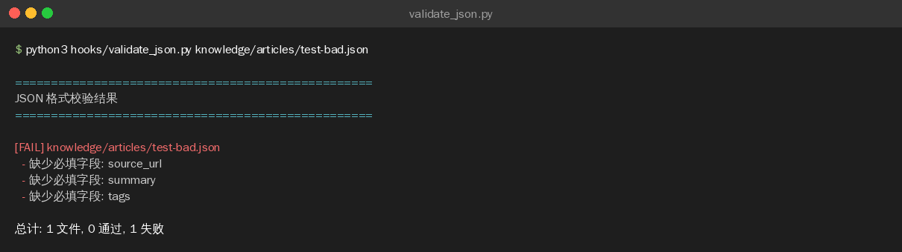
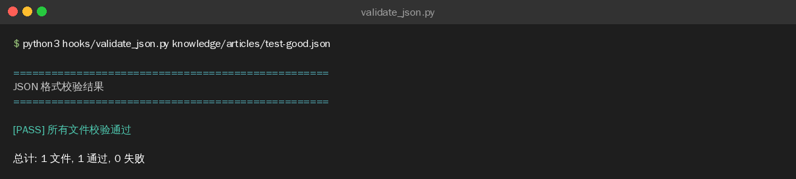

>**目标**：validate_json.py 能正确校验知识条目 + 通过/失败都有输出

---
从这里开始，你可以把第一周的内容复制到一个新目录，开始制作第二周升级版v2。本周目标实现自动化运营。


## 1.1 创建 hooks 目录


```plain
cd ~/ai-knowledge-base
mkdir -p hooks

---
```


## 1.2 用 AI 编程工具生成 validate_json.py

>以下代码可以用 **OpenCode**、**Claude Code**、**Cursor**、**Trae** 或**通义灵码**等任意 AI 编程工具生成。
**提示词：**

```plain
请帮我编写一个 Python 脚本 hooks/validate_json.py，用于校验知识条目 JSON 文件：

需求：
1. 支持单文件和多文件（通配符 *.json）两种输入模式
2. 检查 JSON 是否能正确解析
3. 必填字段使用 dict[str, type] 格式，同时校验字段存在性和类型：
   id(str), title(str), source_url(str), summary(str), tags(list), status(str)
4. 检查 ID 格式是否为 {source}-{YYYYMMDD}-{NNN}（如 github-20260317-001）
5. 检查 status 是否为 draft/review/published/archived 之一
6. 检查 URL 格式（https?://...）
7. 检查摘要最少 20 字、标签至少 1 个
8. 检查 score（如有）是否在 1-10 范围，audience（如有）是否为 beginner/intermediate/advanced
9. 命令行用法：python hooks/validate_json.py <json_file> [json_file2 ...]
10. 校验通过 exit 0，失败 exit 1 + 错误列表 + 汇总统计

编码规范：遵循 PEP 8，使用 pathlib，不依赖第三方库
```

**生成的代码：**（参考实现）

```plain
#!/usr/bin/env python3
"""
JSON 格式校验脚本 — 检查知识库文章是否符合标准格式。

用法：
    python hooks/validate_json.py knowledge/articles/github-20260317-001.json
    python hooks/validate_json.py knowledge/articles/*.json

退出码：
    0 — 全部通过
    1 — 存在校验失败
"""

from __future__ import annotations

import json
import re
import sys
from pathlib import Path
from typing import Any

# ── 校验规则 ─────────────────────────────────────────────────────────────

# 必填字段及其类型
REQUIRED_FIELDS: dict[str, type] = {
    "id": str,
    "title": str,
    "source_url": str,
    "summary": str,
    "tags": list,
    "status": str,
}

# ID 格式：{source}-{YYYYMMDD}-{NNN}
ID_PATTERN = re.compile(r"^[a-z][\w:-]+-\d{8}-\d{3}$")

# 合法的 status 值
VALID_STATUSES = {"draft", "review", "published", "archived"}

# score 范围
SCORE_MIN = 1
SCORE_MAX = 10

# URL 基本格式
URL_PATTERN = re.compile(r"^https?://\S+$")

# 摘要最小长度（字符数）
SUMMARY_MIN_LENGTH = 20

# 合法的 audience 值
VALID_AUDIENCES = {"beginner", "intermediate", "advanced"}


# ── 校验函数 ─────────────────────────────────────────────────────────────

def validate_article(data: dict[str, Any]) -> list[str]:
    """
    校验单篇文章，返回错误列表。

    Args:
        data: 文章 JSON 数据

    Returns:
        错误消息列表，空列表表示校验通过
    """
    errors: list[str] = []

    # 检查必填字段（同时校验存在性和类型）
    for field_name, field_type in REQUIRED_FIELDS.items():
        if field_name not in data:
            errors.append(f"缺少必填字段: {field_name}")
        elif not isinstance(data[field_name], field_type):
            errors.append(
                f"字段类型错误: {field_name} 应为 {field_type.__name__}，"
                f"实际为 {type(data[field_name]).__name__}"
            )

    # 如果必填字段缺失，后续校验无意义
    if errors:
        return errors

    # ID 格式
    article_id = data["id"]
    if not ID_PATTERN.match(article_id):
        errors.append(
            f"ID 格式错误: '{article_id}'，"
            f"应为 '{{source}}-{{YYYYMMDD}}-{{NNN}}'"
        )

    # 标题非空
    if not data["title"].strip():
        errors.append("标题不能为空")

    # URL 格式
    source_url = data["source_url"]
    if not URL_PATTERN.match(source_url):
        errors.append(f"URL 格式错误: '{source_url}'")

    # 摘要长度
    summary = data["summary"]
    if len(summary.strip()) < SUMMARY_MIN_LENGTH:
        errors.append(
            f"摘要太短: {len(summary.strip())} 字，"
            f"要求至少 {SUMMARY_MIN_LENGTH} 字"
        )

    # 标签非空
    tags = data["tags"]
    if len(tags) == 0:
        errors.append("至少需要 1 个标签")
    for tag in tags:
        if not isinstance(tag, str) or not tag.strip():
            errors.append(f"标签格式错误: '{tag}'")

    # status 值
    status = data["status"]
    if status not in VALID_STATUSES:
        errors.append(
            f"无效的 status: '{status}'，"
            f"允许值: {', '.join(sorted(VALID_STATUSES))}"
        )

    # score 范围（可选字段，存在时校验）
    if "score" in data:
        score = data["score"]
        if not isinstance(score, (int, float)):
            errors.append(f"score 应为数字，实际为 {type(score).__name__}")
        elif not (SCORE_MIN <= score <= SCORE_MAX):
            errors.append(
                f"score 超出范围: {score}，"
                f"允许范围: {SCORE_MIN}-{SCORE_MAX}"
            )

    # audience（可选字段，存在时校验）
    if "audience" in data:
        audience = data["audience"]
        if audience not in VALID_AUDIENCES:
            errors.append(
                f"无效的 audience: '{audience}'，"
                f"允许值: {', '.join(sorted(VALID_AUDIENCES))}"
            )

    return errors


# ── CLI 入口 ─────────────────────────────────────────────────────────────

def main() -> int:
    if len(sys.argv) < 2:
        print("用法: python hooks/validate_json.py <json_file> [json_file2 ...]")
        print("示例: python hooks/validate_json.py knowledge/articles/*.json")
        return 1

    files = sys.argv[1:]
    total_files = 0
    failed_files = 0
    all_errors: dict[str, list[str]] = {}

    for filepath in files:
        path = Path(filepath)
        if not path.exists():
            print(f"[SKIP] 文件不存在: {filepath}")
            continue
        if not path.suffix == ".json":
            print(f"[SKIP] 非 JSON 文件: {filepath}")
            continue

        total_files += 1

        try:
            with open(path, "r", encoding="utf-8") as f:
                data = json.load(f)
        except json.JSONDecodeError as e:
            all_errors[filepath] = [f"JSON 解析失败: {e}"]
            failed_files += 1
            continue

        errors = validate_article(data)
        if errors:
            all_errors[filepath] = errors
            failed_files += 1

    # 输出结果
    print(f"\n{'='*50}")
    print(f"JSON 格式校验结果")
    print(f"{'='*50}")

    if all_errors:
        for filepath, errors in all_errors.items():
            print(f"\n[FAIL] {filepath}")
            for err in errors:
                print(f"  - {err}")
    else:
        print("\n[PASS] 所有文件校验通过")

    print(f"\n总计: {total_files} 文件, {total_files - failed_files} 通过, {failed_files} 失败")

    return 1 if failed_files > 0 else 0


if __name__ == "__main__":
    sys.exit(main())
```
>如果你对这段代码有疑问，可以让 AI 编程工具解释：
>`请解释 hooks/validate_json.py 的设计：`
>`1. REQUIRED_FIELDS 为什么用 dict[str, type] 而不是简单列表？`
>`2. validate_article() 为什么在必填字段缺失时提前返回？`
>`3. main() 函数为什么支持多文件输入和汇总统计？`

---

## 1.3 创建测试用例

创建一个**正确的**测试文件：

```plain
mkdir -p knowledge/articles

cat > knowledge/articles/test-good.json << 'EOF'
{
  "id": "github-20260310-001",
  "title": "OpenCode",
  "source_url": "https://github.com/nicepkg/opencode",
  "summary": "开源 AI 编程终端工具，支持 100+ 模型，MIT 协议，Go 语言编写，支持国产模型直连",
  "tags": ["agent", "tool-use", "code-generation"],
  "status": "review",
  "score": 9
}
EOF
```
再创建一个**有问题的**测试文件：
```plain
cat > knowledge/articles/test-bad.json << 'EOF'
{
  "id": "bad",
  "title": "测试",
  "status": "unknown_status"
}
EOF
```




---
## 1.4 运行校验

```plain
# 校验正确文件
python hooks/validate_json.py knowledge/articles/test-good.json

# 校验有问题的文件
python hooks/validate_json.py knowledge/articles/test-bad.json

# 批量校验（支持通配符）
python hooks/validate_json.py knowledge/articles/*.json
```
**校验正确文件 — 输出 PASS：**

**校验有问题文件 — 输出 FAIL + 错误列表：**


**检查清单：**

|检查项|期望|实际|
|:----|:----|:----|
|正确文件输出 PASS|是||
|错误文件输出 FAIL + 错误列表|是||
|缺少字段能检测出来|是||
|字段类型错误能检测出来|是||
|无效状态能检测出来|是||
|ID 格式错误能检测出来|是||
|汇总统计正确显示|是||


---

## 1.5 清理测试文件

```plain
rm knowledge/articles/test-good.json knowledge/articles/test-bad.json

---
```


## 提交到 Git

```plain
git add hooks/validate_json.py
git commit -m "feat: add JSON validation hook script"

---
```


**完成！** 格式校验脚本就绪，进入实操 2 编写。

