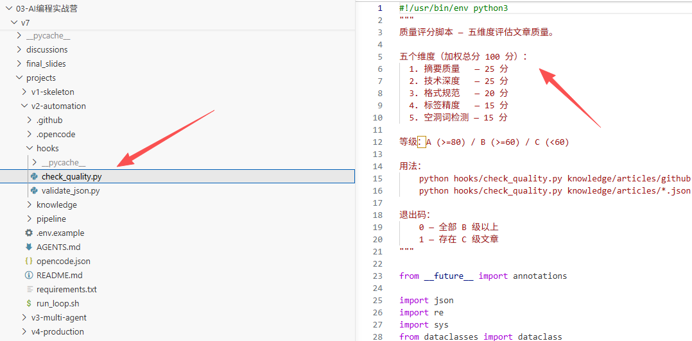
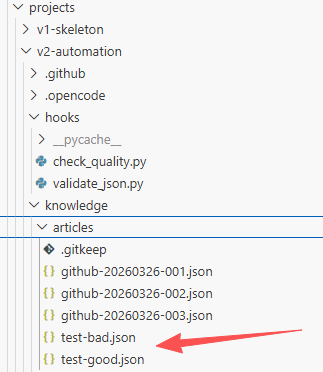
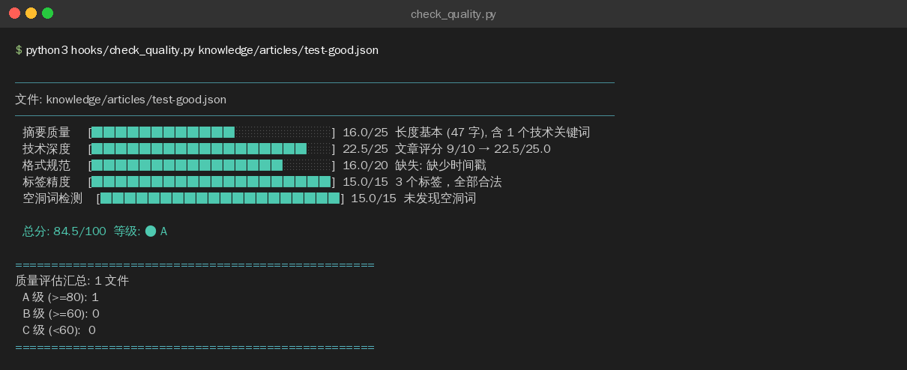
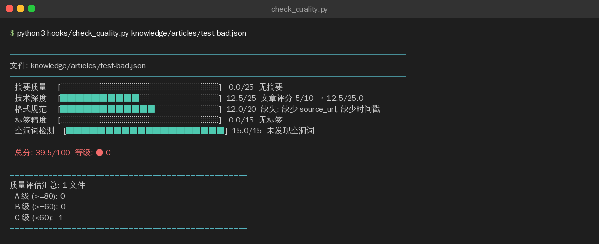

>目标：check_quality.py 能对知识条目打分 + 输出质量报告

---

## 2.1 用 AI 编程工具生成 check_quality.py

>以下代码可以用 **OpenCode**、**Claude Code**、**Cursor**、**Trae** 或**通义灵码**等任意 AI 编程工具生成。
**提示词：**

```plain
请帮我编写一个 Python 脚本 hooks/check_quality.py，用于给知识条目做 5 维度质量评分：

需求：
1. 支持单文件和多文件（通配符 *.json）两种输入模式
2. 使用 dataclass 定义 DimensionScore 和 QualityReport 结构
3. 5 个评分维度及满分（加权总分 100 分）：
   - 摘要质量 (25 分)：>= 50 字满分，>= 20 字基本分，含技术关键词有奖励
   - 技术深度 (25 分)：基于文章 score 字段（1-10 映射到 0-25）
   - 格式规范 (20 分)：id、title、source_url、status、时间戳五项各 4 分
   - 标签精度 (15 分)：1-3 个合法标签最佳，有标准标签列表校验
   - 空洞词检测 (15 分)：不含"赋能""抓手""闭环""打通"等空洞词
4. 空洞词黑名单分中英两组：
   - 中文：赋能、抓手、闭环、打通、全链路、底层逻辑、颗粒度、对齐、拉通、沉淀、强大的、革命性的
   - 英文：groundbreaking、revolutionary、game-changing、cutting-edge 等
5. 输出可视化进度条 + 每维度得分 + 等级 A/B/C
6. 等级标准：A >= 80, B >= 60, C < 60
7. 退出码：存在 C 级返回 1，否则返回 0

编码规范：遵循 PEP 8，使用 pathlib 和 dataclass，不依赖第三方库
```

**生成的代码：**（参考实现）

```plain
#!/usr/bin/env python3
"""
质量评分脚本 — 五维度评估文章质量。

五个维度（加权总分 100 分）：
  1. 摘要质量   — 25 分
  2. 技术深度   — 25 分
  3. 格式规范   — 20 分
  4. 标签精度   — 15 分
  5. 空洞词检测 — 15 分

等级：A (>=80) / B (>=60) / C (<60)

用法：
    python hooks/check_quality.py knowledge/articles/github-20260317-001.json
    python hooks/check_quality.py knowledge/articles/*.json

退出码：
    0 — 全部 B 级以上
    1 — 存在 C 级文章
"""

from __future__ import annotations

import json
import sys
from dataclasses import dataclass
from pathlib import Path
from typing import Any

# ── 空洞词列表 ───────────────────────────────────────────────────────────

HOLLOW_WORDS_ZH = [
    "赋能", "抓手", "闭环", "打通", "全链路", "底层逻辑",
    "颗粒度", "对齐", "拉通", "沉淀", "强大的", "革命性的",
]

HOLLOW_WORDS_EN = [
    "groundbreaking", "revolutionary", "game-changing", "cutting-edge",
    "state-of-the-art", "leverage", "synergy", "paradigm shift",
    "disruptive", "next-generation", "world-class",
]

HOLLOW_WORDS = HOLLOW_WORDS_ZH + HOLLOW_WORDS_EN

# ── 合法标签列表 ─────────────────────────────────────────────────────────

VALID_TAGS = {
    "agent", "rag", "mcp", "llm", "fine-tuning", "prompt-engineering",
    "multi-agent", "tool-use", "evaluation", "deployment", "security",
    "reasoning", "code-generation", "vision", "audio", "robotics",
}


# ── 评分结构 ─────────────────────────────────────────────────────────────

@dataclass
class DimensionScore:
    """单维度评分"""
    name: str
    score: float
    max_score: float
    details: str

    @property
    def percentage(self) -> float:
        return (self.score / self.max_score * 100) if self.max_score > 0 else 0


@dataclass
class QualityReport:
    """质量评估报告"""
    filepath: str
    dimensions: list[DimensionScore]

    @property
    def total_score(self) -> float:
        return sum(d.score for d in self.dimensions)

    @property
    def max_total(self) -> float:
        return sum(d.max_score for d in self.dimensions)

    @property
    def grade(self) -> str:
        score = self.total_score
        if score >= 80:
            return "A"
        elif score >= 60:
            return "B"
        else:
            return "C"


# ── 五维度评分函数 ───────────────────────────────────────────────────────

def score_summary_quality(data: dict[str, Any]) -> DimensionScore:
    """维度 1：摘要质量（25 分）— >= 50 字满分，含技术关键词有奖励。"""
    max_score = 25.0
    summary = data.get("summary", "").strip()

    if not summary:
        return DimensionScore("摘要质量", 0, max_score, "无摘要")

    length = len(summary)
    if length >= 50:
        base = 20.0
        detail = f"长度充足 ({length} 字)"
    elif length >= 20:
        base = 15.0
        detail = f"长度基本 ({length} 字)"
    else:
        base = 5.0
        detail = f"太短 ({length} 字)"

    # 技术关键词奖励（+5 分封顶）
    tech_keywords = [
        "模型", "训练", "推理", "API", "框架", "agent", "LLM", "RAG",
        "token", "向量", "embedding", "transformer", "微调",
    ]
    keyword_count = sum(1 for kw in tech_keywords if kw.lower() in summary.lower())
    bonus = min(5.0, keyword_count * 1.0)
    if bonus > 0:
        detail += f", 含 {keyword_count} 个技术关键词"

    score = min(max_score, base + bonus)
    return DimensionScore("摘要质量", score, max_score, detail)


def score_tech_depth(data: dict[str, Any]) -> DimensionScore:
    """维度 2：技术深度（25 分）— 基于文章 score 字段（1-10 映射）。"""
    max_score = 25.0
    article_score = data.get("score", 5)

    if not isinstance(article_score, (int, float)):
        return DimensionScore("技术深度", 10, max_score, "score 字段类型异常")

    mapped = (article_score / 10) * max_score
    detail = f"文章评分 {article_score}/10 → {mapped:.1f}/{max_score}"
    return DimensionScore("技术深度", round(mapped, 1), max_score, detail)


def score_format(data: dict[str, Any]) -> DimensionScore:
    """维度 3：格式规范（20 分）— id/title/source_url/status/时间戳各 4 分。"""
    max_score = 20.0
    score = 0.0
    checks: list[str] = []

    for field_name, points in [("id", 4), ("title", 4), ("source_url", 4), ("status", 4)]:
        if data.get(field_name, "") and str(data[field_name]).strip():
            score += points
        else:
            checks.append(f"缺少 {field_name}")

    if data.get("updated_at") or data.get("collected_at"):
        score += 4
    else:
        checks.append("缺少时间戳")

    detail = "完整" if not checks else "缺失: " + ", ".join(checks)
    return DimensionScore("格式规范", score, max_score, detail)


def score_tags(data: dict[str, Any]) -> DimensionScore:
    """维度 4：标签精度（15 分）— 1-3 个合法标签最佳。"""
    max_score = 15.0
    tags = data.get("tags", [])

    if not tags:
        return DimensionScore("标签精度", 0, max_score, "无标签")

    valid_count = sum(1 for t in tags if t in VALID_TAGS)
    total_count = len(tags)

    if 1 <= total_count <= 3 and valid_count == total_count:
        score = 15.0
        detail = f"{total_count} 个标签，全部合法"
    elif valid_count > 0:
        score = 10.0
        detail = f"{valid_count}/{total_count} 个合法标签"
    else:
        score = 5.0
        detail = f"有 {total_count} 个标签但均不在标准列表"

    if total_count > 5:
        penalty = min(5.0, (total_count - 5) * 1.0)
        score = max(0, score - penalty)
        detail += f", 标签过多 (扣 {penalty} 分)"

    return DimensionScore("标签精度", score, max_score, detail)


def score_hollow_words(data: dict[str, Any]) -> DimensionScore:
    """维度 5：空洞词检测（15 分）— 每出现一个空洞词扣 3 分。"""
    max_score = 15.0
    text = (data.get("summary", "") + " " + data.get("title", "")).lower()

    found = [word for word in HOLLOW_WORDS if word.lower() in text]
    penalty = min(max_score, len(found) * 3.0)
    score = max_score - penalty

    if found:
        detail = f"发现 {len(found)} 个空洞词: {', '.join(found[:5])}"
    else:
        detail = "未发现空洞词"

    return DimensionScore("空洞词检测", score, max_score, detail)


# ── 综合评估 ─────────────────────────────────────────────────────────────

def evaluate_quality(filepath: str, data: dict[str, Any]) -> QualityReport:
    """对单篇文章进行五维度综合评估。"""
    dimensions = [
        score_summary_quality(data),
        score_tech_depth(data),
        score_format(data),
        score_tags(data),
        score_hollow_words(data),
    ]
    return QualityReport(filepath=filepath, dimensions=dimensions)


def print_report(report: QualityReport) -> None:
    """格式化输出评估报告（含可视化进度条）。"""
    print(f"\n{'─'*50}")
    print(f"文件: {report.filepath}")
    print(f"{'─'*50}")

    for d in report.dimensions:
        bar_len = int(d.percentage / 5)
        bar = "█" * bar_len + "░" * (20 - bar_len)
        print(f"  {d.name:8s} [{bar}] {d.score:5.1f}/{d.max_score:.0f}  {d.details}")

    print(f"\n  总分: {report.total_score:.1f}/{report.max_total:.0f}  "
          f"等级: {report.grade}")


# ── CLI 入口 ─────────────────────────────────────────────────────────────

def main() -> int:
    if len(sys.argv) < 2:
        print("用法: python hooks/check_quality.py <json_file_or_dir> [...]")
        print("示例: python hooks/check_quality.py knowledge/articles/*.json")
        print("      python hooks/check_quality.py knowledge/articles/")
        return 1

    # 支持传目录或文件：目录自动展开为其中所有 .json 文件
    raw_args = sys.argv[1:]
    files: list[str] = []
    for arg in raw_args:
        p = Path(arg)
        if p.is_dir():
            files.extend(str(f) for f in sorted(p.glob("*.json")))
        else:
            files.append(arg)

    total_files = 0
    grade_counts = {"A": 0, "B": 0, "C": 0}
    has_c_grade = False

    for filepath in files:
        path = Path(filepath)
        if not path.exists() or path.suffix != ".json":
            continue

        total_files += 1

        try:
            with open(path, "r", encoding="utf-8") as f:
                data = json.load(f)
        except json.JSONDecodeError as e:
            print(f"[ERROR] {filepath}: JSON 解析失败 — {e}")
            has_c_grade = True
            continue

        report = evaluate_quality(filepath, data)
        print_report(report)
        grade_counts[report.grade] = grade_counts.get(report.grade, 0) + 1

        if report.grade == "C":
            has_c_grade = True

    # 汇总
    print(f"\n{'='*50}")
    print(f"质量评估汇总: {total_files} 文件")
    print(f"  A 级 (>=80): {grade_counts.get('A', 0)}")
    print(f"  B 级 (>=60): {grade_counts.get('B', 0)}")
    print(f"  C 级 (<60):  {grade_counts.get('C', 0)}")
    print(f"{'='*50}")

    return 1 if has_c_grade else 0


if __name__ == "__main__":
    sys.exit(main())
```
>如果你对这段代码有疑问，可以让 AI 编程工具解释：
>`请解释 hooks/check_quality.py 的设计：`
>`1. 为什么用 dataclass 定义 DimensionScore 和 QualityReport？`
>`2. 五个维度的分数是如何加总到 100 分的？`
>`3. 如果我想加一个新的评分维度，需要改哪几处？`

---

## 2.2 创建测试用例

**高质量条目（预期 A 级）：**

```plain
mkdir -p knowledge/articles

cat > knowledge/articles/test-quality-good.json << 'EOF'
{
  "id": "github-20260310-001",
  "title": "OpenCode — 开源 AI 编程终端",
  "source_url": "https://github.com/nicepkg/opencode",
  "summary": "开源 AI 编程终端工具，MIT 协议，支持 100+ 模型直连，基于 Go 语言的 agent 框架，支持 LLM 推理和 RAG 检索",
  "tags": ["agent", "tool-use", "code-generation"],
  "status": "review",
  "score": 9,
  "collected_at": "2026-03-10T08:00:00Z"
}
EOF
```
**低质量条目（预期 C 级）：**
```plain
cat > knowledge/articles/test-quality-bad.json << 'EOF'
{
  "id": "bad",
  "title": "一个赋能全链路的革命性的项目",
  "summary": "底层逻辑打通闭环",
  "status": "review"
}
EOF
```




---

## 2.3 运行质量评分

```plain
# 逐个检查
python hooks/check_quality.py knowledge/articles/test-quality-good.json
python hooks/check_quality.py knowledge/articles/test-quality-bad.json

# 批量检查（支持通配符）
python hooks/check_quality.py knowledge/articles/*.json
```
**高质量条目评分结果（84.5 分，A 级）：**

**低质量条目评分结果（39.5 分，C 级）：**



**检查清单：**

|检查项|期望|实际|
|:----|:----|:----|
|高质量条目 >= 80 分|是||
|低质量条目 < 60 分|是||
|空洞用词被检测出来|是||
|缺少字段被扣分|是||
|标签不足被扣分|是||


---

## 2.4 清理测试文件

```plain
rm knowledge/articles/test-quality-*.json

---
```


## 提交到 Git

```plain
git add hooks/check_quality.py
git commit -m "feat: add content quality scoring hook"

---
```


**完成！** 两个质量校验脚本都写好了，进入实操 3 配置 Plugin Hook（选修）。

