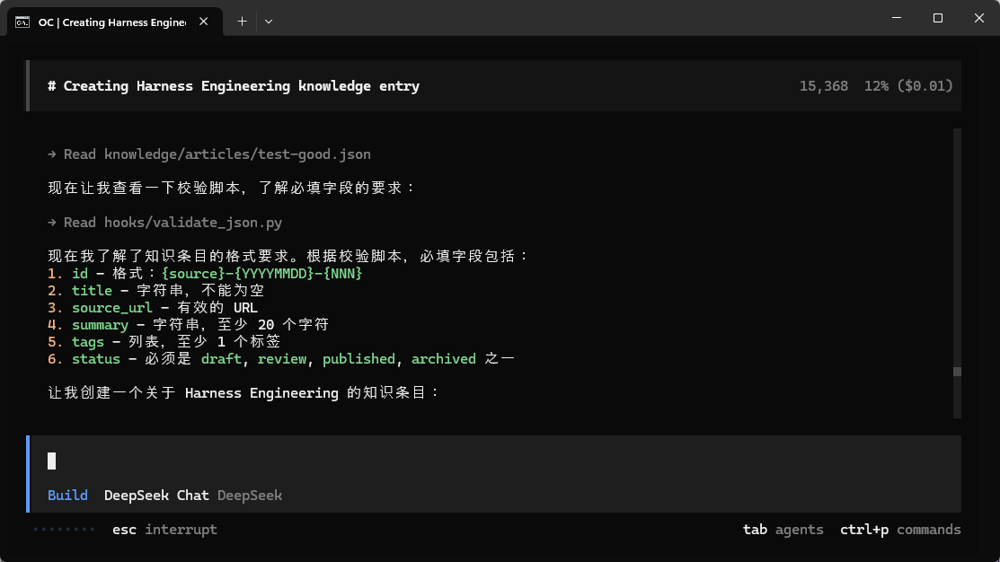
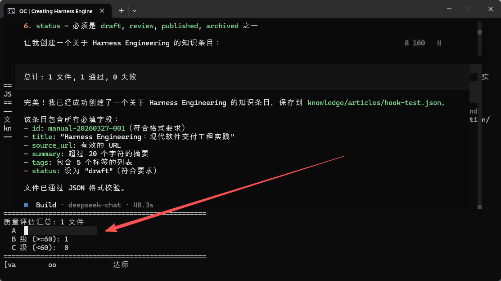
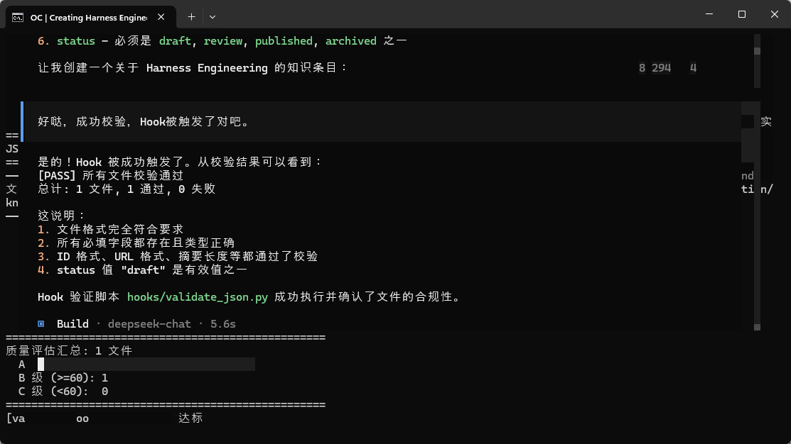

>**目标**：在 OpenCode 中触发完整的 产出→校验→修正→再校验 循环 跳过本实操不影响后续课程。

---

## 3.0 为什么这是选修？

实操 1 和实操 2 你写了 `validate_json.py` 和 `check_quality.py`——这两个脚本就是反馈循环里的**裁判**。你可以随时手动运行它们来校验质量。

本实操配置 OpenCode Plugin，让校验**自动触发**。这需要 TypeScript 基础和对 OpenCode 插件系统的理解。


**重要提示**：手动跑校验脚本已经完整体现了反馈驱动的核心概念。自动 Hook 是锦上添花。


---

## 3.1 手动模拟反馈循环

在配置自动 Hook 之前，先手动跑一遍完整循环，理解原理。

### Step A：让 Agent 产出一个知识条目

```plain
cd ~/ai-knowledge-base
opencode
```
在 OpenCode 中输入：
```plain
请先读取 AGENTS.md 中的「知识条目格式」部分，
然后按照其中定义的 JSON 格式，创建一个关于 LangGraph 的知识条目，
保存到 knowledge/articles/test-loop.json。

要求：
1. 所有必填字段都要有（id, title, source_url, summary, tags, status）
2. status 设为 "draft"
3. tags 至少 2 个
4. summary 不超过 50 字
```
>[截图占位：OpenCode 生成知识条目的过程]
### Step B：用校验脚本检查

```plain
python3 hooks/validate_json.py knowledge/articles/test-loop.json
python3 hooks/check_quality.py knowledge/articles/test-loop.json
```
### Step C：把错误反馈给 Agent（如有错误）

**完整地**把校验输出粘贴回 OpenCode（不要只描述，要粘贴原文）：

```plain
刚才创建的 test-loop.json 校验不通过，错误如下：

[粘贴你实际看到的校验输出]

请重新读取 AGENTS.md 中的「知识条目格式」部分，对照修正这个文件。
```
### Step D：再次校验

```plain
python3 hooks/validate_json.py knowledge/articles/test-loop.json
```
通常 1-2 轮即可通过。这就是完整的反馈循环：
```plain
产出(Act) → 校验(Verify) → 发现问题 → 反馈给Agent → 修正(Fix) → 再校验 → 通过

---
```


## 3.2 配置 TypeScript Plugin 自动 Hook

>**重要区别**：OpenCode 的 Hook 不是 JSON 配置式的（不是 `settings.json`）， 而是 **TypeScript Plugin**，放在 `.opencode/plugins/` 目录下自动加载。 这和 Claude Code 的 JSON Shell Hook 方式完全不同。
### Step 1：初始化插件环境

```plain
cd ~/ai-knowledge-base
mkdir -p .opencode/plugins
cd .opencode
npm init -y
npm install @opencode-ai/plugin
```
### Step 2：用 AI 编程工具生成校验插件

>以下代码可以用 **OpenCode**、**Claude Code**、**Cursor**、**Trae** 或**通义灵码**等任意 AI 编程工具生成。
**提示词：**

```plain
请帮我编写一个 OpenCode TypeScript 插件 .opencode/plugins/validate.ts：

需求：
1. 监听 tool.execute.after 事件
2. 当 Agent 使用 write 或 edit 工具写入 knowledge/articles/*.json 时触发
3. 触发时调用 python3 hooks/validate_json.py <file_path>
4. 使用 Bun Shell API（$ 模板字符串）执行命令
5. 必须使用 .nothrow() 而非 .quiet()（.quiet() 会导致 OpenCode 卡死）
6. 必须用 try/catch 包裹所有 shell 调用（未捕获异常会阻塞 Agent）

关键 API：
- import type { Plugin } from "@opencode-ai/plugin"
- input.tool 是工具名（如 "write"、"edit"）
- input.args.file_path 或 input.args.filePath 是文件路径
```
**生成的代码：**（参考实现）
```plain
import type { Plugin } from "@opencode-ai/plugin"

export const ValidateHook: Plugin = async ({ $ }) => {
  return {
    "tool.execute.after": async (input) => {
      const tool = input.tool
      const filePath = input.args?.file_path ?? input.args?.filePath ?? ""

      // 只对 knowledge/articles/ 下的 JSON 文件触发
      if (
        (tool === "write" || tool === "edit") &&
        typeof filePath === "string" &&
        filePath.includes("knowledge/articles/") &&
        filePath.endsWith(".json")
      ) {
        try {
          // 调用 Python 校验脚本
          await $`python3 hooks/validate_json.py ${filePath}`.nothrow()
        } catch {
          // 吞掉异常，避免阻塞 OpenCode
        }
      }
    },
  }
}
```
>如果你对这段代码有疑问，可以让 AI 编程工具解释：
>`请解释 .opencode/plugins/validate.ts 的关键设计：`
>`1. 为什么用 .nothrow() 而不是 .quiet()？`
>`2. try/catch 为什么是必须的？不加会怎样？`
>`3. input.args?.file_path ?? input.args?.filePath 为什么要两种写法？`
**关键 API 说明：**

|字段|含义|
|:----|:----|
|tool.execute.after|工具执行**后**触发|
|input.tool|工具名，如 "write"、"edit"、"read"|
|input.args.file_path|文件路径（注意：不是 output.args，是 input.args）|
|$`...`|Bun Shell API，用于执行外部命令|
|.nothrow()|非零退出码不抛异常|

### 踩坑清单（真实踩过的坑）

|坑|说明|解决方案|
|:----|:----|:----|
|.quiet() 可能导致 OpenCode 卡死|抑制输出后 Promise 可能无法 resolve|用 .nothrow() + try/catch|
|插件抛异常会阻塞 Agent|未捕获的异常会卡住整个执行流程|**必须** try/catch 包裹所有 Shell 调用|
|卡死后下次可能不触发|按 Esc 中断后 Hook 可能失效|重启 OpenCode|
|插件加载位置|项目级 .opencode/plugins/（自动加载）|确保文件在正确目录|

### Step 3：验证 Hook 是否生效

重启 OpenCode（插件在启动时加载）：

```plain
cd ~/ai-knowledge-base
opencode
```
让 Agent 写入一个新的知识条目：
```plain
请先读取 AGENTS.md 中的「知识条目格式」，
然后创建一个关于 Harness Engineering 的知识条目，
保存到 knowledge/articles/hook-test.json。
所有必填字段都要有，status 设为 "draft"。
```
>[截图占位：如果 Hook 生效，你会看到校验脚本的输出自动打印]



**如果 Hook 没有自动触发**——不用担心，可能是 OpenCode 版本差异。 手动跑 `python3 hooks/validate_json.py knowledge/articles/hook-test.json` 完全 OK。 **重要的不是自动化本身，而是你理解了闭环的概念。**

### OpenCode Hook 事件一览（参考）

|事件|说明|
|:----|:----|
|tool.execute.before|工具执行前，可修改参数或阻止执行|
|tool.execute.after|工具执行后，可做校验、格式化|
|shell.env|注入环境变量|
|permission.ask|拦截权限请求|
|chat.message|新消息到达时|
|chat.params|修改 LLM 参数|
|experimental.session.compacting|会话压缩时注入上下文|
|experimental.chat.system.transform|修改 system prompt|


---

## 3.3 清理测试文件

```plain
rm -f knowledge/articles/test-loop.json knowledge/articles/hook-test.json

---
```


## 提交到 Git

```plain
git add hooks/ .opencode/
git commit -m "feat: add quality hook config and validation scripts"

---
```


## 常见问题

**Q：Agent 修正后还是不通过怎么办？**

检查三件事：

1. AGENTS.md 里的 JSON 格式是否包含 `source_url`、`tags`、`status` 字段

2. 你的 prompt 是否明确要求 Agent "读取 AGENTS.md"

3. 反馈时是否粘贴了**完整的**校验错误输出

**Q：为什么不直接在 prompt 里告诉 Agent 所有字段？**

可以，但那样你就把“规则”写死在 prompt 里了。让 Agent 读 AGENTS.md 的好处是：以后你改了格式，只需要改一处（AGENTS.md），所有 Agent 自动适配。


---

**完成！** 第 5 节全部实操结束。你已经理解了反馈驱动循环的核心——从开环变闭环。

