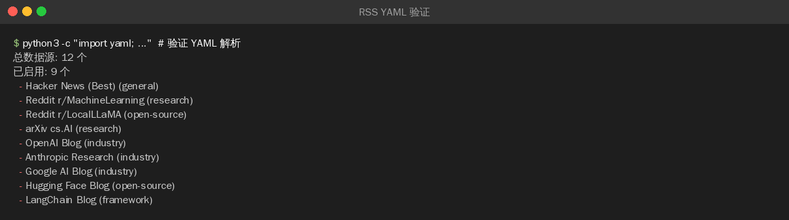

>**目标**：rss_sources.yaml 配置完成 + Pipeline 能读取并采集 RSS 数据

---
## 3.1 用 AI 编程工具生成 rss_sources.yaml

>以下配置可以用 **OpenCode**、**Claude Code**、**Cursor**、**Trae** 或**通义灵码**等任意 AI 编程工具生成。
**提示词：**

```plain
请帮我创建 pipeline/rss_sources.yaml，配置知识库的 RSS 数据源：

需求：
1. YAML 格式，每个源包含 name、url、category、enabled 字段
2. 包含以下分类的数据源：
   - 综合技术：Hacker News Best (AI 相关)、Lobsters AI/ML
   - AI 研究：arXiv cs.AI
   - 公司博客：OpenAI Blog、Anthropic Research、Hugging Face Blog
   - 中文社区：机器之心、量子位（默认 disabled，需确认 RSS 可用性）
3. 每个源的 enabled 字段控制是否采集
4. 量太大的源默认设为 enabled: false
```
**生成的配置：**（参考实现）
```plain
# RSS 数据源配置
# 用于 pipeline.py 自动采集 AI 技术内容

sources:
  # --- 综合技术 ---
  - name: "Hacker News (Best)"
    url: "https://hnrss.org/best?q=AI+OR+LLM+OR+agent"
    category: "general"
    enabled: true

  - name: "Lobsters (AI/ML)"
    url: "https://lobste.rs/t/ai,ml.rss"
    category: "general"
    enabled: true

  # --- AI 研究 ---
  - name: "arXiv cs.AI"
    url: "https://rss.arxiv.org/rss/cs.AI"
    category: "research"
    enabled: true

  - name: "arXiv cs.CL"
    url: "https://rss.arxiv.org/rss/cs.CL"
    category: "research"
    enabled: false  # 量太大，按需开启

  # --- 公司博客 ---
  - name: "OpenAI Blog"
    url: "https://openai.com/blog/rss.xml"
    category: "industry"
    enabled: true

  - name: "Anthropic Research"
    url: "https://www.anthropic.com/research/rss.xml"
    category: "industry"
    enabled: true

  - name: "Hugging Face Blog"
    url: "https://huggingface.co/blog/feed.xml"
    category: "open-source"
    enabled: true

  - name: "LangChain Blog"
    url: "https://blog.langchain.dev/rss/"
    category: "framework"
    enabled: true

  # --- 中文社区 ---
  - name: "机器之心"
    url: "https://www.jiqizhixin.com/rss"
    category: "chinese"
    enabled: false  # 需确认 RSS 可用性

  - name: "量子位"
    url: "https://www.qbitai.com/feed"
    category: "chinese"
    enabled: false  # 需确认 RSS 可用性
```
>如果你对这段配置有疑问，可以让 AI 编程工具解释：
>`请解释 rss_sources.yaml 的设计：`
>`1. 为什么有些源设为 enabled: false？`
>`2. category 字段在后续代码里怎么用？`
>`3. 如果我想添加一个自己的技术博客 RSS 该怎么加？`

---

## 3.2 自定义你的数据源

在 `rss_sources.yaml` 中添加你关注的源。推荐：

|源名称|RSS 地址|类别|
|:----|:----|:----|
|Reddit r/MachineLearning|[https://www.reddit.com/r/MachineLearning/hot.rss](https://www.reddit.com/r/MachineLearning/hot.rss)|research|
|Reddit r/LocalLLaMA|[https://www.reddit.com/r/LocalLLaMA/hot.rss](https://www.reddit.com/r/LocalLLaMA/hot.rss)|open-source|
|Google AI Blog|[https://blog.google/technology/ai/rss/](https://blog.google/technology/ai/rss/)|industry|
|The Verge (AI)|[https://www.theverge.com/rss/ai-artificial-intelligence/index.xml](https://www.theverge.com/rss/ai-artificial-intelligence/index.xml)|news|


---

## 3.3 验证 YAML 格式

```plain
# 用 Python 验证 YAML 能否正确解析
python3 -c "
import yaml
from pathlib import Path
data = yaml.safe_load(Path('pipeline/rss_sources.yaml').read_text())
sources = data.get('sources', [])
enabled = [s for s in sources if s.get('enabled')]
print(f'总数据源: {len(sources)} 个')
print(f'已启用: {len(enabled)} 个')
for s in enabled:
    print(f'  - {s[\"name\"]} ({s[\"category\"]})')
"
```
**YAML 解析结果：**

>注意：如果提示 `No module named 'yaml'`，需要 `pip install pyyaml`。
**检查清单：**

|检查项|期望|实际|
|:----|:----|:----|
|YAML 能正确解析|是||
|启用的源 >= 3 个|是||
|至少有一个自定义源|是||


---

## 提交到 Git

```plain
git add pipeline/rss_sources.yaml
git commit -m "feat: add RSS sources config for multi-source collection"

---
```


**完成！** 现在你的知识库有多路数据源配置了。第 6 节全部实操结束。

