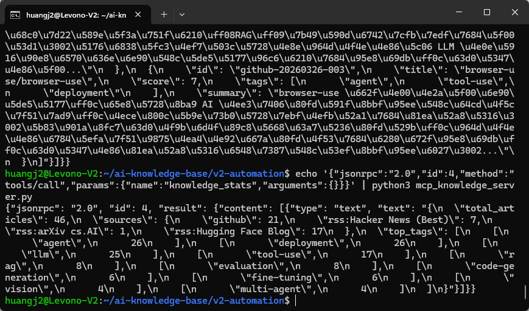
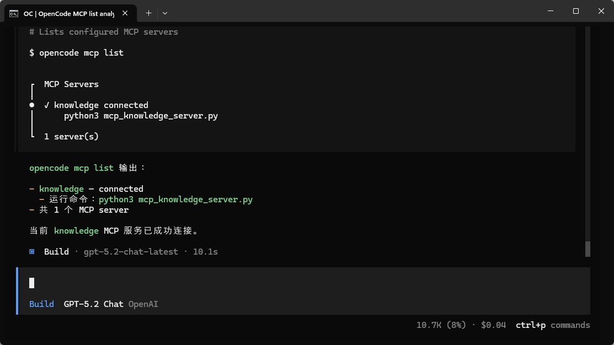
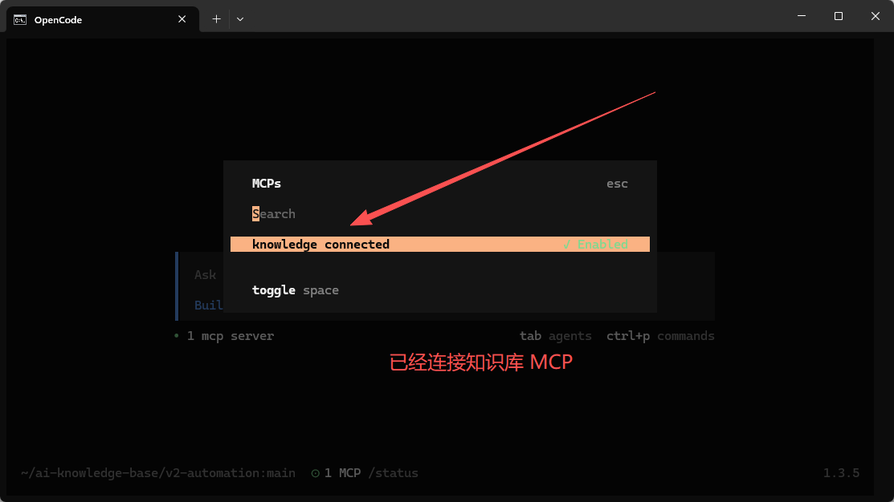

>**目标**：在 OpenCode 中通过 MCP 搜索和查询本地知识库文章

---

## 3.1 为什么要做这个？

前面我们讲了 MCP 的概念——AI 世界的 USB 接口。但光讲协议没有感觉。

现在我们做一件事：**给你的知识库写一个 MCP Server**，让 OpenCode 可以通过 MCP 协议搜索你 `knowledge/articles/` 里的文章。

效果：你在 OpenCode 里说"搜索关于 RAG 的文章"，MCP Server 被调用，结果直接返回。**整个链路看得见**。


---

## 3.2 理解架构

```plain
你（对话）→ OpenCode (MCP Client) → mcp_knowledge_server.py (MCP Server) → knowledge/articles/*.json
                                         │
                                    3 个工具：
                                    ├── search_articles（按关键词搜索）
                                    ├── get_article（按 ID 获取详情）
                                    └── knowledge_stats（统计信息）
```
MCP Server 就是一个 Python 脚本，通过 stdin/stdout 与 OpenCode 通信，协议是 JSON-RPC 2.0。

---

## 3.3 用 AI 编程工具生成 MCP Server

>以下代码可以用 **OpenCode**、**Claude Code**、**Cursor**、**Trae** 或**通义灵码**等任意 AI 编程工具生成。
**提示词：**

```plain
请帮我写一个 MCP Server（mcp_knowledge_server.py），让 AI 工具可以搜索本地知识库：

需求：
1. 读取 knowledge/articles/ 目录下的所有 JSON 文件
2. 提供 3 个 MCP 工具：
   - search_articles(keyword, limit=5): 按关键词搜索文章标题和摘要
   - get_article(article_id): 按 ID 获取文章完整内容
   - knowledge_stats(): 返回统计信息（文章总数、来源分布、热门标签）
3. 使用 JSON-RPC 2.0 over stdio 协议
4. 支持 MCP initialize、tools/list、tools/call 方法
5. 无第三方依赖，只用 Python 标准库

文章 JSON 格式参考：
{
  "id": "github-20260326-001",
  "title": "langgenius/dify",
  "source": "github",
  "summary": "...",
  "score": 7,
  "tags": ["agent", "llm"]
}
```
**生成的代码：** 文件已包含在项目模板中，路径为 `mcp_knowledge_server.py`。
>如果你对这段代码有疑问，可以让 AI 编程工具解释：
>`请解释 mcp_knowledge_server.py 的设计：`
>`1. JSON-RPC 2.0 over stdio 是什么意思？`
>`2. MCP 的 initialize → tools/list → tools/call 三步流程是怎样的？`
>`3. 为什么不用 Flask/FastAPI 做 HTTP 服务？`
>`4. inputSchema 的作用是什么？`

---

## 3.4 手动测试 MCP Server

先用命令行验证 Server 能正常工作：

```plain
# 测试 1：初始化
echo '{"jsonrpc":"2.0","id":1,"method":"initialize","params":{}}' | python3 mcp_knowledge_server.py

# 测试 2：列出工具
echo '{"jsonrpc":"2.0","id":2,"method":"tools/list","params":{}}' | python3 mcp_knowledge_server.py

# 测试 3：搜索文章
echo '{"jsonrpc":"2.0","id":3,"method":"tools/call","params":{"name":"search_articles","arguments":{"keyword":"agent","limit":3}}}' | python3 mcp_knowledge_server.py

# 测试 4：查看统计
echo '{"jsonrpc":"2.0","id":4,"method":"tools/call","params":{"name":"knowledge_stats","arguments":{}}}' | python3 mcp_knowledge_server.py
```



**搜索结果示例：**

```plain
[
  {
    "id": "github-20260326-001",
    "title": "langgenius/dify",
    "score": 7,
    "tags": ["agent", "llm", "deployment"],
    "summary": "Dify 是一个面向生产环境的智能体工作流开发平台..."
  }
]

---
```


## 3.5 配置到 OpenCode

在项目根目录创建（或编辑） `opencode.json`，添加 MCP Server 配置：

```plain
{
  "$schema": "https://opencode.ai/config.json",
  "mcp": {
    "knowledge": {
      "type": "local",
      "command": ["python3", "mcp_knowledge_server.py"],
      "enabled": true
    }
  }
}
```
重启 OpenCode。验证 MCP Server 已连接：
```plain
# 查看所有 MCP Server 状态
opencode mcp list

# 如果连接有问题，用 debug 排查
opencode mcp debug knowledge
```




连接成功后，3 个新工具自动对 LLM 可用：`search_articles`、`get_article`、`knowledge_stats`。




---

## 3.6 在 OpenCode 中体验 MCP

现在可以直接在 OpenCode 中用自然语言操作知识库了：

```plain
> 搜索知识库里关于 RAG 的文章

> 知识库里一共有多少篇文章？哪些标签最热门？

> 给我看 github-20260326-002 这篇文章的详细内容

> 对比知识库里 agent 和 rag 相关文章的数量
```
OpenCode 会自动选择合适的 MCP 工具来回答你的问题。
**MCP 搜索效果截图：**


---

## 3.7 小结：MCP 的价值

|不用 MCP|用 MCP|
|:----|:----|
|手动写 python3 search.py keyword|自然语言"搜索关于 RAG 的文章"|
|脚本只能做预设的事|AI 动态组合工具，灵活应答|
|结果自己看 JSON|AI 帮你解读和对比|

MCP 的核心价值：**把你的数据变成 AI 可调用的工具，用对话代替命令行。**


---

**检查清单：**

|检查项|期望|实际|
|:----|:----|:----|
|MCP Server 命令行测试通过|4/4||
|OpenCode 中能看到 3 个新工具|是||
|自然语言搜索返回结果|是||
|knowledge_stats 显示正确文章数|是||


---

## 提交到 Git

```plain
git add mcp_knowledge_server.py opencode.json
git commit -m "feat: add MCP knowledge server for article search"

---
```


**完成！** 你的知识库现在有了 MCP 接口——AI 可以直接搜索和查询你的文章库了。

