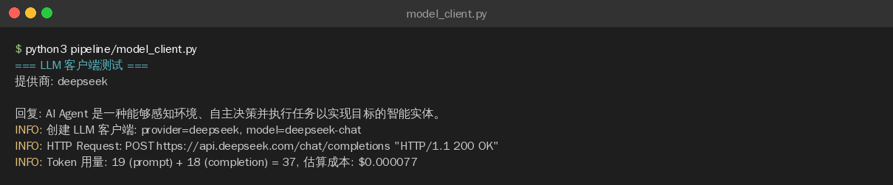

>**目标**：model_client.py 编写完成 + 成功调用 DeepSeek API 返回结果

---

## 背景

从这节开始，我们把 Week 1 的手动操作变成自动化代码。

第一步是统一模型客户端——一个 Python 模块，封装 LLM API 调用，让后续的 Pipeline 不用关心底层用的是 DeepSeek 还是 Qwen。

```plain
Week 1（V1）：你 → 对话 OpenCode → OpenCode 调 LLM → 返回结果
Week 2（V2）：你 → python pipeline.py → 脚本直接调 LLM API → 结果入库
                                        ↑
                                 model_client.py 就是这一层
```
>⚠️ **OpenCode 的角色变了**：从这节开始，OpenCode 是帮你**写代码**的工具，不是运行时的一环。你用 OpenCode 写 pipeline.py，写完后脚本独立运行。

---

## 步骤 1：创建 pipeline 目录

```plain
cd ~/ai-knowledge-base
mkdir -p pipeline

---
```


## 步骤 2：用 AI 编程工具生成 model_client.py

>以下代码可以用 **OpenCode**、**Claude Code**、**Cursor**、**Trae** 或**通义灵码**等任意 AI 编程工具生成。
**提示词：**

```plain
请帮我编写一个 Python 模块 pipeline/model_client.py，作为统一的 LLM 调用客户端：

需求：
1. 支持 DeepSeek、Qwen、OpenAI 三种模型提供商
2. 通过环境变量切换：LLM_PROVIDER（默认 deepseek）、对应的 API_KEY
3. 使用 httpx 直接调用 OpenAI 兼容 API（不依赖 openai SDK）
4. 用抽象基类 LLMProvider 定义接口，OpenAICompatibleProvider 实现
5. 统一返回 LLMResponse dataclass，包含 content 和 Usage 用量统计
6. 包含带重试的 chat_with_retry() 函数（3次，指数退避）和 60 秒超时
7. 包含 Token 消耗估算和成本计算函数（USD 计价）
8. 包含 quick_chat() 便捷函数，一句话调用 LLM
9. 最后有 if __name__ == "__main__" 的测试代码

编码规范：遵循 PEP 8，Google 风格 docstring，使用 logging 不用 print
```
**生成的代码：**（参考实现）
```plain
"""统一 LLM 客户端 — 工厂模式封装多模型调用

支持 DeepSeek、Qwen、OpenAI，通过环境变量切换。
返回统一格式：LLMResponse dataclass（content + Usage 用量统计）
"""

from __future__ import annotations

import os
import time
import logging
from abc import ABC, abstractmethod
from dataclasses import dataclass, field
from typing import Any

import httpx
from dotenv import load_dotenv

load_dotenv()

logger = logging.getLogger(__name__)

# ── 数据结构 ──────────────────────────────────────────────────

@dataclass
class Usage:
    """Token 用量统计"""
    prompt_tokens: int = 0
    completion_tokens: int = 0

    @property
    def total_tokens(self) -> int:
        return self.prompt_tokens + self.completion_tokens

    def to_dict(self) -> dict[str, int]:
        return {
            "prompt_tokens": self.prompt_tokens,
            "completion_tokens": self.completion_tokens,
            "total_tokens": self.total_tokens,
        }


@dataclass
class LLMResponse:
    """统一的 LLM 响应格式"""
    content: str
    usage: Usage = field(default_factory=Usage)

    def to_dict(self) -> dict[str, Any]:
        return {
            "content": self.content,
            "usage": self.usage.to_dict(),
        }


# ── 成本估算（每 1K tokens 价格，单位 USD） ──────────────────

PRICING: dict[str, dict[str, float]] = {
    "deepseek-chat": {"input": 0.0014, "output": 0.0028},
    "deepseek-reasoner": {"input": 0.004, "output": 0.016},
    "qwen-plus": {"input": 0.002, "output": 0.006},
    "qwen-turbo": {"input": 0.0005, "output": 0.001},
    "gpt-4o-mini": {"input": 0.00015, "output": 0.0006},
    "gpt-4o": {"input": 0.005, "output": 0.015},
}


def estimate_cost(model: str, usage: Usage) -> float:
    """估算单次调用成本（USD）"""
    prices = PRICING.get(model, {"input": 0.002, "output": 0.006})
    return (
        usage.prompt_tokens / 1000 * prices["input"]
        + usage.completion_tokens / 1000 * prices["output"]
    )


# ── Provider 抽象基类 ────────────────────────────────────────

class LLMProvider(ABC):
    """LLM 提供商抽象基类"""

    def __init__(self, api_key: str, base_url: str, model: str):
        self.api_key = api_key
        self.base_url = base_url.rstrip("/")
        self.model = model
        self.client = httpx.Client(timeout=60.0)

    @abstractmethod
    def chat(
        self,
        messages: list[dict[str, str]],
        temperature: float = 0.7,
        max_tokens: int = 2000,
    ) -> LLMResponse:
        """发送聊天请求，返回统一格式响应"""
        ...

    def close(self) -> None:
        self.client.close()


class OpenAICompatibleProvider(LLMProvider):
    """兼容 OpenAI Chat Completions API 的提供商。"""

    def chat(self, messages, temperature=0.7, max_tokens=2000) -> LLMResponse:
        url = f"{self.base_url}/chat/completions"
        headers = {
            "Authorization": f"Bearer {self.api_key}",
            "Content-Type": "application/json",
        }
        payload = {
            "model": self.model,
            "messages": messages,
            "temperature": temperature,
            "max_tokens": max_tokens,
        }

        resp = self.client.post(url, json=payload, headers=headers)
        resp.raise_for_status()
        data = resp.json()

        content = data["choices"][0]["message"]["content"]
        usage_data = data.get("usage", {})
        usage = Usage(
            prompt_tokens=usage_data.get("prompt_tokens", 0),
            completion_tokens=usage_data.get("completion_tokens", 0),
        )
        return LLMResponse(content=content, usage=usage)


# ── 工厂函数 ─────────────────────────────────────────────────

PROVIDER_CONFIG: dict[str, dict[str, str]] = {
    "deepseek": {
        "api_key_env": "DEEPSEEK_API_KEY",
        "base_url_env": "DEEPSEEK_BASE_URL",
        "model_env": "DEEPSEEK_MODEL",
        "default_base_url": "https://api.deepseek.com",
        "default_model": "deepseek-chat",
    },
    "qwen": {
        "api_key_env": "QWEN_API_KEY",
        "base_url_env": "QWEN_BASE_URL",
        "model_env": "QWEN_MODEL",
        "default_base_url": "https://dashscope.aliyuncs.com/compatible-mode/v1",
        "default_model": "qwen-plus",
    },
    "openai": {
        "api_key_env": "OPENAI_API_KEY",
        "base_url_env": "OPENAI_BASE_URL",
        "model_env": "OPENAI_MODEL",
        "default_base_url": "https://api.openai.com/v1",
        "default_model": "gpt-4o-mini",
    },
}


def create_provider(provider_name: str | None = None) -> LLMProvider:
    """工厂函数：根据提供商名称创建对应的 LLM 客户端。

    Args:
        provider_name: 提供商名称（deepseek/qwen/openai），
                       默认读取环境变量 LLM_PROVIDER

    Returns:
        LLMProvider 实例
    """
    name = (provider_name or os.getenv("LLM_PROVIDER", "deepseek")).lower()
    if name not in PROVIDER_CONFIG:
        raise ValueError(f"未知的模型提供商: {name}")

    config = PROVIDER_CONFIG[name]
    api_key = os.getenv(config["api_key_env"], "")
    if not api_key:
        raise RuntimeError(f"缺少 API Key，请设置环境变量: {config['api_key_env']}")

    base_url = os.getenv(config["base_url_env"], config["default_base_url"])
    model = os.getenv(config["model_env"], config["default_model"])

    logger.info("创建 LLM 客户端: provider=%s, model=%s", name, model)
    return OpenAICompatibleProvider(api_key=api_key, base_url=base_url, model=model)


# ── 带重试的调用封装 ──────────────────────────────────────────

def chat_with_retry(
    provider: LLMProvider,
    messages: list[dict[str, str]],
    temperature: float = 0.7,
    max_tokens: int = 2000,
    max_retries: int = 3,
    backoff_base: float = 2.0,
) -> LLMResponse:
    """带指数退避重试的聊天调用。"""
    last_error = None
    for attempt in range(max_retries):
        try:
            response = provider.chat(messages=messages, temperature=temperature, max_tokens=max_tokens)
            if attempt > 0:
                logger.info("第 %d 次重试成功", attempt)
            return response
        except (httpx.HTTPStatusError, httpx.ConnectError, httpx.TimeoutException) as e:
            last_error = e
            if attempt < max_retries - 1:
                wait_time = backoff_base ** attempt
                logger.warning("LLM 调用失败（第 %d/%d 次），%0.1fs 后重试: %s", attempt + 1, max_retries, wait_time, e)
                time.sleep(wait_time)
            else:
                logger.error("LLM 调用失败，已达最大重试次数: %s", e)
    raise last_error


# ── 便捷函数 ─────────────────────────────────────────────────

def quick_chat(
    prompt: str,
    system: str = "你是一个 AI 技术分析助手。",
    provider_name: str | None = None,
) -> str:
    """快捷调用：一句话调用 LLM，返回纯文本。"""
    messages = [
        {"role": "system", "content": system},
        {"role": "user", "content": prompt},
    ]
    provider = create_provider(provider_name)
    try:
        response = chat_with_retry(provider, messages)
        cost = estimate_cost(provider.model, response.usage)
        logger.info(
            "Token 用量: %d (prompt) + %d (completion) = %d, 估算成本: $%.6f",
            response.usage.prompt_tokens, response.usage.completion_tokens,
            response.usage.total_tokens, cost,
        )
        return response.content
    finally:
        provider.close()


def chat(
    prompt: str,
    system: str = "你是一个 AI 技术分析助手。",
    provider: str | None = None,
    max_retries: int = 3,
) -> dict[str, Any]:
    """
    便捷调用 LLM，返回包含 content 和 usage 的字典。

    Args:
        prompt: 用户提示词
        system: 系统提示词
        provider: 提供商名称（deepseek/qwen/openai），默认读环境变量
        max_retries: 最大重试次数

    Returns:
        {"content": str, "usage": {"prompt_tokens": int, ...}}
    """
    messages = [
        {"role": "system", "content": system},
        {"role": "user", "content": prompt},
    ]
    provider_name = provider or os.getenv("LLM_PROVIDER", "deepseek")
    llm = create_provider(provider_name)
    try:
        response = chat_with_retry(llm, messages, max_retries=max_retries)
        return response.to_dict()
    finally:
        llm.close()


# ── CLI 测试入口 ──────────────────────────────────────────────
if __name__ == "__main__":
    logging.basicConfig(level=logging.INFO, format="%(levelname)s: %(message)s")
    print("=== LLM 客户端测试 ===")
    print(f"提供商: {os.getenv('LLM_PROVIDER', 'deepseek')}")
    try:
        result = quick_chat("用一句话介绍什么是 AI Agent。")
        print(f"\n回复: {result}")
    except Exception as e:
        print(f"\n错误: {e}")
        print("请检查 .env 文件中的 API Key 配置。")

---
```


## 步骤 3：理解代码

>如果你对这段代码有疑问，可以让 AI 编程工具解释：
>`请解释 pipeline/model_client.py 的设计：`
>`1. 为什么用抽象基类 LLMProvider 而不是 if-else 切换模型？`
>`2. 为什么 DeepSeek 和 Qwen 可以共用 OpenAICompatibleProvider？`
>`3. chat_with_retry 的指数退避重试是什么意思？`
>`4. estimate_cost 函数按模型名查 PRICING 的好处是什么？`
>`5. Usage 和 LLMResponse 为什么用 dataclass 而不是 dict？`
**关键设计解读：**

|设计点|为什么这样做|
|:----|:----|
|LLMProvider 抽象基类|工厂模式 + 策略模式，新增模型只需加子类和配置|
|OpenAICompatibleProvider|DeepSeek/Qwen/OpenAI 都兼容同一 API 格式，一个实现覆盖三家|
|LLMResponse dataclass|类型安全，有属性访问和 to_dict() 方法，比裸 dict 更可靠|
|PRICING 按模型名索引|同一提供商可能有多个模型（如 deepseek-chat vs deepseek-reasoner），按模型名定价更精确|
|chat_with_retry 指数退避|第 1 次等 1s，第 2 次 2s，第 3 次 4s，避免打爆 API|
|quick_chat 便捷函数|一句话调用，自动创建/关闭 provider，适合简单场景|
|成本估算（USD）|为 Week 2 第 8 节的成本控制做铺垫|


---

## 步骤 4：安装依赖并测试

```plain
# 安装依赖（httpx 发请求，python-dotenv 读 .env 文件）
pip install httpx python-dotenv

# 配置环境变量（或写入 .env 文件）
export LLM_PROVIDER=deepseek
export DEEPSEEK_API_KEY=你的密钥

# 运行测试
python pipeline/model_client.py
```
**期望输出：**
```plain
=== LLM 客户端测试 ===
提供商: deepseek
INFO: 创建 LLM 客户端: provider=deepseek, model=deepseek-chat
INFO: Token 用量: 42 (prompt) + 38 (completion) = 80, 估算成本: $0.000165

回复: AI Agent 是一种能够自主感知环境、做出决策并采取行动的智能系统...
```
**实际运行结果：**


---

## 步骤 5：提交到 Git

```plain
git add pipeline/model_client.py
git commit -m "feat: add unified model client for multi-provider LLM calls"

---
```


## 常见问题

|问题|解决方案|
|:----|:----|
|httpx.HTTPStatusError: 401|检查 API Key 是否正确设置在 .env 或环境变量中|
|httpx.ConnectError|检查网络，国内可能需要代理访问 OpenAI|
|httpx.HTTPStatusError: 429|触发限流，chat_with_retry 会自动重试，也可换个 provider|
|RuntimeError: 缺少 API Key|确认 .env 文件中配置了对应提供商的 API Key|
|DeepSeek 返回乱码|确认 system prompt 用了中文|


---

**完成！** 统一模型客户端就位，进入实操 2 编写四步 Pipeline 流水线。

