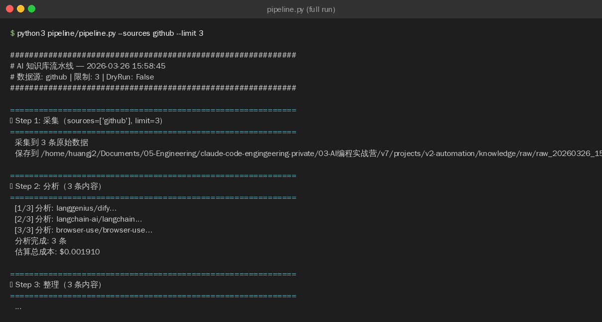
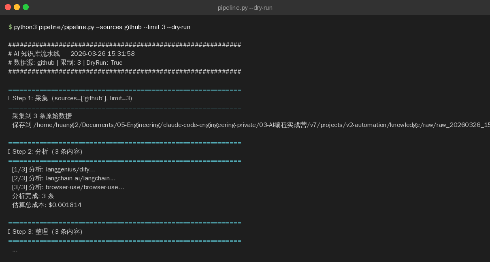

>**目标**：pipeline.py 四步流水线跑通（采集 → 分析 → 整理 → 保存）

---

## 背景

这是 V2 的核心脚本。pipeline.py 是一个**独立于 OpenCode 运行**的 Python 脚本——你用 OpenCode 帮你写它，写完后它自己跑。

```plain
OpenCode 帮你写 pipeline.py（开发时）
pipeline.py 自己跑采集和分析（运行时）

---
```


## 2.1 用 AI 编程工具生成 pipeline.py

>以下代码可以用 **OpenCode**、**Claude Code**、**Cursor**、**Trae** 或**通义灵码**等任意 AI 编程工具生成。
**提示词：**

```plain
请帮我编写 pipeline/pipeline.py，一个四步知识库自动化流水线：

需求：
1. Step 1: 采集（Collect）— 从 GitHub Search API 和 RSS 源采集 AI 相关内容
2. Step 2: 分析（Analyze）— 调用 LLM 对每条内容进行摘要/评分/标签分析
3. Step 3: 整理（Organize）— 去重 + 格式标准化 + 校验
4. Step 4: 保存（Save）— 将文章保存为独立 JSON 文件到 knowledge/articles/

CLI 设计：
- python pipeline/pipeline.py --sources github,rss --limit 20   # 完整流水线
- python pipeline/pipeline.py --sources github --limit 5         # 只采集 GitHub
- python pipeline/pipeline.py --sources rss --limit 10           # 只采集 RSS
- python pipeline/pipeline.py --sources github --limit 5 --dry-run  # 干跑模式
- python pipeline/pipeline.py --verbose                          # 详细日志

关键约束：
- 采集层用 httpx 发 HTTP 请求，RSS 用简易正则解析
- 分析层调用 model_client 的 chat_with_retry()（需要 API Key）
- 采集数据存入 knowledge/raw/，最终文章存入 knowledge/articles/
- model_client 在同目录下，用 from model_client import create_provider, chat_with_retry

编码规范：遵循 PEP 8，用 argparse 解析参数，用 pathlib 处理路径
```
**生成的代码：**（参考实现，建议分块理解）
**文件头部和导入：**

```plain
"""
AI 知识库四步流水线：采集 → 分析 → 整理 → 保存

运行方式：
    python pipeline/pipeline.py --sources github,rss --limit 20
    python pipeline/pipeline.py --sources github --limit 5 --dry-run
"""

from __future__ import annotations

import argparse
import json
import logging
import os
import re
import sys
from datetime import datetime, timezone
from pathlib import Path
from typing import Any

import httpx
import yaml
from dotenv import load_dotenv

# 添加项目根目录到 path，以便导入 model_client
sys.path.insert(0, str(Path(__file__).parent))
from model_client import create_provider, chat_with_retry, estimate_cost, LLMResponse

load_dotenv()
logger = logging.getLogger(__name__)

# ── 项目路径 ─────────────────────────────────────────────────────────────

PROJECT_ROOT = Path(__file__).parent.parent
RAW_DIR = PROJECT_ROOT / "knowledge" / "raw"
ARTICLES_DIR = PROJECT_ROOT / "knowledge" / "articles"
RSS_CONFIG = Path(__file__).parent / "rss_sources.yaml"
```
**collect_github() -- GitHub 采集：**
```plain
def collect_github(limit: int = 10) -> list[dict[str, Any]]:
    """从 GitHub 搜索 API 采集 AI 相关热门仓库。"""
    token = os.getenv("GITHUB_TOKEN", "")
    headers = {"Accept": "application/vnd.github.v3+json"}
    if token:
        headers["Authorization"] = f"token {token}"

    query = "topic:ai+topic:agent OR topic:llm OR topic:rag pushed:>2026-03-10"
    url = "https://api.github.com/search/repositories"
    params = {
        "q": query,
        "sort": "stars",
        "order": "desc",
        "per_page": min(limit, 30),
    }

    results: list[dict[str, Any]] = []
    try:
        with httpx.Client(timeout=30.0) as client:
            resp = client.get(url, params=params, headers=headers)
            resp.raise_for_status()
            data = resp.json()

            for i, repo in enumerate(data.get("items", [])[:limit]):
                now = datetime.now(timezone.utc).isoformat()
                results.append({
                    "id": f"github-{datetime.now().strftime('%Y%m%d')}-{i+1:03d}",
                    "title": repo["full_name"],
                    "source": "github",
                    "source_url": repo["html_url"],
                    "author": repo["owner"]["login"],
                    "published_at": repo.get("pushed_at", ""),
                    "raw_description": repo.get("description", "") or "",
                    "stars": repo.get("stargazers_count", 0),
                    "language": repo.get("language", ""),
                    "topics": repo.get("topics", []),
                    "collected_at": now,
                })

        logger.info("GitHub 采集完成: %d 条", len(results))
    except httpx.HTTPError as e:
        logger.error("GitHub API 调用失败: %s", e)

    return results
```
**collect_rss() -- RSS 采集：**
```plain
def collect_rss(limit: int = 10) -> list[dict[str, Any]]:
    """从配置的 RSS 源采集内容。"""
    if not RSS_CONFIG.exists():
        logger.warning("RSS 配置文件不存在: %s", RSS_CONFIG)
        return []

    with open(RSS_CONFIG, "r", encoding="utf-8") as f:
        config = yaml.safe_load(f)

    sources = [s for s in config.get("sources", []) if s.get("enabled", True)]
    results: list[dict[str, Any]] = []
    count = 0

    with httpx.Client(timeout=20.0) as client:
        for source in sources:
            if count >= limit:
                break
            try:
                resp = client.get(source["url"])
                resp.raise_for_status()
                feed_text = resp.text

                # 简易 RSS 解析：提取 <item> 中的 <title> 和 <link>
                items = re.findall(
                    r"<item[^>]*>.*?<title[^>]*>(?:<!\[CDATA\[)?(.*?)(?:\]\]>)?</title>.*?"
                    r"<link[^>]*>(.*?)</link>.*?</item>",
                    feed_text,
                    re.DOTALL,
                )

                for title, link in items:
                    if count >= limit:
                        break
                    title = title.strip()
                    link = link.strip()
                    if not title or not link:
                        continue

                    now = datetime.now(timezone.utc).isoformat()
                    count += 1
                    results.append({
                        "id": f"rss-{datetime.now().strftime('%Y%m%d')}-{count:03d}",
                        "title": title,
                        "source": f"rss:{source['name']}",
                        "source_url": link,
                        "author": source.get("name", "unknown"),
                        "published_at": now,
                        "raw_description": "",
                        "category": source.get("category", "general"),
                        "collected_at": now,
                    })

            except httpx.HTTPError as e:
                logger.warning("RSS 源 [%s] 获取失败: %s", source["name"], e)

    return results
```
**step_collect() -- 统一采集入口：**
```plain
def step_collect(sources: list[str], limit: int) -> list[dict[str, Any]]:
    """Step 1: 按数据源采集原始数据。"""
    print(f"\n{'='*60}")
    print(f"Step 1: 采集（sources={sources}, limit={limit}）")
    print(f"{'='*60}")

    all_items: list[dict[str, Any]] = []

    if "github" in sources:
        all_items.extend(collect_github(limit))
    if "rss" in sources:
        all_items.extend(collect_rss(limit))

    # 保存原始数据
    RAW_DIR.mkdir(parents=True, exist_ok=True)
    timestamp = datetime.now().strftime("%Y%m%d_%H%M%S")
    raw_file = RAW_DIR / f"raw_{timestamp}.json"
    with open(raw_file, "w", encoding="utf-8") as f:
        json.dump(all_items, f, ensure_ascii=False, indent=2)

    print(f"  采集到 {len(all_items)} 条原始数据")
    print(f"  保存到 {raw_file}")

    return all_items
```
**Step 2 -- AI 分析：**
```plain
ANALYZE_PROMPT_TEMPLATE = """请分析以下 AI 技术内容，返回 JSON 格式的分析结果。

内容信息：
- 标题：{title}
- 来源：{source}
- 描述：{description}

请返回以下格式的 JSON（不要包含 markdown 代码块标记）：
{{
  "summary": "2-3 句话的技术摘要，说明核心内容和价值",
  "score": 7,
  "tags": ["tag1", "tag2"],
  "audience": "intermediate"
}}
"""


def step_analyze(items: list[dict[str, Any]]) -> list[dict[str, Any]]:
    """Step 2: 调用 LLM 对每条内容进行分析。"""
    print(f"\n{'='*60}")
    print(f"Step 2: 分析（{len(items)} 条内容）")
    print(f"{'='*60}")

    provider = create_provider()
    analyzed: list[dict[str, Any]] = []
    total_cost = 0.0

    try:
        for i, item in enumerate(items):
            print(f"  [{i+1}/{len(items)}] 分析: {item['title'][:50]}...")

            prompt = ANALYZE_PROMPT_TEMPLATE.format(
                title=item["title"],
                source=item["source"],
                description=item.get("raw_description", "无描述"),
            )

            try:
                response = chat_with_retry(
                    provider,
                    messages=[
                        {"role": "system", "content": "你是一个 AI 技术分析专家。请严格按要求返回 JSON。"},
                        {"role": "user", "content": prompt},
                    ],
                    temperature=0.3,
                    max_tokens=500,
                )

                cost = estimate_cost(provider.model, response.usage)
                total_cost += cost

                # 解析 LLM 返回的 JSON
                content = response.content.strip()
                content = re.sub(r"^```json\s*", "", content)
                content = re.sub(r"\s*```$", "", content)
                analysis = json.loads(content)

                # 合并原始数据和分析结果
                enriched = {**item, **analysis}
                enriched["status"] = "review"
                enriched["analyzed_at"] = datetime.now(timezone.utc).isoformat()
                analyzed.append(enriched)

            except (json.JSONDecodeError, KeyError) as e:
                logger.warning("分析结果解析失败: %s — %s", item["title"], e)
                enriched = {
                    **item,
                    "summary": item.get("raw_description", "")[:200],
                    "score": 5,
                    "tags": ["llm"],
                    "audience": "intermediate",
                    "status": "draft",
                    "analyzed_at": datetime.now(timezone.utc).isoformat(),
                }
                analyzed.append(enriched)
    finally:
        provider.close()

    print(f"  分析完成: {len(analyzed)} 条")
    print(f"  估算总成本: ${total_cost:.6f}")
    return analyzed
```
**Step 3 -- 整理（去重 + 格式化）：**
```plain
def step_organize(items: list[dict[str, Any]]) -> list[dict[str, Any]]:
    """Step 3: 去重、格式化、校验。"""
    print(f"\n{'='*60}")
    print(f"Step 3: 整理（{len(items)} 条内容）")
    print(f"{'='*60}")

    # 去重：按 source_url 去重
    seen_urls: set[str] = set()
    unique: list[dict[str, Any]] = []

    # 先读取已有文章的 URL
    if ARTICLES_DIR.exists():
        for f in ARTICLES_DIR.glob("*.json"):
            try:
                with open(f, "r", encoding="utf-8") as fh:
                    existing = json.load(fh)
                    if "source_url" in existing:
                        seen_urls.add(existing["source_url"])
            except (json.JSONDecodeError, IOError):
                pass

    dedup_count = 0
    for item in items:
        url = item.get("source_url", "")
        if url in seen_urls:
            dedup_count += 1
            continue
        seen_urls.add(url)
        unique.append(item)

    # 格式标准化
    organized: list[dict[str, Any]] = []
    for item in unique:
        article = {
            "id": item.get("id", "unknown-000"),
            "title": item.get("title", ""),
            "source": item.get("source", "unknown"),
            "source_url": item.get("source_url", ""),
            "author": item.get("author", "unknown"),
            "published_at": item.get("published_at", ""),
            "collected_at": item.get("collected_at", ""),
            "summary": item.get("summary", ""),
            "score": max(1, min(10, item.get("score", 5))),
            "tags": item.get("tags", []),
            "audience": item.get("audience", "intermediate"),
            "status": item.get("status", "draft"),
            "updated_at": datetime.now(timezone.utc).isoformat(),
        }
        organized.append(article)

    print(f"  去重: 移除 {dedup_count} 条重复")
    print(f"  整理后: {len(organized)} 条")
    return organized
```
**Step 4 -- 保存：**
```plain
def step_save(items: list[dict[str, Any]], dry_run: bool = False) -> list[Path]:
    """Step 4: 将文章保存为独立 JSON 文件。"""
    print(f"\n{'='*60}")
    print(f"Step 4: 保存（{len(items)} 条内容，dry_run={dry_run}）")
    print(f"{'='*60}")

    ARTICLES_DIR.mkdir(parents=True, exist_ok=True)
    saved_files: list[Path] = []

    for item in items:
        filename = f"{item['id']}.json"
        filepath = ARTICLES_DIR / filename

        if dry_run:
            print(f"  [DRY RUN] 将保存: {filepath}")
        else:
            with open(filepath, "w", encoding="utf-8") as f:
                json.dump(item, f, ensure_ascii=False, indent=2)
            print(f"  已保存: {filepath}")

        saved_files.append(filepath)

    print(f"\n  共 {'模拟' if dry_run else ''}保存 {len(saved_files)} 个文件")
    return saved_files
```
**run_pipeline() 主流程：**
```plain
def run_pipeline(
    sources: list[str],
    limit: int = 20,
    dry_run: bool = False,
    steps: list[int] | None = None,
) -> dict[str, Any]:
    """运行完整的四步流水线。

    Args:
        sources: 数据源列表
        limit: 每个源的最大采集数
        dry_run: 仅模拟运行
        steps: 要执行的步骤列表（1-4），默认全部执行
    """
    run_steps = set(steps) if steps else {1, 2, 3, 4}

    start_time = datetime.now()
    print(f"\n{'#'*60}")
    print(f"# AI 知识库流水线 — {start_time.strftime('%Y-%m-%d %H:%M:%S')}")
    print(f"# 数据源: {', '.join(sources)} | 限制: {limit} | DryRun: {dry_run}")
    print(f"# 执行步骤: {sorted(run_steps)}")
    print(f"{'#'*60}")

    raw_items: list[dict] = []
    analyzed_items: list[dict] = []
    organized_items: list[dict] = []
    saved_files: list[str] = []

    # Step 1: 采集
    if 1 in run_steps:
        raw_items = step_collect(sources, limit)
        if not raw_items:
            print("\n  没有采集到任何数据，流水线结束。")
            return {"collected": 0, "analyzed": 0, "saved": 0}

    # Step 2: 分析
    if 2 in run_steps and raw_items:
        analyzed_items = step_analyze(raw_items)

    # Step 3: 整理
    if 3 in run_steps and analyzed_items:
        organized_items = step_organize(analyzed_items)

    # Step 4: 保存
    if 4 in run_steps and organized_items:
        saved_files = step_save(organized_items, dry_run=dry_run)

    elapsed = (datetime.now() - start_time).total_seconds()
    stats = {
        "collected": len(raw_items),
        "analyzed": len(analyzed_items),
        "organized": len(organized_items),
        "saved": len(saved_files),
        "elapsed_seconds": round(elapsed, 1),
    }

    print(f"\n{'#'*60}")
    print(f"# 流水线完成！耗时 {elapsed:.1f} 秒")
    print(f"# 采集: {stats['collected']} → 分析: {stats['analyzed']} "
          f"→ 整理: {stats['organized']} → 保存: {stats['saved']}")
    print(f"{'#'*60}\n")
    return stats
```
**CLI 入口：**
```plain
def main() -> None:
    parser = argparse.ArgumentParser(
        description="AI 知识库采集流水线",
        formatter_class=argparse.RawDescriptionHelpFormatter,
        epilog="""
示例:
    python pipeline/pipeline.py --sources github,rss --limit 20
    python pipeline/pipeline.py --sources github --limit 5 --dry-run
    python pipeline/pipeline.py --sources rss --limit 10
        """,
    )
    parser.add_argument(
        "--sources", type=str, default="github,rss",
        help="数据源，逗号分隔（默认: github,rss）",
    )
    parser.add_argument(
        "--limit", type=int, default=20,
        help="每个源的最大采集数量（默认: 20）",
    )
    parser.add_argument(
        "--dry-run", action="store_true",
        help="仅模拟运行，不实际保存文件",
    )
    parser.add_argument(
        "--verbose", action="store_true",
        help="显示详细日志",
    )
    parser.add_argument(
        "--step", type=int, action="append",
        help="指定执行的步骤（1-4），可多次使用，如 --step 1 --step 2",
    )
    parser.add_argument(
        "--provider", type=str, default=None,
        help="LLM 提供商（deepseek/qwen/openai），覆盖环境变量 LLM_PROVIDER",
    )
    args = parser.parse_args()

    if args.provider:
        os.environ["LLM_PROVIDER"] = args.provider

    logging.basicConfig(
        level=logging.DEBUG if args.verbose else logging.INFO,
        format="%(asctime)s %(levelname)s %(name)s: %(message)s",
        datefmt="%H:%M:%S",
    )

    sources = [s.strip() for s in args.sources.split(",")]
    run_pipeline(sources=sources, limit=args.limit, dry_run=args.dry_run, steps=args.step)


if __name__ == "__main__":
    main()
```
>如果你对这段代码有疑问，可以让 AI 编程工具解释：
>`请解释 pipeline/pipeline.py 的架构设计：`
>`1. 四步流水线（采集→分析→整理→保存）的数据流是怎样的？`
>`2. collect_github() 和 collect_rss() 为什么返回统一的数据结构？`
>`3. step_analyze() 的 prompt 为什么要求返回 JSON 而不是自由文本？`
>`4. step_organize() 的去重为什么按 source_url 而不是 title？`

---

## 2.2 测试采集（免费，不需要 LLM）

```plain
# 只采集 GitHub，限制 5 条，干跑模式
python pipeline/pipeline.py --sources github --limit 5 --dry-run

# 采集 GitHub + RSS
python pipeline/pipeline.py --sources github,rss --limit 10
```
**采集输出（dry-run 模式）：**

验证产出：

```plain
ls knowledge/raw/
```
应该看到一个带时间戳的 JSON 文件：
```plain
knowledge/raw/
└── raw_20260317_143022.json

---
```


## 2.3 测试完整流水线（需要 API Key）

```plain
python pipeline/pipeline.py --sources github,rss --limit 5
```
**完整流水线运行（含 AI 分析）：**

验证产出：

```plain
ls knowledge/articles/

---
```


## 2.4 测试 CLI 功能

```plain
# 干跑模式（不实际保存文件）
python pipeline/pipeline.py --sources github --limit 3 --dry-run

# 完整流水线 + 详细日志
python pipeline/pipeline.py --sources github,rss --limit 20 --verbose
```
**检查清单：**
|检查项|期望|实际|
|:----|:----|:----|
|collect_github() 采集有数据|是||
|collect_rss() 采集有数据|是||
|knowledge/raw/ 有 raw_*.json 文件|是||
|step_analyze() 分析成功（无报错）|是||
|knowledge/articles/ 有条目文件|是||


---

## 提交到 Git

```plain
git add pipeline/pipeline.py
git commit -m "feat: add V2 automation pipeline (4-step collect-analyze-organize)"

---
```


**完成！** V2 核心引擎就绪。四步流水线（采集 → 分析 → 整理 → 保存）已可运行。

