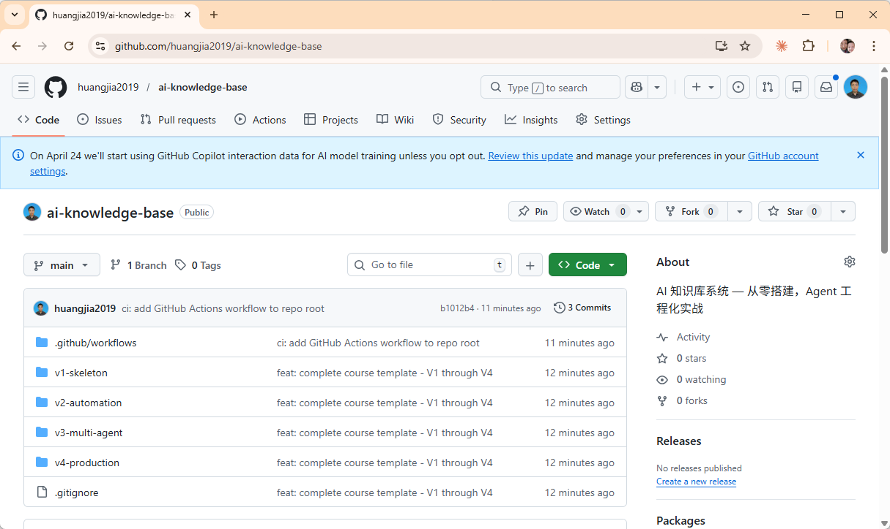
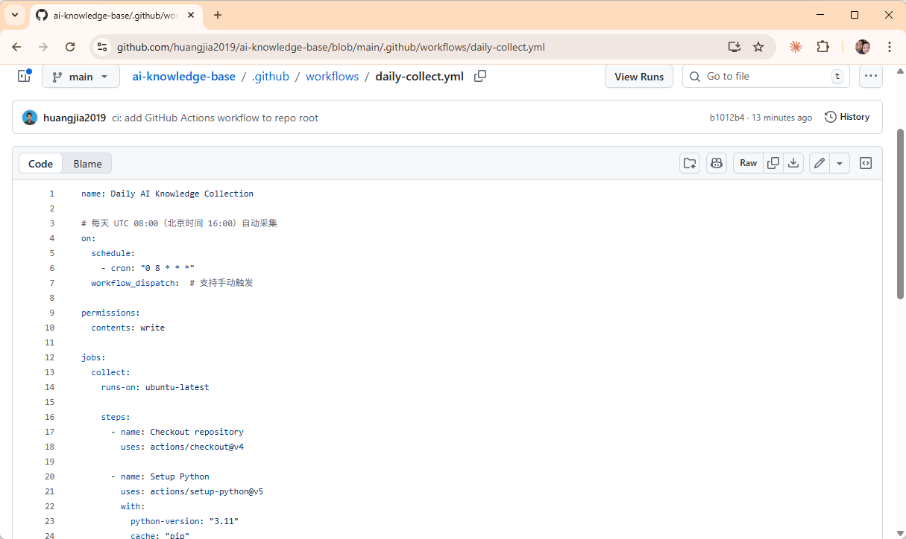
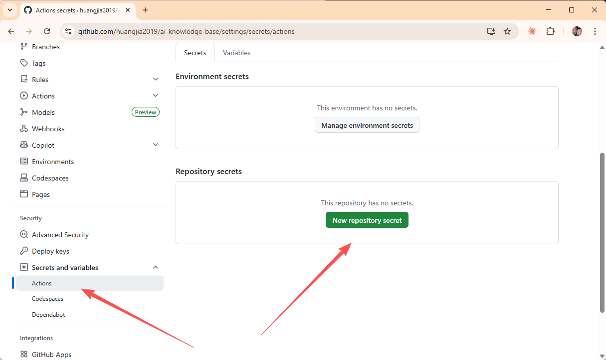
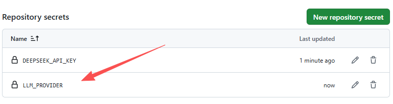
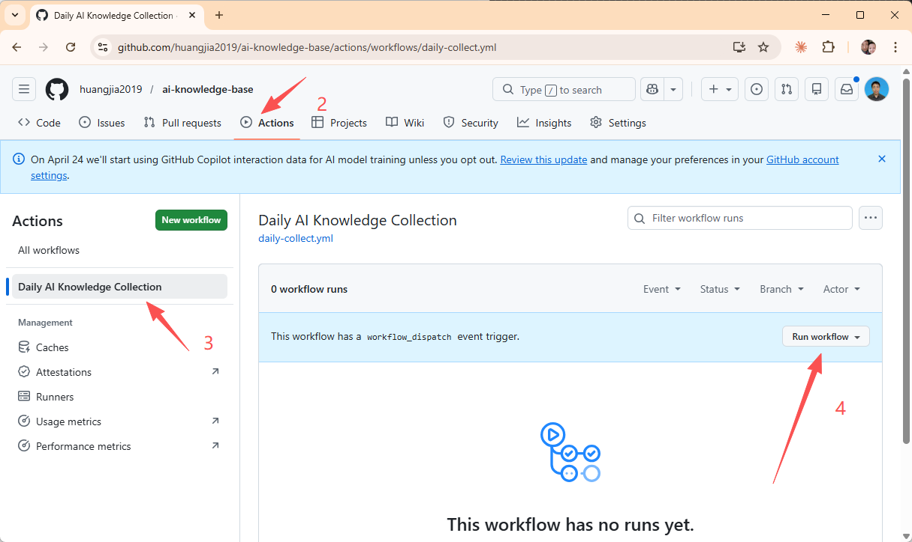
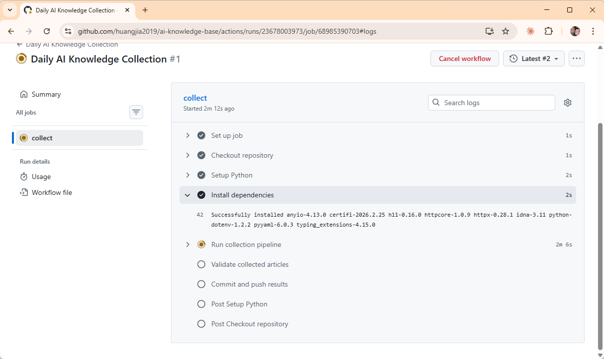
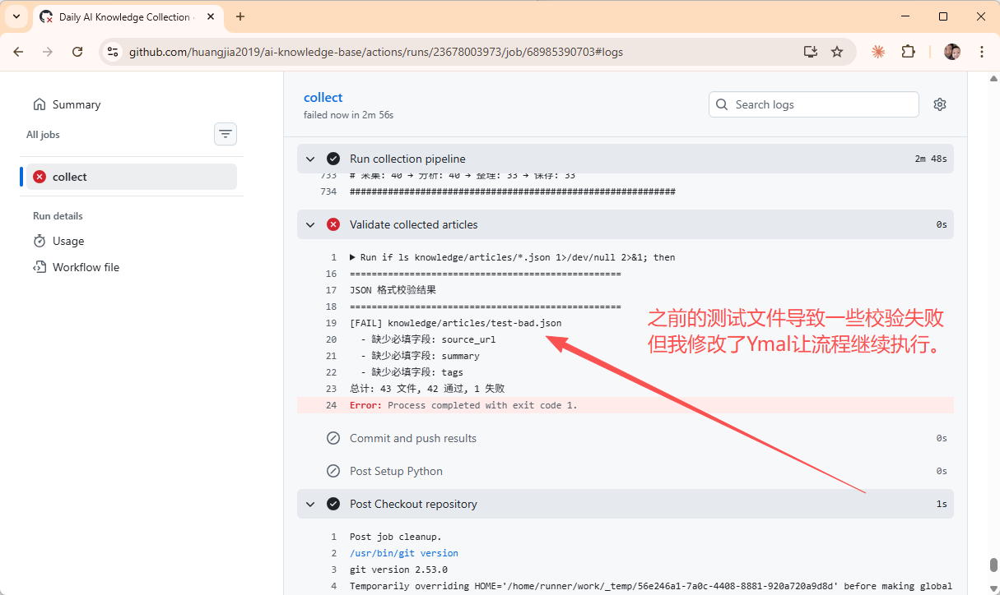
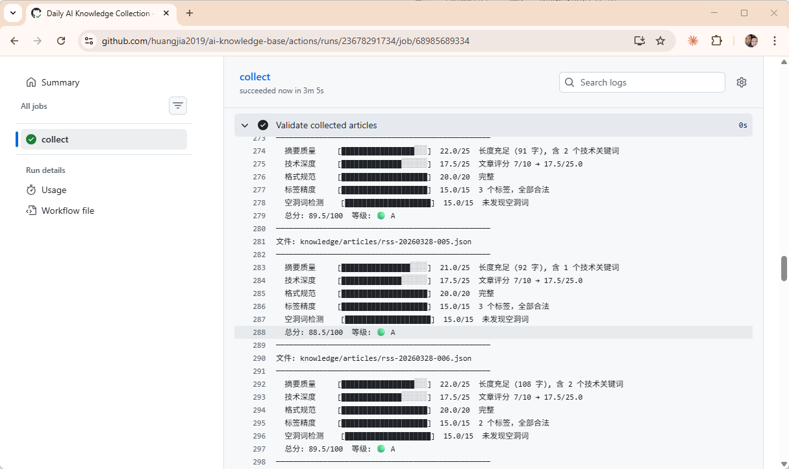
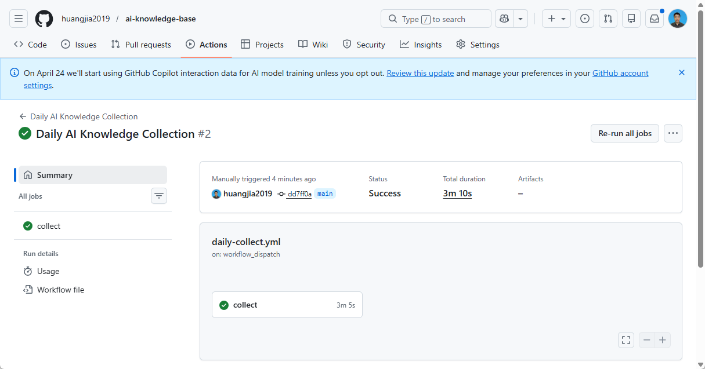
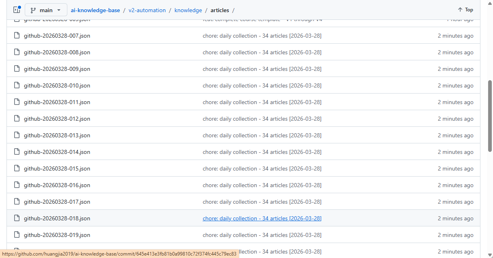

>**目标**：daily-collect.yml 推送成功 + Actions 手动触发成功

---
## 1.1 前置条件

确认你的项目已推送到 GitHub：

```plain
cd ~/ai-knowledge-base
git remote -v
# 应该看到 origin 指向你的 GitHub 仓库
```
如果还没有推送：
```plain
# 在 GitHub 上创建仓库（不勾选 Initialize with README）
git remote add origin https://github.com/你的用户名/ai-knowledge-base.git
git push -u origin main
```




---
## 1.2 用 AI 编程工具生成 workflow 文件

>以下配置可以用 **OpenCode**、**Claude Code**、**Cursor**、**Trae** 或**通义灵码**等任意 AI 编程工具生成。
**提示词：**

```plain
请帮我创建 .github/workflows/daily-collect.yml，一个 GitHub Actions 工作流：

需求：
1. 每天 UTC 08:00（北京时间 16:00）自动运行
2. 同时支持手动触发（workflow_dispatch）
3. 添加 permissions: contents: write
4. 使用 Python 3.11，启用 pip 缓存
5. 通过 pip install -r requirements.txt 安装依赖
6. 运行命令：python pipeline/pipeline.py --sources github,rss --limit 20 --verbose
7. 支持多个 LLM 密钥（LLM_PROVIDER、DEEPSEEK_API_KEY、QWEN_API_KEY、OPENAI_API_KEY）
8. 采集后运行 validate_json.py 和 check_quality.py 校验文章
9. 自动 git commit + push，commit 消息包含文章数量和日期
10. 如果没有新数据则不提交（避免空 commit）
```
**生成的配置：**（参考实现）
```plain
name: Daily AI Knowledge Collection

# 每天 UTC 08:00（北京时间 16:00）自动采集
on:
  schedule:
    - cron: "0 8 * * *"
  workflow_dispatch:  # 支持手动触发

permissions:
  contents: write

jobs:
  collect:
    runs-on: ubuntu-latest

    steps:
      - name: Checkout repository
        uses: actions/checkout@v4

      - name: Setup Python
        uses: actions/setup-python@v5
        with:
          python-version: "3.11"
          cache: "pip"

      - name: Install dependencies
        run: pip install -r requirements.txt

      - name: Run collection pipeline
        env:
          LLM_PROVIDER: ${{ secrets.LLM_PROVIDER }}
          DEEPSEEK_API_KEY: ${{ secrets.DEEPSEEK_API_KEY }}
          QWEN_API_KEY: ${{ secrets.QWEN_API_KEY }}
          OPENAI_API_KEY: ${{ secrets.OPENAI_API_KEY }}
          GITHUB_TOKEN: ${{ secrets.GITHUB_TOKEN }}
        run: |
          python pipeline/pipeline.py \
            --sources github,rss \
            --limit 20 \
            --verbose

      - name: Validate collected articles
        run: |
          if ls knowledge/articles/*.json 1>/dev/null 2>&1; then
            python hooks/validate_json.py knowledge/articles/*.json
            python hooks/check_quality.py knowledge/articles/*.json
          else
            echo "No articles to validate"
          fi

      - name: Commit and push results
        run: |
          git config user.name "github-actions[bot]"
          git config user.email "github-actions[bot]@users.noreply.github.com"

          git add knowledge/
          if git diff --staged --quiet; then
            echo "No new articles to commit"
          else
            ARTICLE_COUNT=$(git diff --staged --name-only | grep -c '\.json$' || true)
            git commit -m "chore: daily collection - ${ARTICLE_COUNT} articles [$(date -u +%Y-%m-%d)]"
            git push
          fi
```
>如果你对这段配置有疑问，可以让 AI 编程工具解释：
>`请解释 daily-collect.yml 中每一步的作用：`
>`1. cron: "0 8 * * *" 是什么意思？为什么选 UTC 08:00？`
>`2. permissions: contents: write 为什么需要？`
>`3. 为什么用 pip install -r requirements.txt 而不是单独装包？`
>`4. Validate 步骤的 if ls ... 判断有什么作用？`
>`5. commit 消息里的 ARTICLE_COUNT 是怎么算出来的？`
**逐行理解：**

|行|含义|
|:----|:----|
|cron: "0 8 * * *"|每天 UTC 08:00 触发（北京时间 16:00）|
|workflow_dispatch|允许从 GitHub 页面手动触发|
|permissions: contents: write|授权 workflow 推送代码|
|actions/checkout@v4|拉取仓库代码到 runner|
|actions/setup-python@v5|安装 Python 3.11，启用 pip 缓存|
|pip install -r requirements.txt|安装项目所有依赖|
|--sources github,rss --limit 20|从 GitHub 和 RSS 源采集，每次最多 20 条|
|validate_json.py + check_quality.py|采集后自动校验文章格式和质量|
|ARTICLE_COUNT|统计本次新增的 JSON 文件数量|
|git diff --staged --quiet|如果有新数据才 commit（避免空提交）|


---

## 1.3 创建目录并保存文件

```plain
mkdir -p .github/workflows
```
将上面的 YAML 内容保存到 `.github/workflows/daily-collect.yml`。

---

## 1.4 推送到 GitHub

```plain
git add .github/workflows/daily-collect.yml
git commit -m "ci: add daily collection workflow"
git push
```


>**注意**：因为我的Repo里面有多个目录，而工作流只能在根目录下面跑，因此所有路径都要加 `v2-automation/` 前缀。这样所有命令都在 v2 子目录下跑，最后 commit 步骤切回根目录 push。



---
## 1.5 配置 GitHub Secrets

Workflow 运行时需要 API Key，但**绝对不能写在代码里**。GitHub Secrets 是专门管密钥的地方。

1. 打开 GitHub 仓库页面

2. 点击顶部 **Settings** 标签

3. 左侧菜单：**Secrets and variables → Actions**

4. 点击 **New repository secret**，逐个添加：

|Secret 名称|值|必填|
|:----|:----|:----|
|DEEPSEEK_API_KEY|你的 DeepSeek API Key（sk-...）|是|
|LLM_PROVIDER|deepseek|是|
|QWEN_API_KEY|你的 Qwen API Key（如果用 Qwen）|否|

1. 每个 Secret 填完点 **Add secret** 保存





**检查清单：**

|检查项|期望|实际|
|:----|:----|:----|
|DEEPSEEK_API_KEY 已添加|是||
|LLM_PROVIDER 已添加|是||
|Secret 值不含多余空格|是||




## 1.6 手动触发测试

1. 打开 GitHub 仓库页面

2. 点击顶部 **Actions** 标签

3. 左侧选择 **Daily Knowledge Collection**

4. 点击 **Run workflow** -> **Run workflow**

>在 GitHub 网页上操作：点击 **Run workflow** 按钮，等待运行完成后会看到绿色 ✓ 标记。回到仓库首页可以看到 `github-actions[bot]` 自动提交的 commit。
1. 回到仓库首页，查看是否有新 commit












---

## 1.7 验证自动采集数据

```plain
# 拉取远程新数据
git pull

# 查看新采集的数据
ls knowledge/articles/
```

**检查清单：**

|检查项|期望|实际|
|:----|:----|:----|
|workflow 文件已推送|是||
|Actions 页面能看到 workflow|是||
|手动触发成功（绿色标记）|是||
|Validate 步骤正常运行|是||
|仓库有 bot 的新 commit|是||
|commit 消息包含文章数量|是||
|knowledge/articles/ 有新数据|是||


---

**完成！** 你的知识库现在每天自动采集数据了。

