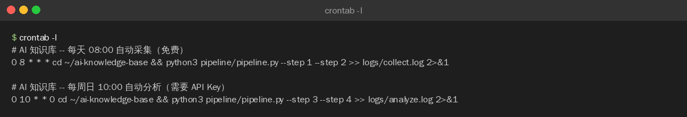
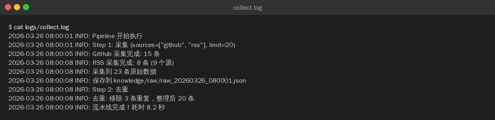

>**目标**：crontab 配置成功（Linux/Mac）或 Task Scheduler 配置成功（Windows） 注意：这是 GitHub Actions 的备选方案，二选一即可

---

## 2.1 方案 A：Linux / Mac -- crontab

### 创建日志目录

```plain
mkdir -p ~/ai-knowledge-base/logs
```
### 用 AI 编程工具生成 crontab 配置

>以下配置可以用 **OpenCode**、**Claude Code**、**Cursor**、**Trae** 或**通义灵码**等任意 AI 编程工具生成。
**提示词：**

```plain
请帮我写两条 crontab 配置：

1. 每天早上 8 点自动运行 pipeline 的 Step 1-2（免费采集）
   命令：cd ~/ai-knowledge-base && python pipeline/pipeline.py --step 1 --step 2
   日志追加到 logs/collect.log

2. 每周日上午 10 点运行 Step 3-4（AI 分析入库）
   命令：cd ~/ai-knowledge-base && python pipeline/pipeline.py --step 3 --step 4
   日志追加到 logs/analyze.log


要求：标准 crontab 格式，包含注释说明
```
**生成的配置：**
```plain
# 编辑 crontab
crontab -e
```
添加以下行：
```plain
# AI 知识库 -- 每天 08:00 自动采集（免费）
0 8 * * * cd ~/ai-knowledge-base && python3 pipeline/pipeline.py --step 1 --step 2 >> logs/collect.log 2>&1

# AI 知识库 -- 每周日 10:00 自动分析（需要 API Key）
0 10 * * 0 cd ~/ai-knowledge-base && python3 pipeline/pipeline.py --step 3 --step 4 >> logs/analyze.log 2>&1

```
保存退出后验证：
```plain
crontab -l
```
**crontab -l 输出：**

### 手动测试

先手动跑一次，确保路径和权限没问题：

```plain
cd ~/ai-knowledge-base && python3 pipeline/pipeline.py --step 1 --step 2 >> logs/collect.log 2>&1

# 检查日志
cat logs/collect.log
```
**日志内容：**


---

## 2.2 方案 B：Windows -- Task Scheduler

### 用 AI 编程工具生成批处理脚本

**提示词：**

```plain
请帮我写一个 Windows 批处理脚本 run_collect.bat，用于定时采集知识库：
- 切换到项目目录 C:\Users\你的用户名\ai-knowledge-base
- 运行 python pipeline\pipeline.py --step 1 --step 2
- 日志追加到 logs\collect.log
```
**生成的配置：**
在项目目录创建 `run_collect.bat`：

```plain
@echo off
cd /d C:\Users\你的用户名\ai-knowledge-base
python pipeline\pipeline.py --step 1 --step 2 >> logs\collect.log 2>&1
```
### 配置 Task Scheduler

1. 打开 Windows 搜索，输入「任务计划程序」

2. 点击右侧「创建基本任务」

3. 名称：`AI Knowledge Collection`

4. 触发器：「每天」-> 开始时间 08:00

5. 操作：「启动程序」-> 浏览选择 `run_collect.bat`

6. 完成

>Windows 截图：在任务计划程序中看到名为 `AI Knowledge Collection` 的任务，触发器为「每天 08:00」。
### 手动测试

右键任务 -> 「运行」，然后检查日志：

```plain
type C:\Users\你的用户名\ai-knowledge-base\logs\collect.log

---
```


## 2.3 验证定时任务

等到下一个触发时间点后，检查：

```plain
# 检查日志
tail -20 ~/ai-knowledge-base/logs/collect.log

# 检查是否有新数据
ls -lt ~/ai-knowledge-base/knowledge/raw/ | head -5
```
**检查清单：**
|检查项|期望|实际|
|:----|:----|:----|
|定时任务已配置|是||
|手动测试通过|是||
|日志文件有输出|是||
|knowledge/raw/ 有新数据|是||


---

**完成！** 本地定时任务配置就绪。

