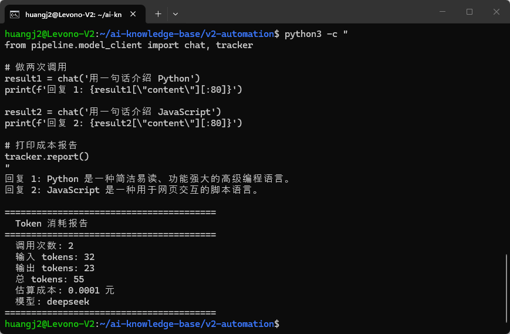
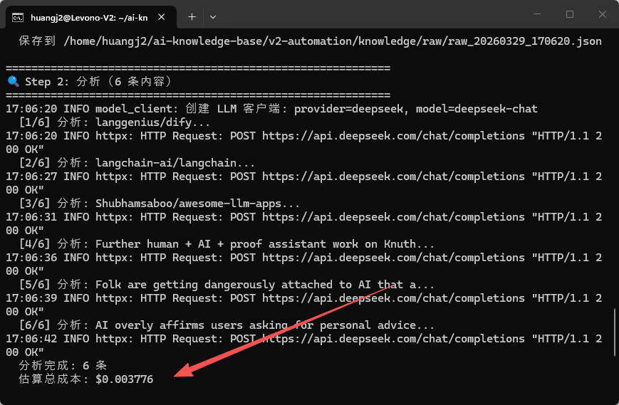

>**目标**：Pipeline 运行后自动输出 Token 消耗报告 + 成本估算

---

## 1.1 理解 API 返回的 usage 字段

model_client.py 已经返回了 `usage` 字段：

```plain
result = chat("用一句话介绍 LangGraph")
print(result["usage"])
# {"prompt_tokens": 42, "completion_tokens": 38, "total_tokens": 80}
```
我们需要一个 CostTracker 来累计统计每次调用的消耗。

---

## 1.2 用 AI 编程工具生成 CostTracker

>以下代码可以用 **OpenCode**、**Claude Code**、**Cursor**、**Trae** 或**通义灵码**等任意 AI 编程工具生成。
**提示词：**

```plain
请帮我在 pipeline/model_client.py 中添加 CostTracker 功能：

需求：
1. 创建一个 CostTracker 类，追踪 LLM 调用的 token 消耗和成本
2. 包含国产模型价格表（单位：元/百万 tokens）：
   - deepseek: 输入 1, 输出 2
   - qwen: 输入 4, 输出 12
   - openai (gpt-4o-mini): 输入 150, 输出 600
3. CostTracker 方法：
   - record(usage, provider): 记录一次 API 调用
   - estimated_cost(provider): 返回估算成本（元）
   - report(provider): 打印成本报告
4. 在 chat() 函数中，每次调用成功后自动 record
5. 创建全局 tracker 实例，Pipeline 结束时可以调 tracker.report()

编码规范：遵循 PEP 8，Google 风格 docstring
```
**生成的代码：**（参考实现，添加到 model_client.py 中）
```plain
# 国产模型价格（元/百万 tokens）
PRICING = {
    "deepseek": {"input": 1, "output": 2},
    "qwen": {"input": 4, "output": 12},
    "openai": {"input": 150, "output": 600},
}


class CostTracker:
    """追踪 LLM 调用的 token 消耗和成本。"""

    def __init__(self):
        self.total_input_tokens = 0
        self.total_output_tokens = 0
        self.call_count = 0
        self.calls = []

    def record(self, usage: dict, provider: str = "deepseek"):
        """记录一次 API 调用的 token 消耗。"""
        input_tokens = usage.get("prompt_tokens", 0)
        output_tokens = usage.get("completion_tokens", 0)

        self.total_input_tokens += input_tokens
        self.total_output_tokens += output_tokens
        self.call_count += 1

        self.calls.append({
            "provider": provider,
            "input_tokens": input_tokens,
            "output_tokens": output_tokens,
        })

    def estimated_cost(self, provider: str = "deepseek") -> float:
        """估算总成本（单位：元）。"""
        pricing = PRICING.get(provider, PRICING["deepseek"])
        cost_input = self.total_input_tokens * pricing["input"] / 1_000_000
        cost_output = self.total_output_tokens * pricing["output"] / 1_000_000
        return cost_input + cost_output

    def report(self, provider: str = "deepseek"):
        """打印成本报告。"""
        cost = self.estimated_cost(provider)
        print(f"\n{'='*40}")
        print(f"  Token 消耗报告")
        print(f"{'='*40}")
        print(f"  调用次数: {self.call_count}")
        print(f"  输入 tokens: {self.total_input_tokens:,}")
        print(f"  输出 tokens: {self.total_output_tokens:,}")
        print(f"  总 tokens: {self.total_input_tokens + self.total_output_tokens:,}")
        print(f"  估算成本: {cost:.4f} 元")
        print(f"  模型: {provider}")
        print(f"{'='*40}")


# 全局 tracker 实例
tracker = CostTracker()
```
>如果你对这段代码有疑问，可以让 AI 编程工具解释：
>`请解释 CostTracker 的设计：`
>`1. 为什么用全局 tracker 实例而不是每次创建新的？`
>`2. 价格表为什么用"百万 tokens"做单位？`
>`3. 如果我想把统计结果保存到文件该怎么加？`

---

## 1.3 修改 chat() 函数加入自动统计

在 `chat()` 函数返回结果前，添加一行：

```plain
def chat(prompt, system="...", provider=None, max_retries=3):
    # ... 现有代码 ...

    # 成功后记录 token 消耗
    usage = result.get("usage", {})
    if usage:
        tracker.record(usage, provider or "deepseek")

    return result

---
```


## 1.4 测试 Token 统计

```plain
python3 -c "
from pipeline.model_client import chat, tracker

# 做两次调用
result1 = chat('用一句话介绍 Python')
print(f'回复 1: {result1[\"content\"][:80]}')

result2 = chat('用一句话介绍 JavaScript')
print(f'回复 2: {result2[\"content\"][:80]}')

# 打印成本报告
tracker.report()
"
```
**两次调用后的 Token 消耗报告：**
**检查清单：**

|检查项|期望|实际|
|:----|:----|:----|
|CostTracker 能记录调用|是||
|显示输入/输出 tokens|是||
|成本估算合理（< 0.01 元）|是||
|调用次数正确|2||


---

## 1.5 在 Pipeline 中加入成本报告

编辑 `pipeline/pipeline.py`，在 `run_pipeline()` 函数末尾添加：

```plain
from model_client import tracker

# 在 run_pipeline() 末尾
tracker.report(provider=provider or "deepseek")
```
测试：
```plain
python3 pipeline/pipeline.py --limit 3
```
**Pipeline 运行后自动输出 Token 消耗报告：**


## 提交到 Git

```plain
git add pipeline/model_client.py
git commit -m "feat: add token consumption tracking and cost reporting"

---
```


**完成！** 每次调用 LLM 都有成本记录了。

