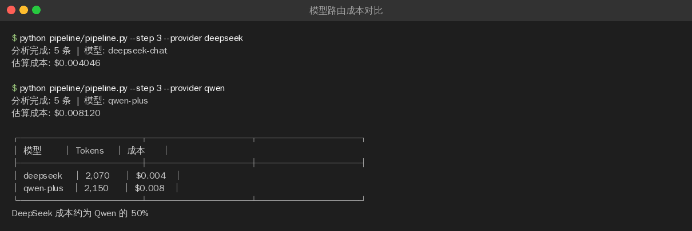

>**目标**：不同 Pipeline 步骤使用不同模型 + 成本对比记录

---
## 2.1 理解三档策略

|档位|任务|模型|成本|
|:----|:----|:----|:----|
|零成本|采集（Steps 1-2）|无（纯 API）|0 元|
|低成本|分析（Step 3）|DeepSeek Chat|1 元/M|
|按需|重要决策|DeepSeek R1 / Qwen|4-16 元/M|

Pipeline 已经天然支持分档——Steps 1-2 不调 LLM，Steps 3-4 调 LLM。

现在要做的是：**用不同模型对比成本和质量**。


---

## 2.2 用不同模型跑 Step 3

>以下操作用命令行直接执行即可，不需要 AI 编程工具。
```plain
# 用 DeepSeek（最便宜）—— 采集 5 条数据，走完整流程
python pipeline/pipeline.py --limit 5 --provider deepseek

# 用 Qwen（质量更高但更贵）—— 同样 5 条数据
python pipeline/pipeline.py --limit 5 --provider qwen
```
每次运行后查看 CostTracker 报告，对比成本差异。

**不同模型的输出和成本对比：**



---

## 2.3 用 AI 编程工具生成成本对比记录模板

**提示词：**

```plain
请帮我创建一个 Markdown 模板 cost_comparison.md，用于记录不同模型的成本对比：

包含：
1. 测试条件（输入数据量、任务类型）
2. DeepSeek Chat 的 token 统计和成本
3. Qwen Plus 的 token 统计和成本（如已配置）
4. 结论（哪个模型性价比最高）
```


填写你的实际数据。


---

## 2.4 关键发现

对于知识摘要和分析任务：

* DeepSeek Chat 和 Qwen Plus 的**质量差异 ？**

* DeepSeek Chat 和 Qwen Plus 的**成本差异 ？**

* 推荐默认用 DeepSeek，重要内容再用 XXX


---

**完成！** 你已经理解了模型路由策略——不同任务用不同价位的模型。

