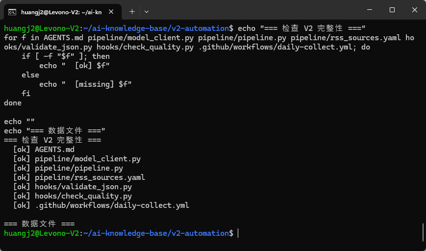
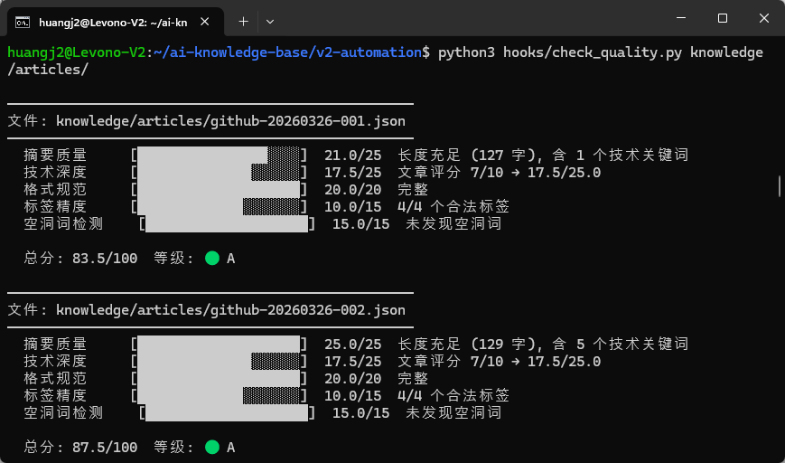

>目标：V2 全部文件提交 + 目录结构完整 + Git 历史干净

---

## 3.1 检查项目完整性

```plain
cd ~/ai-knowledge-base
```
你的项目应该包含以下文件：
```plain
ai-knowledge-base/
├── AGENTS.md                              <- Week 1: 项目规范
├── .gitignore                             <- 排除 .env
├── .env                                   <- API Keys（不提交）
├── .env.example                           <- API Keys 模板
│
├── .opencode/                             <- Week 1: OpenCode 配置
│   ├── agents/                            <- Agent 角色定义
│   │   ├── collector.md
│   │   ├── analyzer.md
│   │   └── organizer.md
│   ├── skills/                            <- Skill 定义
│   │   ├── github-trending/SKILL.md
│   │   └── tech-summary/SKILL.md
│   └── plugins/                           <- Week 2: Hook 插件（如已配置）
│       └── validate.ts
│
├── pipeline/                              <- Week 2: 自动化流水线
│   ├── model_client.py                    <- 统一模型客户端 + CostTracker
│   ├── pipeline.py                        <- 4 步流水线
│   └── rss_sources.yaml                   <- RSS 数据源配置
│
├── hooks/                                 <- Week 2: 质量校验
│   ├── validate_json.py                   <- 格式校验
│   └── check_quality.py                   <- 质量评分
│
├── .github/workflows/                     <- Week 2: CI/CD
│   └── daily-collect.yml                  <- 每日采集
│
├── knowledge/                             <- 知识数据
│   ├── raw/                               <- 原始采集数据
│   │   ├── github-trending-*.json
│   │   └── hn-digest-*.json
│   └── articles/                          <- 结构化知识条目
│       └── *.json
│
└── logs/                                  <- 运行日志（如已配置本地 cron）
    └── collect.log
```
逐项检查：
```plain
echo "=== 检查 V2 完整性 ==="
for f in AGENTS.md pipeline/model_client.py pipeline/pipeline.py pipeline/rss_sources.yaml hooks/validate_json.py hooks/check_quality.py .github/workflows/daily-collect.yml; do
    if [ -f "$f" ]; then
        echo "  [ok] $f"
    else
        echo "  [missing] $f"
    fi
done

echo ""
echo "=== 数据文件 ==="
echo "  raw/: $(ls knowledge/raw/*.json 2>/dev/null | wc -l) 个"
echo "  articles/: $(ls knowledge/articles/*.json 2>/dev/null | wc -l) 个"
```
**完整性检查结果：**


---

## 3.2 最终质量检查

```plain
# 对所有知识条目做质量检查
python3 hooks/check_quality.py knowledge/articles/
```
**最终质量报告：**


---

## 3.3 提交 V2

```plain
# 查看未提交的文件
git status

# 添加所有文件（排除 .env）
git add AGENTS.md .opencode/ pipeline/ hooks/ .github/ knowledge/ .gitignore .env.example

# 查看将要提交的内容
git diff --staged --stat

# 提交
git commit -m "feat: complete V2 - pipeline + hooks + CI/CD + cost tracking"
```


---

## 3.4 推送到 GitHub

```plain
git push

---
```


## 3.5 查看 Git 历史

```plain
git log --oneline
```
理想的 Git 历史应该类似：
```plain
abc1234 feat: complete V2 - pipeline + hooks + CI/CD + cost tracking
def5678 feat: add token consumption tracking and cost reporting
ghi9012 ci: add daily collection workflow
jkl3456 feat: add RSS sources config for multi-source collection
mno7890 feat: add V2 automation pipeline
pqr1234 feat: add unified model client
stu5678 feat: add content quality scoring hook
vwx9012 feat: add JSON validation hook script
yza3456 feat: complete V1 - agents, skills, and first batch of knowledge
...

---
```


## 3.6 V1 -> V2 自查清单

```plain
Week 1 (V1):
[ ] AGENTS.md 编写完成
[ ] 3 个 Agent 角色文件编写完成
[ ] 2+ 个 Skill 封装完成
[ ] V1 手动流程跑通

Week 2 (V2):
[ ] model_client.py 统一模型客户端
[ ] pipeline.py 4 步流水线
[ ] rss_sources.yaml RSS 数据源
[ ] validate_json.py 格式校验
[ ] check_quality.py 质量评分
[ ] CostTracker Token 消耗统计
[ ] daily-collect.yml 每日采集
[ ] GitHub Actions 手动触发测试通过
[ ] 所有文件已提交 Git

---
```


**恭喜完成第 2 周全部实操！**


V2 知识库系统特性：

* **自动化流水线** — 4 步 Python 脚本，一键执行

* **多数据源** — GitHub + HN + RSS

* **质量校验** — 格式校验 + 5 维度评分 + 空洞用词检测

* **成本控制** — Token 统计 + 模型路由 + 预算守卫

* **CI/CD** — 每日免费采集

* **月成本** — 5-10 元

* **角色分离** — OpenCode 写代码，Pipeline 独立运行


下周进入 Week 3：**多 Agent 协作**——从单兵作战到团队协同。

