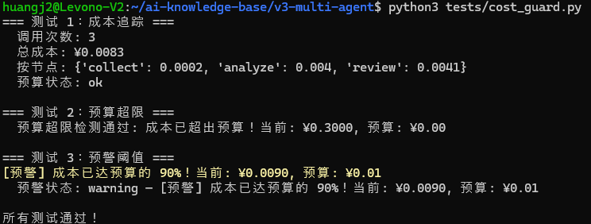

>**目标**：cost_guard.py 能追踪成本 + 预警提醒 + 预算超标抛出 BudgetExceededError 
>目标文件：`tests/cost_guard.py`

---
## 背景

多 Agent 系统每次管线会调用多个 LLM：

```plain
Analyzer(~3500 tokens) → Reviewer(~3300 tokens) → 修订重跑(+2500)
```
一次正常管线：~9000 tokens ≈ ¥0.012 
一次带修订的管线：~11500 tokens ≈ ¥0.015 

如果死循环 10 次：~35000+ tokens ≈ ¥0.05+


CostGuard 提供三重保护：成本追踪（`record()`）+ 预警提醒 + 预算熔断（`check()` 抛出 `BudgetExceededError`）。


---

## 步骤 1：用 AI 编程工具生成 cost_guard.py

以下代码可以用 **OpenCode**、**Claude Code**、**Cursor**、**Trae** 或**通义灵码**等任意 AI 编程工具生成。

**提示词：**

```plain
请帮我编写 tests/cost_guard.py，实现多 Agent 预算守卫：

需求：
1. CostRecord 数据类：记录单次 LLM 调用（timestamp, node_name, prompt_tokens, completion_tokens, cost_yuan, model）
2. CostGuard 类，三重保护机制：
   - record(node_name, usage, model=""): 记录一次 LLM 调用的 token 用量，usage 格式 {"prompt_tokens": int, "completion_tokens": int}
   - check() -> dict: 检查预算状态，返回 {"status": "ok"|"warning"|"exceeded", "total_cost": float, "budget": float, "usage_ratio": float, "message": str}
     - 接近预算（>= alert_threshold）时状态为 "warning"
     - 超出预算时抛出 BudgetExceededError 异常
   - get_report() -> dict: 生成成本报告（按节点分组统计）
   - save_report(path=None): 保存成本报告到 JSON 文件
3. 构造函数参数：budget_yuan=1.0, alert_threshold=0.8, input_price_per_million=1.0, output_price_per_million=2.0
4. BudgetExceededError 异常类
5. 包含 if __name__ == "__main__" 的测试代码，验证：
   - 成本追踪正确（record 后 total_prompt_tokens 和 total_cost_yuan 正确）
   - 预算超限检测（check() 抛出 BudgetExceededError）
   - 预警阈值触发（check() 返回 status="warning"）
```
**生成的代码**（参考实现）：
```plain
"""CostGuard — 多 Agent 预算守卫

三重保护：成本追踪 (record) + 预警提醒 + 预算熔断 (BudgetExceededError)
"""

import time
from dataclasses import dataclass, field
from typing import Any


@dataclass
class CostRecord:
    """单次 LLM 调用的成本记录"""
    timestamp: float
    node_name: str
    prompt_tokens: int
    completion_tokens: int
    cost_yuan: float
    model: str = ""


class BudgetExceededError(Exception):
    """预算超标异常 — 触发熔断"""
    pass


class CostGuard:
    """成本守卫：追踪、预警、熔断

    使用方式:
        guard = CostGuard(budget_yuan=1.0)
        guard.record("analyze", usage)   # 记录每次调用
        guard.check()                     # 检查是否超标
    """

    def __init__(
        self,
        budget_yuan: float = 1.0,
        alert_threshold: float = 0.8,
        input_price_per_million: float = 1.0,
        output_price_per_million: float = 2.0,
    ) -> None:
        self.budget_yuan = budget_yuan
        self.alert_threshold = alert_threshold
        self.input_price = input_price_per_million
        self.output_price = output_price_per_million

        self.records: list[CostRecord] = []
        self.total_prompt_tokens: int = 0
        self.total_completion_tokens: int = 0
        self.total_cost_yuan: float = 0.0
        self._alert_fired: bool = False

    def record(self, node_name: str, usage: dict, model: str = "") -> CostRecord:
        """记录一次 LLM 调用的 token 用量"""
        prompt_tokens = usage.get("prompt_tokens", 0)
        completion_tokens = usage.get("completion_tokens", 0)
        cost = (prompt_tokens * self.input_price
                + completion_tokens * self.output_price) / 1_000_000

        rec = CostRecord(
            timestamp=time.time(), node_name=node_name,
            prompt_tokens=prompt_tokens, completion_tokens=completion_tokens,
            cost_yuan=cost, model=model,
        )
        self.records.append(rec)
        self.total_prompt_tokens += prompt_tokens
        self.total_completion_tokens += completion_tokens
        self.total_cost_yuan += cost
        return rec

    def check(self) -> dict[str, Any]:
        """检查预算状态，超标时抛出 BudgetExceededError"""
        ratio = self.total_cost_yuan / self.budget_yuan if self.budget_yuan > 0 else 0

        if self.total_cost_yuan >= self.budget_yuan:
            raise BudgetExceededError(
                f"成本已超出预算！当前: ¥{self.total_cost_yuan:.4f}, "
                f"预算: ¥{self.budget_yuan:.2f}"
            )

        if ratio >= self.alert_threshold and not self._alert_fired:
            self._alert_fired = True
            status = "warning"
            message = f"[预警] 成本已达预算的 {ratio:.0%}！"
        else:
            status = "ok"
            message = f"成本正常: ¥{self.total_cost_yuan:.4f} / ¥{self.budget_yuan:.2f}"

        return {"status": status, "total_cost": round(self.total_cost_yuan, 6),
                "budget": self.budget_yuan, "usage_ratio": round(ratio, 4), "message": message}

    def get_report(self) -> dict:
        """生成成本报告（按节点分组统计）"""
        by_node: dict[str, float] = {}
        for r in self.records:
            by_node[r.node_name] = by_node.get(r.node_name, 0) + r.cost_yuan
        return {
            "total_cost_yuan": round(self.total_cost_yuan, 6),
            "total_prompt_tokens": self.total_prompt_tokens,
            "total_completion_tokens": self.total_completion_tokens,
            "total_calls": len(self.records),
            "budget_yuan": self.budget_yuan,
            "cost_by_node": {k: round(v, 6) for k, v in by_node.items()},
        }


# --- 测试入口 ---
if __name__ == "__main__":
    print("=== 测试 1：成本追踪 ===")
    guard = CostGuard(budget_yuan=1.0)
    guard.record("collect", {"prompt_tokens": 100, "completion_tokens": 50})
    guard.record("analyze", {"prompt_tokens": 2000, "completion_tokens": 1000})
    guard.record("review", {"prompt_tokens": 2500, "completion_tokens": 800})
    report = guard.get_report()
    print(f"  调用次数: {report['total_calls']}")
    print(f"  总成本: ¥{report['total_cost_yuan']}")
    print(f"  按节点: {report['cost_by_node']}")
    result = guard.check()
    print(f"  预算状态: {result['status']}\n")

    print("=== 测试 2：预算超限 ===")
    guard2 = CostGuard(budget_yuan=0.001)
    guard2.record("analyze", {"prompt_tokens": 100000, "completion_tokens": 100000})
    try:
        guard2.check()
        assert False, "应该抛出 BudgetExceededError！"
    except BudgetExceededError as e:
        print(f"  预算超限检测通过: {e}\n")

    print("=== 测试 3：预警阈值 ===")
    guard3 = CostGuard(budget_yuan=0.01, alert_threshold=0.5)
    guard3.record("analyze", {"prompt_tokens": 5000, "completion_tokens": 2000})
    result3 = guard3.check()
    print(f"  预警状态: {result3['status']} — {result3['message']}\n")

    print("所有测试通过！")

---
```


## 步骤 2：理解代码

如果你对这段代码有疑问，可以让 AI 编程工具解释：

>`请解释 cost_guard.py 的设计：`
>`1. 为什么成本计算公式是 tokens * price / 1_000_000？`
>`2. record() 和 check() 为什么分开？`
>`3. 为什么 check() 超标时抛异常而不是返回 False？`
>`4. 在 LangGraph 工作流中怎么集成 CostGuard？`
**关键设计解读：**

|设计点|为什么这样做|
|:----|:----|
|三重保护|record() 是仪表盘，预警是黄灯，BudgetExceededError 是保险丝|
|CostRecord 数据类|每次调用记录完整信息（节点名、时间戳、token 数），方便按节点统计|
|check() 抛异常|超预算是严重事件，异常比返回值更难被忽略|
|get_report() 按节点分组|一眼看出哪个节点最费钱，指导优化方向|


---

## 步骤 3：运行测试

```plain
cd ~/ai-knowledge-base/v3-multi-agent
python3 tests/cost_guard.py
```
**期望输出：**
```plain
=== 测试 1：成本追踪 ===
  调用次数: 3
  总成本: ¥0.0083
  按节点: {'collect': 0.0002, 'analyze': 0.004, 'review': 0.0041}
  预算状态: ok

=== 测试 2：预算超限 ===
  预算超限检测通过: 成本已超出预算！当前: ¥0.3000, 预算: ¥0.00

=== 测试 3：预警阈值 ===
  预警状态: warning — [预警] 成本已达预算的 90%！

所有测试通过！
```




---

## 步骤 4：提交到 Git

```plain
cd ~/ai-knowledge-base/v3-multi-agent
git add tests/cost_guard.py
git commit -m "feat: add CostGuard with budget control and circuit breaker"

---
```


**完成！** CostGuard 为多 Agent 系统提供三重保护。`record()` 追踪每次调用成本，`check()` 在接近预算时预警、超标时抛出 `BudgetExceededError` 强制停止，`get_report()` 按节点统计方便优化。

