>**目标**：Telegram Bot 能和OpenClaw连接，并正确回复你的消息。大家先安装一个Telegram APP。如果没有Telegram的话，那么只能上网搜索连接飞书、微信等其它Bot的方法了。

---
## 背景

OpenClaw 是消息网关——它把 Telegram/微信/钉钉的消息路由到你的 Agent。本实操从零安装 OpenClaw，创建 Telegram Bot，让 Bot 说出第一句话。

>以下操作可以用 **OpenCode**、**Claude Code**、**Cursor**、**Trae** 或**通义灵码**等任意 AI 编程工具辅助排查问题。

---
## 1.1 前置检查

**说明**：工具演进很快，大家最好去网络上查看本讲中各种工具的最新安装方法。

### 检查 Node.js 版本

```plain
node --version
# 需要 v22.0.0 或更高
```
如果版本低于 22 或未安装：
```plain
# 方法 1：使用 nvm（推荐）
curl -o- https://raw.githubusercontent.com/nvm-sh/nvm/v0.40.0/install.sh | bash
source ~/.bashrc
nvm install 22
nvm use 22

# 方法 2：使用 fnm（更快）
curl -fsSL https://fnm.vercel.app/install | bash
source ~/.bashrc
fnm install 22
fnm use 22
```
### 检查 npm

```plain
npm --version
# 需要 10+（Node.js 22 自带）
```
**验证点 ：** `node --version` 输出 v22.x.x 或更高。

---
## 1.2 安装 OpenClaw

**说明**：OpenClaw演进很快，大家最好去[https://github.com/openclaw/openclaw](https://github.com/openclaw/openclaw)上查看最新安装方法。

```plain
# 全局安装
npm install -g openclaw@latest

# 验证安装
openclaw --version
# 输出类似：openclaw v1.x.x
```


任何安装问题，可以通过AI排查、网上搜索或者群里面讨论解决。


---

## 1.3 初始化项目

```plain
mkdir -p ~/ai-knowledge-base/v4-production
cd ~/ai-knowledge-base/v4-production
openclaw onboard --install-daemon
```
**路径关键**：必须在 `v4-production/` 下跑 onboard——这样 OpenClaw 才会把这个目录认作 workspace 的“项目根”（虽然默认还是用全局 workspace，下一节实操 2 会切到这里）。

**v4-production 此时可以是空目录**，onboard 会自动生成 `openclaw/` 子目录及 AGENTS.md / SOUL.md / skills/。Week 3 的代码（workflows / patterns / knowledge）下一节实操 2 再 copy 过来，本节只要 OpenClaw 能跟 Telegram 通就够了。


>**咖哥发言**`daemon`（守护进程）就是一种**在后台一直运行的程序**。
>在 `openclaw onboard --install-daemon` 里，它通常代表把 `openclaw onboard` 安装成一个**后台服务。**这样它不用你每次手动开终端运行，系统启动后，它也可以自动启动并持续工作 
>你可以这样理解：
>普通程序：你手动打开，它才运行；关掉终端可能就停了。
>daemon：像“后台值班员”一样，一直待命运行。


向导会询问模型提供商、API Key、Agent 名称等等。


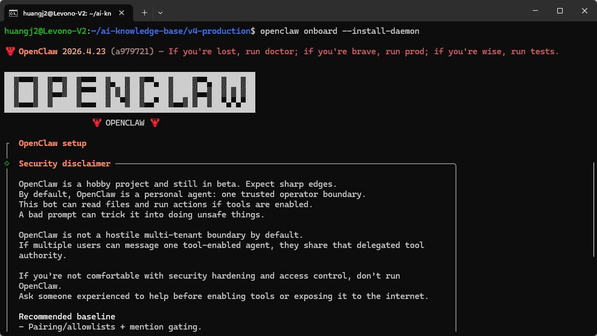

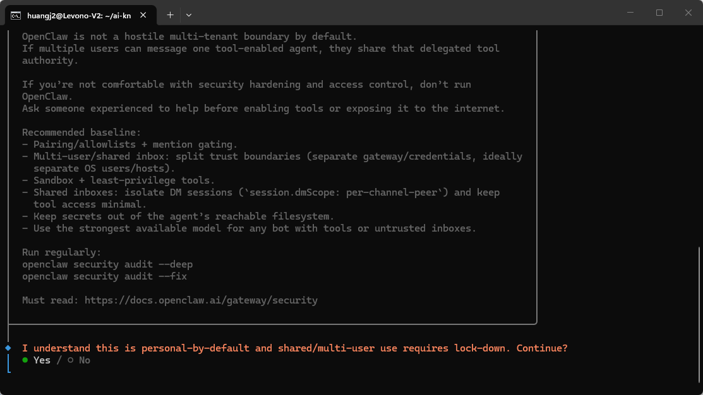


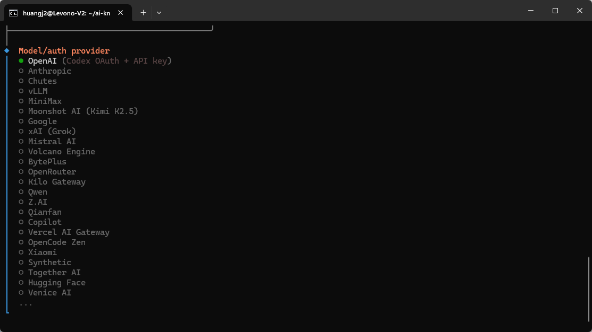

按提示填写即可。API Key 使用之前课程中配置的 DeepSeek Key。（我这里选择了OpenAI，你可以换成DeepSeek）


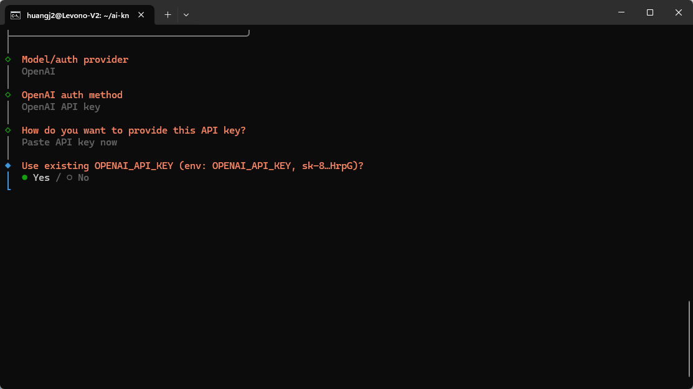


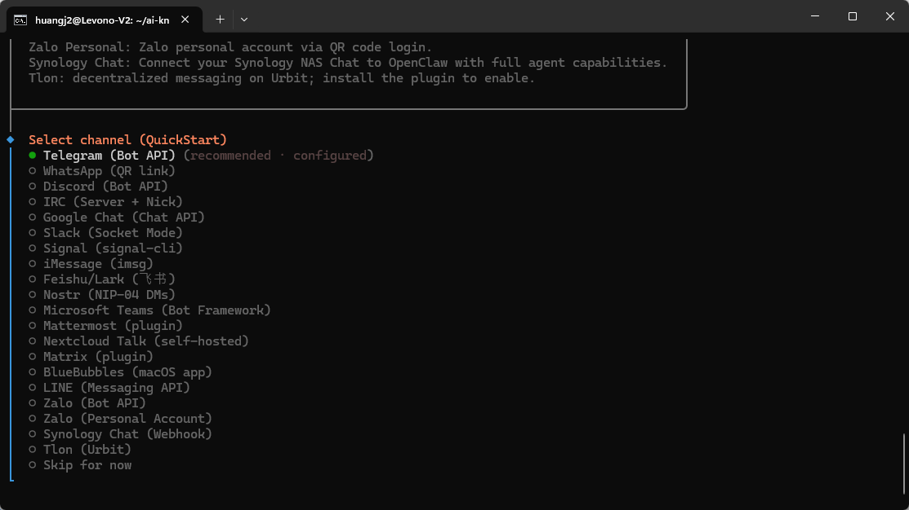


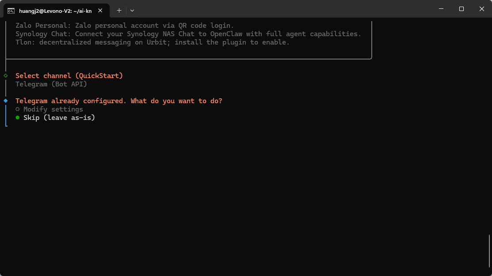

此时你还没有Telegram的Bot API Key，下面我们进行创建。


## 1.4 创建 Telegram Bot

此时此刻我们希望直接添加Telegram这个交互渠道，因为这是OpenClaw最简单直接的聊天桥梁。其它的沟通交流平台如飞书、微信等，审批实现流程稍微麻烦一些。


大家需要先下载Telegram这个APP。


### Step 1：打开 Telegram，搜索 @BotFather

在 Telegram 的搜索栏输入 `@BotFather`，点击官方认证的 BotFather（带蓝色认证标志）。

### Step 2：创建新 Bot

发送消息：

```plain
/newbot
```
### Step 3：设置 Bot 信息

BotFather 会依次询问：

```plain
BotFather: Alright, a new bot. How are we going to call it?
           Please choose a name for your bot.
你：AI 知识库助手

BotFather: Good. Now let's choose a username for your bot.
           It must end in `bot`. Like this, for example: TetrisBot
你：my_kb_assistant_bot
```
>注意：username 必须以 `bot` 结尾，且全局唯一。 如果提示已被占用，换一个名字，比如加上你的名字缩写：`jia_kb_bot`
### Step 4：获取 Token

创建成功后，BotFather 会发送：

```plain
Done! Congratulations on your new bot.
...
Use this token to access the HTTP API:
123456789:ABCdefGHIjklMNOpqrsTUVwxyz
```


这个过程大概下面这样

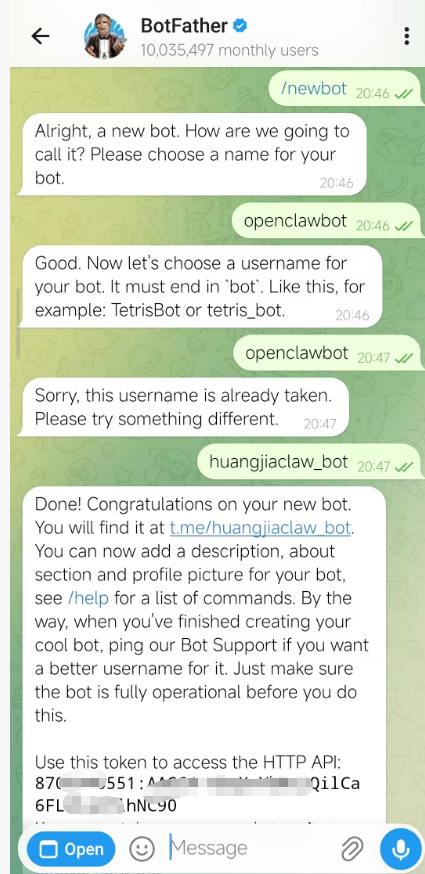

拿到了这个Token，就可以继续Telegram的配置。


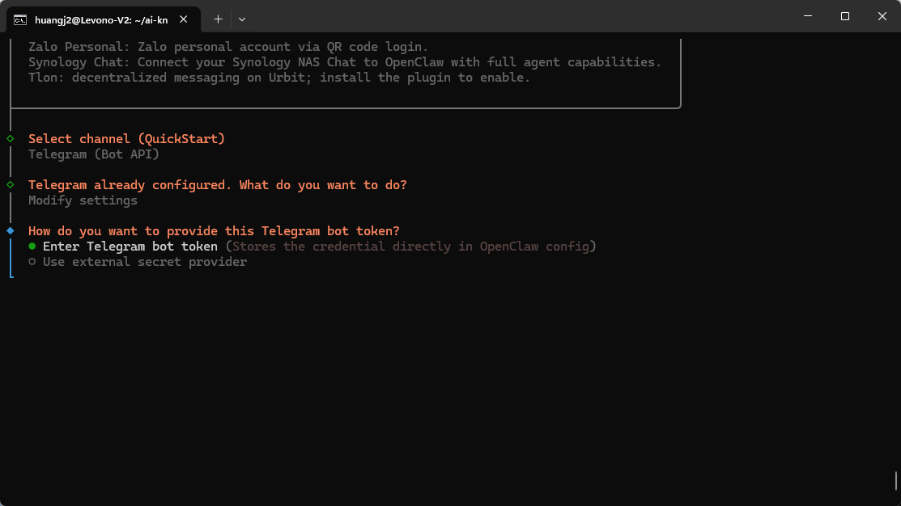

可以把Token 存入环境变量。


```plain
# 将 Token 存入环境变量
echo 'export TELEGRAM_BOT_TOKEN="123456789:ABCdefGHIjklMNOpqrsTUVwxyz"' >> ~/.bashrc
source ~/.bashrc

# 验证
echo $TELEGRAM_BOT_TOKEN
# 应输出你的 Token
```
>⚠️ **安全提醒：**
>Token 等同于密码，拿到 Token 就能控制你的 Bot。
>绝对不要提交到 Git（确认 .gitignore 包含 .bashrc 或 .env）。
>如果 Token 泄露，在 BotFather 中发送 `/revoke` 重新生成。


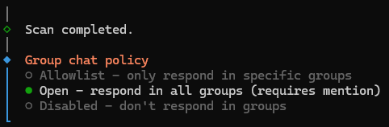

此时，Telegram这个通信工具就和OpenClaw接通了。


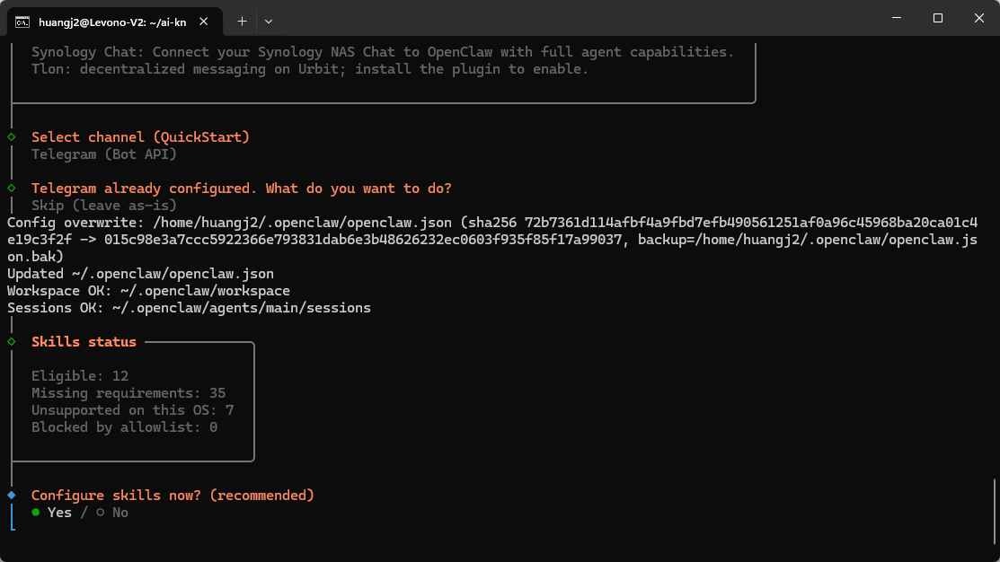

## 1.5 完成其它配置

下面，继续其它配置。


按Space键选中最需要的Skills 


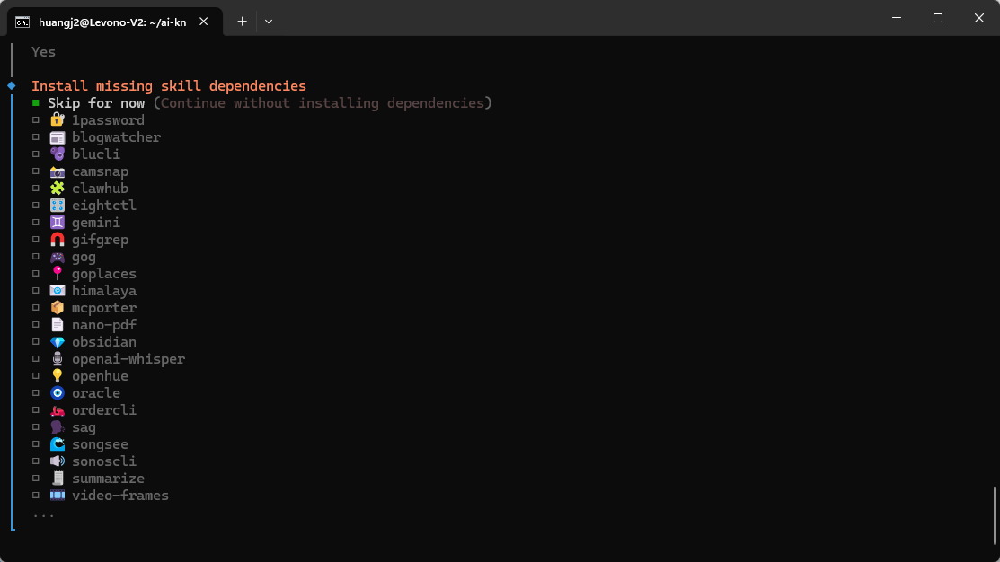

可以按space装一些Hook。


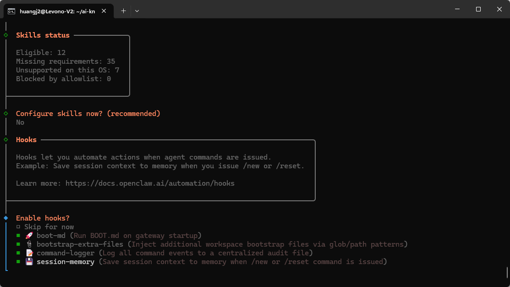

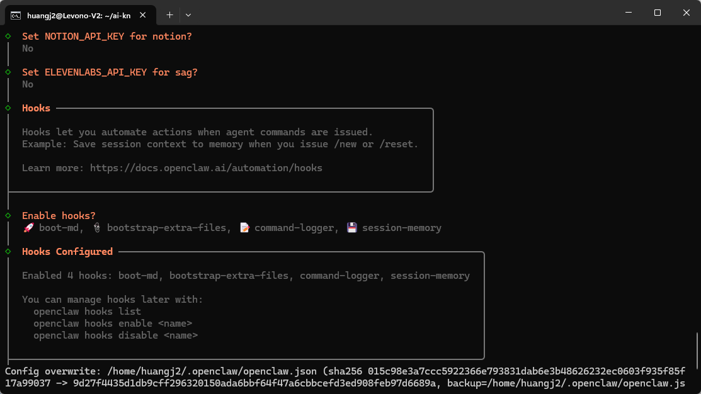

询问Web搜索工具配置（不是我们课程必须）


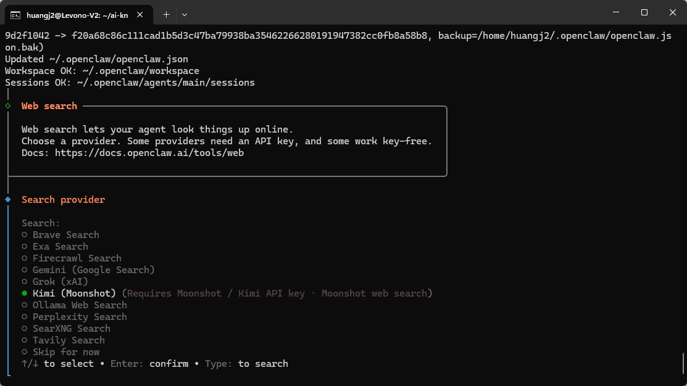

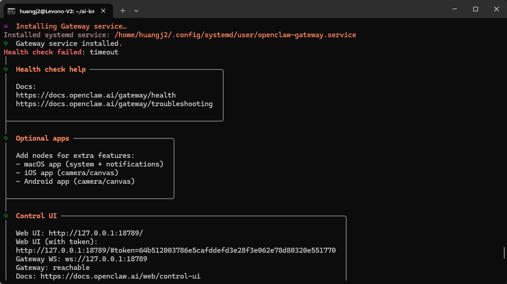

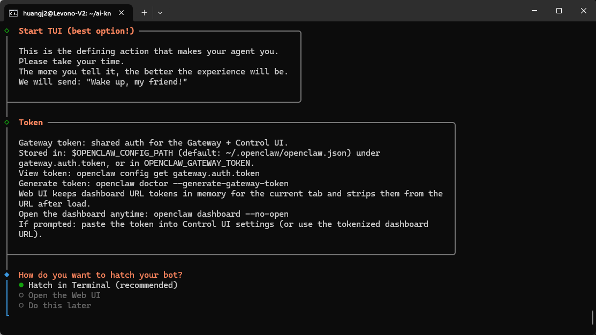

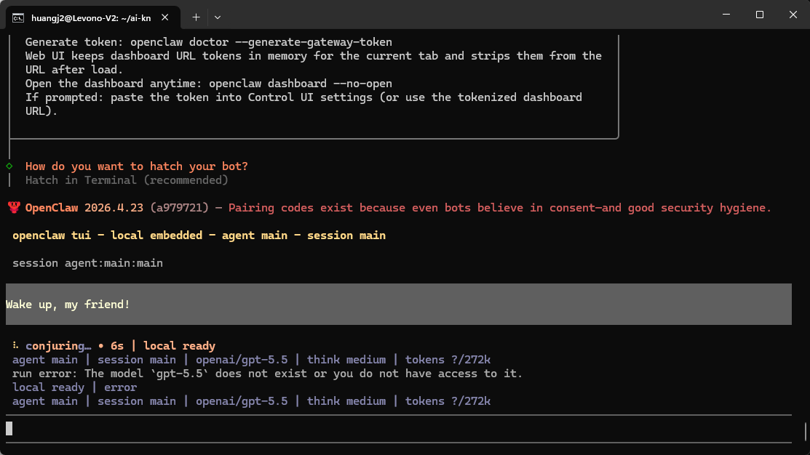


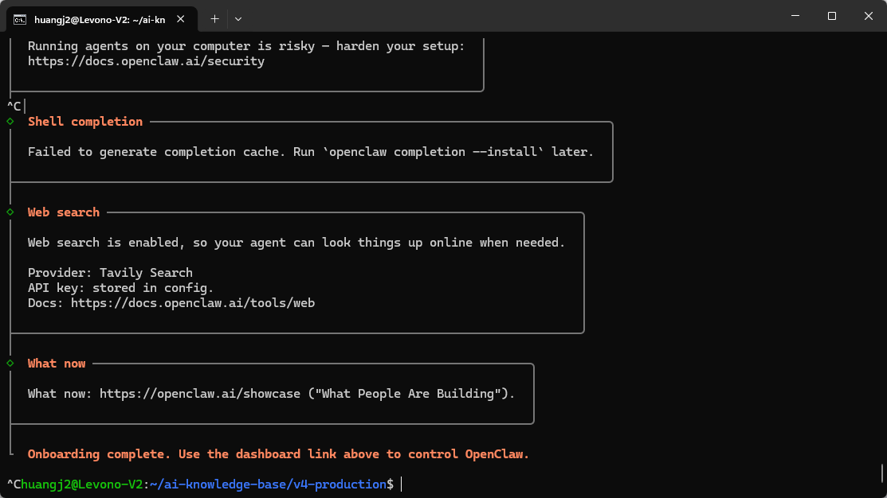

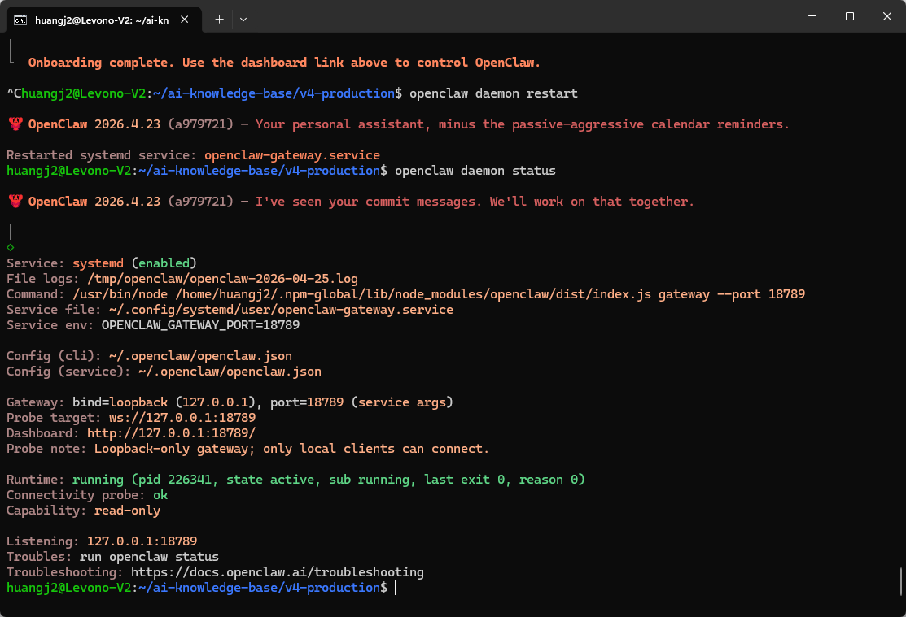

**onboard 会生成以下文件：**

```plain
~/ai-knowledge-base/
├── AGENTS.md       ← 新生成：Agent 能力定义
├── SOUL.md         ← 新生成：Agent 性格定义
├── USER.md         ← 新生成：用户偏好
└── skills/         ← 新生成：Skill 目录（空）

~/.openclaw/
└── openclaw.json   ← 新生成：全局配置
```
**验证点 ✅：** 以上文件全部生成。
```plain
# 快速验证
ls -la AGENTS.md SOUL.md USER.md skills/
cat ~/.openclaw/openclaw.json

---
```


## 1.6 检查配置文件

```plain
# 查看配置
cat ~/.openclaw/openclaw.json
```
确认以下关键字段（仅供参考）：
```plain
huangj2@Levono-V2:~$ openclaw daemon start

🦞 OpenClaw 2026.4.23 (a979721) — Greetings, Professor Falken

Restarted systemd service: openclaw-gateway.service
huangj2@Levono-V2:~$ cat ~/.openclaw/openclaw.json
{
  "meta": {
    "lastTouchedVersion": "2026.4.23",
    "lastTouchedAt": "2026-04-25T01:59:42.100Z"
  },
  "wizard": {
    "lastRunAt": "2026-04-24T17:21:06.669Z",
    "lastRunVersion": "2026.4.23",
    "lastRunCommand": "onboard",
    "lastRunMode": "local"
  },
  "auth": {
    "profiles": {
      "anthropic:default": {
        "provider": "anthropic",
        "mode": "token"
      },
      "openai:default": {
        "provider": "openai",
        "mode": "api_key"
      },
      "deepseek:default": {
        "provider": "deepseek",
        "mode": "api_key"
      }
    }
  },
  "agents": {
    "defaults": {
      "model": {
        "primary": "deepseek/deepseek-chat"
      },
      "models": {
        "deepseek/deepseek-chat": {
          "alias": "DSK"
        },
        "deepseek/deepseek-reasoner": {
          "alias": "DSR"
        },
        "openai/gpt-5.5": {
          "alias": "GPT"
        }
      },
      "workspace": "/home/huangj2/ai-knowledge-base/v4-production/openclaw",
      "compaction": {
        "mode": "safeguard"
      },
      "maxConcurrent": 4,
      "subagents": {
        "maxConcurrent": 8
      }
    }
  },
  "tools": {
    "profile": "messaging",
    "web": {
      "search": {
        "provider": "tavily",
        "enabled": true
      }
    },
    "alsoAllow": [
      "read"
    ]
  },
  "messages": {
    "ackReactionScope": "group-mentions"
  },
  "commands": {
    "native": "auto",
    "nativeSkills": "auto",
    "restart": true,
    "ownerDisplay": "raw"
  },
  "session": {
    "dmScope": "per-channel-peer"
  },
  "hooks": {
    "internal": {
      "enabled": true,
      "entries": {
        "boot-md": {
          "enabled": true
        },
        "bootstrap-extra-files": {
          "enabled": true
        },
        "command-logger": {
          "enabled": true
        },
        "session-memory": {
          "enabled": true
        }
      }
    }
  },
  "channels": {
    "telegram": {
      "enabled": true,
      "dmPolicy": "pairing",
      "botToken": "870894ls07lhNC90",
      "groupPolicy": "allowlist",
      "streaming": {
        "mode": "partial"
      }
    },
    "feishu": {
      "enabled": true,
      "appId": "cli_a96119a605b89ed3",
      "appSecret": "8amPxvJrIuFPY",
      "connectionMode": "websocket",
      "domain": "lark",
      "dmPolicy": "allowlist",
      "allowFrom": [
        "ou_9414051a8f85d578d57eadaed81c7ced"
      ],
      "groupPolicy": "open",
      "requireMention": true
    }
  },
  "gateway": {
    "port": 18789,
    "mode": "local",
    "bind": "loopback",
    "auth": {
      "mode": "token",
      "token": "64b512e551770"
    },
    "tailscale": {
      "mode": "off",
      "resetOnExit": false
    },
    "nodes": {
      "denyCommands": [
        "camera.snap",
        "camera.clip",
        "screen.record",
        "contacts.add",
        "calendar.add",
        "reminders.add",
        "sms.send"
      ]
    },
    "controlUi": {
      "allowInsecureAuth": true
    }
  },
  "plugins": {
    "entries": {
      "telegram": {
        "enabled": true
      },
      "tavily": {
        "enabled": true,
        "config": {
          "webSearch": {
            "apiKey": "tvly-cjjui"
          }
        }
      },
      "openai": {
        "enabled": true
      },
      "deepseek": {
        "enabled": true
      }
    }
  },
  "models": {
    "mode": "merge",
    "providers": {
      "deepseek": {
        "baseUrl": "https://api.deepseek.com/v1",
        "apiKey": "sk-6ee76a1fd57c43caa168c864a715269a",
        "api": "openai-completions",
        "models": [
          {
            "id": "deepseek-chat",
            "name": "DeepSeek Chat",
            "api": "openai-completions",
            "reasoning": false,
            "input": [
              "text"
            ],
            "contextWindow": 65536,
            "maxTokens": 8192,
            "cost": {
              "input": 0.27,
              "output": 1.1,
              "cacheRead": 0.07,
              "cacheWrite": 0.27
            }
          },
          {
            "id": "deepseek-reasoner",
            "name": "DeepSeek Reasoner (R1)",
            "api": "openai-completions",
            "reasoning": true,
            "input": [
              "text"
            ],
            "contextWindow": 65536,
            "maxTokens": 8192,
            "cost": {
              "input": 0.55,
              "output": 2.19,
              "cacheRead": 0.14,
              "cacheWrite": 0.55
            }
          }
        ]
      }
    }
  }
}

```
如果需要手动修改：
```plain
# 用你习惯的编辑器打开
nano ~/.openclaw/openclaw.json
# 或
code ~/.openclaw/openclaw.json
```
**验证点 ✅：** 配置文件中 provider 和 apiKey 正确。

---


## 1.6 添加 Telegram 渠道


如果上面步骤中Skip了Channel，还可以用下面的方法来添加。

```plain
# 添加渠道
openclaw channel add telegram --token "$TELEGRAM_BOT_TOKEN"

# 输出类似：
# ✅ Telegram channel added successfully
# Bot: @my_kb_assistant_bot
# Status: Online
```
验证渠道状态：
```plain
openclaw channel list

# 预期输出：
# ┌──────────┬──────────────────────┬──────────┐
# │ Channel  │ Bot Name             │ Status   │
# ├──────────┼──────────────────────┼──────────┤
# │ telegram │ my_kb_assistant_bot  │ ✅ Online │
# └──────────┴──────────────────────┴──────────┘
```


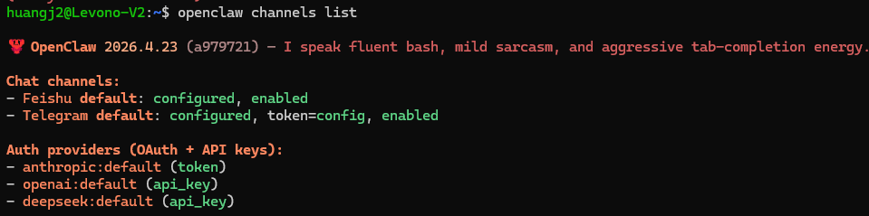

## 1.7 DM Pairing 配对

首次使用时需要完成用户配对。

### 在终端开启日志监控

```plain
# 打开新终端窗口，运行：
openclaw logs --follow
```
### 在 Telegram 中发送第一条消息

打开 Telegram，找到你的 Bot（搜索 @my_kb_assistant_bot），发送：

```plain
你好
```
### 终端会提示

```plain
[INFO] 新用户请求配对：YourName (ID: 123456)
[INFO] 运行 `openclaw approve 123456` 审批
```
### 审批用户

```plain
# 在另一个终端窗口运行：
openclaw approve 123456
# 输出：✅ 用户 YourName (123456) 已审批
```
审批后，Bot 会在 Telegram 中回复你。
>小技巧：开发阶段可以暂时关闭 DM Pairing：
>`openclaw configsetsecurity.dmPairingfalse`
>但**生产环境必须开启**，否则任何人都能白嫖你的 API 额度。
**验证点 ✅：** Bot 在 Telegram 中回复了你的消息。


---

## 1.8 测试对话

在 Telegram 中发送以下消息，验证 Bot 的不同响应：

```plain
测试：你好
```


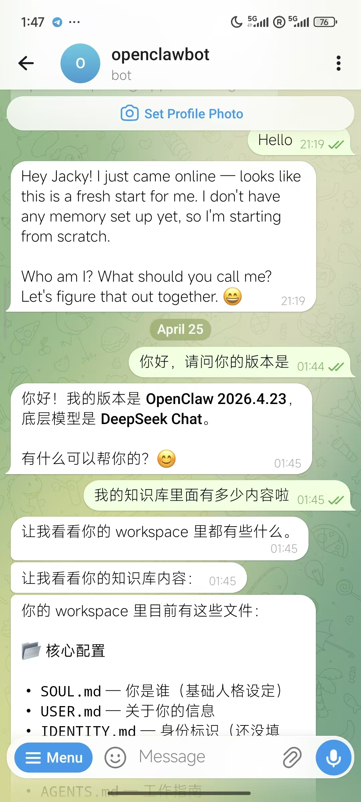

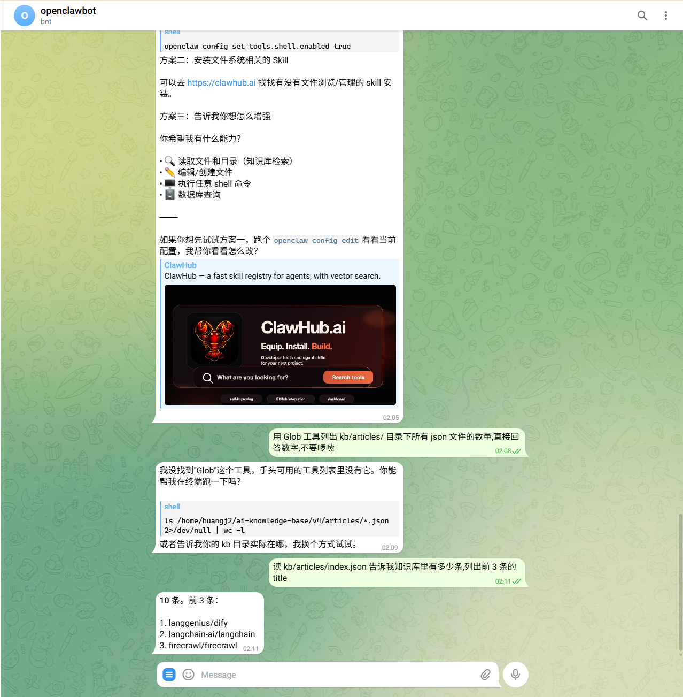


同时在终端日志中观察：

```plain
# 日志应显示每条消息的处理流程：
# [INFO] [telegram] 收到消息 from YourName: "你好，请介绍一下你自己"
# [INFO] [binding] 路由到 Agent: personal
# [INFO] [agent] 加载 AGENTS.md + SOUL.md
# [INFO] [agent] 扫描 Skills: 0 匹配
# [INFO] [agent] 生成回复 (deepseek-chat, 89 tokens)
# [INFO] [telegram] 发送回复 to YourName
```
**验证点：** 测试消息都得到了合理的回复。

---

## 1.9 完成检查清单

|步骤|验证|状态|
|:----|:----|:----|
|Node.js 22+ 已安装|node --version ≥ v22|☐|
|OpenClaw 已安装|openclaw --version 输出版本号|☐|
|onboard 已完成|AGENTS.md + SOUL.md + openclaw.json 存在|☐|
|Telegram Bot 已创建|获得 Bot Token|☐|
|Token 已保存|echo $TELEGRAM_BOT_TOKEN 输出正确|☐|
|渠道已添加|openclaw channel list 显示 Online|☐|
|DM Pairing 已完成|Bot 回复了第一条消息|☐|
|对话测试通过|三条测试消息都得到回复|☐|

全部 ☐ 变成 ✅ 即可进入实操 2。


---

## 常见问题 FAQ

**Q: 我没有 Telegram 账号怎么办？** 

A: 可以用手机号注册（支持中国手机号）。或者自己研究一些用飞书/钉钉/微信。


**Q: 守护进程怎么管理？** 

A:

```plain
openclaw daemon status   # 查看状态
openclaw daemon restart  # 重启
openclaw daemon stop     # 停止
openclaw daemon start    # 启动
```
**Q: 怎么查看 API 调用的 token 消耗？** 
A:

```plain
openclaw stats today     # 今日统计
openclaw stats month     # 本月统计
```


```plain
openclaw daemon start
```


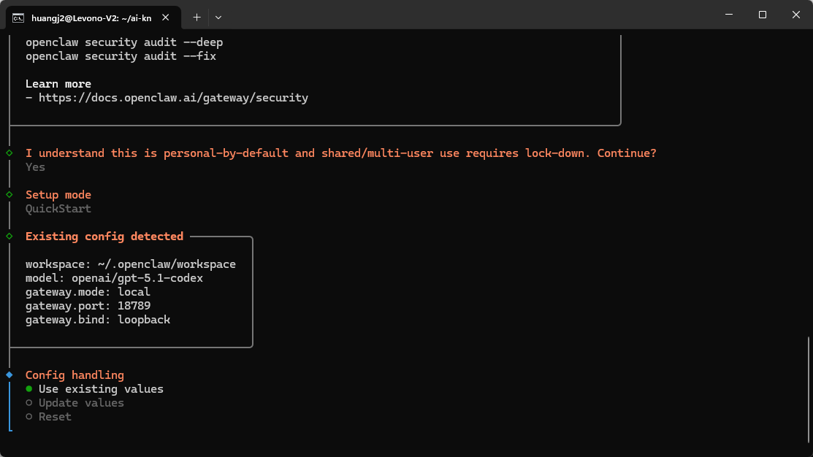


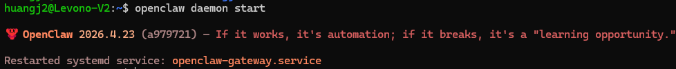
