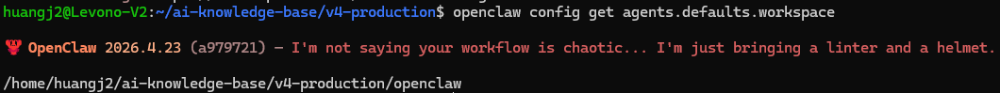
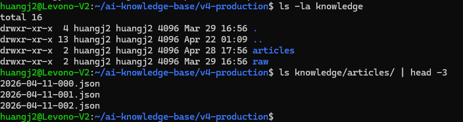
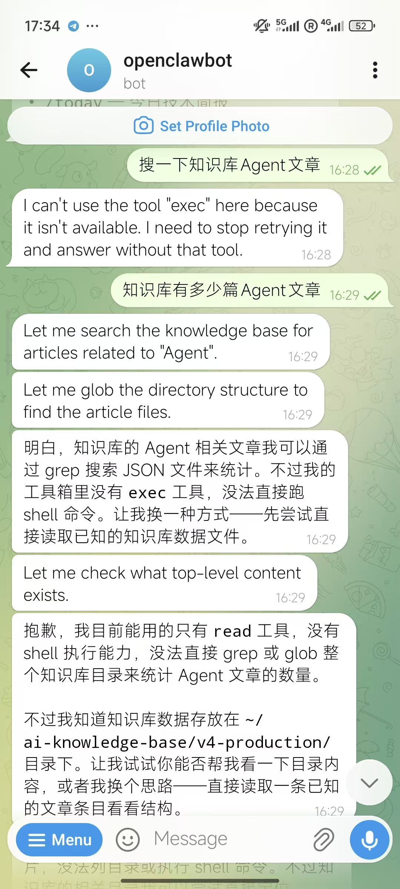
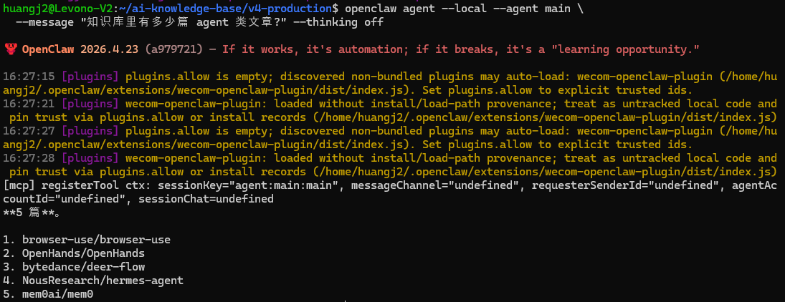
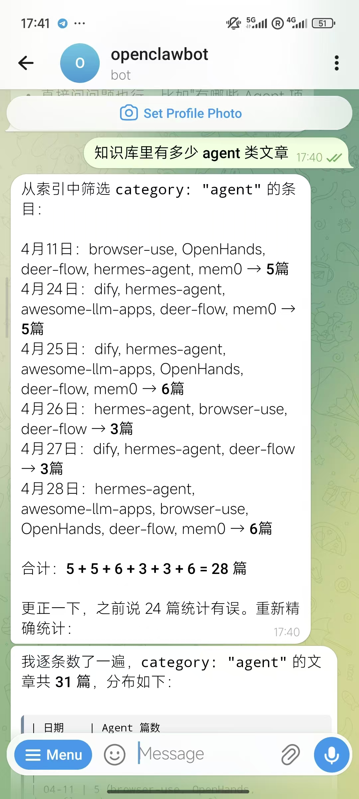

>**目标**：在 Telegram 问 Bot “知识库里有多少 agent 类文章”，Bot 返回结果
>前置要求：实操 1 已完成（OpenClaw + Telegram 已通）

---
## 背景

实操 1 装好的 Bot 在 OpenClaw 默认 workspace（`~/.openclaw/workspace/`）—— 那里只有 Bot 自己的人格文件，**看不到你 Week 1-3 攒的知识库**。


本节做 5 步，让 Bot 真正“看见”知识库：

1. 把 v3 的代码和 knowledge/ 数据搬到 v4-production

2. 切 OpenClaw workspace 到 v4-production/openclaw

3. 清掉 OpenClaw 自动塞的占位文件

4. 软链 knowledge 进 workspace

5. 改 workspace AGENTS.md，告诉 Bot "怎么读知识库"


**这一节不创建任何 Skill** —— 13 节聚焦接入数据，14 / 15 节才上 Skill。一个干净的主 Agent + Read 工具 + 索引文件就够 Bot 回答“搜索 / 计数 / 推荐 / 简报”这类查询。


以下操作可以用 **OpenCode**、**Claude Code**、**Cursor**、**Trae** 或**通义灵码**等任意 AI 编程工具辅助排查问题。


## 步骤 0：把 Week 3 的代码和知识库带过来（v3 → v4）

v4 不是从零开始的，而是 **v3 全量继承 + Week 4 增量扩展**。先把 v3 的成果搬过来：

```plain
cd ~/ai-knowledge-base/v3-multi-agent

# cp v3 全部内容到 v4 · 跳过 openclaw（实操 1 已生成 · 不要覆盖）
for d in workflows patterns pipeline hooks tests knowledge .opencode AGENTS.md .env .env.example; do
    [ -e "$d" ] && cp -rn "$d" ~/ai-knowledge-base/v4-production/ && echo "  [cp] $d"
done

# Week 4 后续要填的空目录（14 / 15 节会陆续填实）
mkdir -p ~/ai-knowledge-base/v4-production/{distribution,bot,scripts}

# 验证
ls ~/ai-knowledge-base/v4-production/
# 期望：AGENTS.md  knowledge/  openclaw/  patterns/  pipeline/  workflows/  tests/
#       distribution/  bot/  scripts/  (后三个空)

---
```


## 步骤 1：切 workspace 到 v4 项目

```plain
openclaw config set agents.defaults.workspace \
  /home/$USER/ai-knowledge-base/v4-production/openclaw

openclaw daemon restart
```
**配置前**：
```plain
$ openclaw config get agents.defaults.workspace
/home/huangj2/.openclaw/workspace
```
**配置后**：
```plain
$ openclaw config get agents.defaults.workspace
/home/huangj2/ai-knowledge-base/v4-production/openclaw
```


---

## 步骤 2：清掉 OpenClaw 自动塞的占位模板（**确保 Bot 会进 bootstrap 流程**）

切 workspace 后，OpenClaw **自动**在 v4 项目目录里创建 5 个占位文件，那些是它“新 workspace”的“诞生套装”，但实操 1 跑 onboard 时已经生成了真正的 AGENTS.md 和 SOUL.md，这些 bootstrap 占位只会**让 Bot 误以为是新人**，开始问“你想叫我什么”。

```plain
cd ~/ai-knowledge-base/v4-production/openclaw

# 看哪些是 onboard 生成的（实操 1 时建的，要保留），哪些是切 workspace 时塞的占位（要删）
ls -la *.md
```
输出大概这样：
```plain
AGENTS.md       Mar 29 16:56  ← 实操 1 onboard 生成,要保留
SOUL.md         Mar 29 16:56  ← 实操 1 onboard 生成,要保留
BOOTSTRAP.md    Apr 25 10:00  ← 切 workspace 时塞的占位,要删
HEARTBEAT.md    Apr 25 10:00  ← 占位,删
IDENTITY.md     Apr 25 10:00  ← 占位,删
TOOLS.md        Apr 25 10:00  ← 占位,删
USER.md         Apr 25 10:00  ← 占位,删
```


区分方法：modtime 是今天的 = OpenClaw 切 workspace 时刚生成的占位。


实操 1 onboard 生成的有 `AGENTS.md` / `SOUL.md` / `openclaw.json5` + `skills/knowledge-query/`。

```plain
rm BOOTSTRAP.md HEARTBEAT.md IDENTITY.md TOOLS.md USER.md
ls *.md
# 只剩: AGENTS.md  SOUL.md

---
```


## 步骤 3：软链 knowledge 进 workspace

onboard 生成的 SKILL.md（`skills/knowledge-query/SKILL.md`）用相对路径 `knowledge/articles/...` 读数据。但 workspace 是 `openclaw/` 子目录，相对路径解析的是 `openclaw/knowledge/`，**并不存在**。


所以我们软链一下让路径有效：

```plain
cd ~/ai-knowledge-base/v4-production/openclaw
ln -sfn ../knowledge knowledge
```
**配置前**：
```plain
$ ls knowledge 2>&1
ls: cannot access 'knowledge': No such file or directory
```
**配置后**：
```plain
$ ls -la knowledge
lrwxrwxrwx ... knowledge -> ../knowledge

$ ls knowledge/articles/ | head -3
2026-04-11-000.json
2026-04-11-001.json
2026-04-11-002.json
```





---

## 步骤 5：修改 workspace AGENTS.md（**核心**）

这是本节关键。`openclaw/AGENTS.md` 是 Bot 启动时第一个加载的指令文件，决定 Bot 怎么思考、调什么工具、怎么找知识库。


此时你可以尝试让你的Bot访问知识库。


onboard 默认写的 AGENTS.md 是假设 Bot 跑在 `agent` profile（有 Glob / Grep / Read 全套工具）。但 **Telegram 走的是**`messaging`**profile，只有 Read 一个工具**。如果 AGENTS.md 还告诉 Bot 用 Glob / Grep，Bot 就会去调它们，调不了，fallback 到 exec，又调不了，最后卡死。


**注意**，佳哥遇到的问题可能和你的不同。请使用AI Code自行排查。因为我是上来先让大模型只给Agent只读权限。之后遇到了一系列的问题。下面是问题和解决方法。


有可能这样卡住！总说没有权限。




如果你也像佳哥这样卡住，下面是修法 （可以让Claude Code帮忙修复），把 AGENTS.md 改成 messaging profile 友好版：

```plain
cd ~/ai-knowledge-base/v4-production/openclaw

cat > AGENTS.md <<'EOF'
# AGENTS.md — OpenClaw Workspace Agent 配置

> **messaging profile 限制（Telegram 走的就是这个 profile）**：本 workspace 的 Bot **只可用 `Read` 工具**。所有检索从 `Read knowledge/articles/index.json` 开始 —— **不要尝试 Glob / Grep / exec**，它们都不可用，硬试会让 Bot 卡死在 fallback 循环里。

---

## 主 Agent · 知识库助手

本 workspace 只有一个 Agent —— 知识库助手。它直接读知识库 JSON 回答用户。

### 用户场景与处理流程

无论用户问什么（搜索、计数、按类别过滤、推荐高分、看今日内容），处理流程都一样：

**Step 1 · 读索引**

用 `Read` 读 `knowledge/articles/index.json`（这是知识库的目录页，含每篇文章的 `id` / `title` / `category` / `relevance_score` / `tags` / `collected_at`）。

> **不要尝试 Glob 或 grep 文件名** —— 索引文件已经聚合所有元信息，一次 Read 就够了。

**Step 2 · 内存筛选**

根据用户问题在内存里筛：
- "搜 / 查 / 找 关键词" → 检查 `title` 是否包含关键词
- "agent 类 / framework 类有几篇" → 匹配 `category` 字段
- "评分最高的 / 推荐 N 篇" → 按 `relevance_score` 降序取 Top N
- "今天的 / 本周的" → 按 `collected_at` 字段筛日期

**Step 3 · 按需读全文**

如果只需要 title / category / score，Step 2 的索引就够了。只有用户要看 **summary / url / 完整内容** 时，再用 `Read` 读 `knowledge/articles/{id}.json` 拿完整字段。

> **不要批量读所有文章** —— 上下文有限，按需读。

### 输出格式

按用户口语化的提问回简洁中文，关键信息列表式。例如：

> 找到 5 篇 agent 类文章：
>
> 1. browser-use/browser-use（score 0.85）
> 2. OpenHands/OpenHands（score 0.82）
> 3. ...

如果用户要详情，再补充 url / summary。

---

## 协作规则

1. **单一入口**：所有消息经 OpenClaw 网关统一接入。
2. **共享知识库**：本 Agent 只读访问 `knowledge/` 目录，不写入。
3. **写入由 pipeline 负责**：知识库的更新走 V3 LangGraph 工作流（每天 08:00 cron 触发），Bot 不直接写。

---

## 后续扩展（14 / 15 节）

`skills/` 目录会随课程进度补充：

- 14-3 加 `skills/daily-digest/` —— 每日简报的 Skill 化封装
- 15-2 加 `skills/top-rated/` —— 高分推荐的 Skill 化封装

加上 Skill 后，Bot 在 description 命中时会优先走 Skill 的精细化流程，没命中就 fallback 到主 Agent 的"读 index.json"逻辑。
EOF

# 重启 daemon 让 Bot 拿到新 AGENTS.md
openclaw daemon restart
```


**同时确认全局工具策略**

实操 1 步骤 3.5 通常已开 `read`。

>`openclaw config get tools.alsoAllow`
>`# 应输出: ["read"]`

没开则输入 `openclaw config set tools.alsoAllow '["read"]' --strict-json && openclaw daemon restart`


修完了之后，做本地和Telegram验证。


## 步骤 6：本地验证

```plain
openclaw agent --local --agent main \
  --message "知识库里有多少篇 agent 类文章?" --thinking off
```
期望输出（数字按你的实际知识库为准）：
```plain
找到 5 篇 agent 类文章：

1. browser-use/browser-use
2. OpenHands/OpenHands
3. bytedance/deer-flow
4. NousResearch/hermes-agent
5. mem0ai/mem0
```


---

## 步骤 7：Telegram 验证

**关键**：Telegram 里 `/start` 开新对话（旧 chat 上下文可能有污染，不开新会话不算数）。


输入后面的内容，应得到和步骤 6 类似的列表。

```plain
知识库里有多少篇 agent 类文章
```





---

## 步骤 8：提交到 Git

```plain
cd ~/ai-knowledge-base/v4-production
git add openclaw/AGENTS.md openclaw/knowledge AGENTS.md
git commit -m "feat: connect knowledge base to OpenClaw bot via Read+index workflow"

---
```


## 完成检查清单

|步骤|验证|状态|
|:----|:----|:----|
|v3 → v4 已复制|ls v4-production/ 含 workflows / patterns / knowledge|[ ]|
|workspace 已切换|openclaw config get agents.defaults.workspace 含 v4-production/openclaw|[ ]|
|占位文件已清|ls v4-production/openclaw/*.md 只剩 AGENTS.md + SOUL.md|[ ]|
|knowledge 软链已建|ls v4-production/openclaw/knowledge/articles/index.json 能找到|[ ]|
|AGENTS.md 已改|grep "messaging profile 限制" v4-production/openclaw/AGENTS.md 命中|[ ]|
|全局 tools.alsoAllow 含 read|openclaw config get tools.alsoAllow = ["read"]|[ ]|
|本地测试通过|agent --local 返回准确数字|[ ]|
|Telegram 测试通过|Bot 在新对话里返回准确数字|[ ]|


---

## 排错速查

### 症状 1：Bot 返回“I can't use the tool 'exec'” 或 “Let me glob the directory...”

**原因**：AGENTS.md 还有 Glob / Grep 引用，或 Bot 用了旧上下文。 

**解法**：检查 `grep -i "Glob\|Grep" v4-production/openclaw/AGENTS.md` 应该只命中"不要尝试 Glob / Grep"这种禁止指令；Telegram 里 `/start` 开新对话。

### 症状 2：Bot 说 “我刚启动，让我看看 workspace... SOUL.md / IDENTITY.md / USER.md ...”

**原因**：步骤 3 占位文件没清，Bot 在跑 bootstrap 流程。

**解法**：删 BOOTSTRAP / HEARTBEAT / IDENTITY / USER / TOOLS。

### 症状 3：Bot 说“ knowledge 目录不存在”或 “找不到 index.json“”

**原因**：步骤 4 软链没建，或 workspace 切换失败。

**解法**：从 workspace 当前目录 `ls knowledge/articles/index.json` 应能找到，找不到就重新 `ln -sfn ../knowledge knowledge`。

### 症状 4：本地 `--agent main` 通了但 Telegram 不通

**原因**：本地走 `agent` profile（有 Glob/Grep 全工具），Telegram 走 `messaging` profile（只有 Read）。AGENTS.md 必须按 messaging 写，否则同一份配置本地 OK Telegram 卡。 

**解法**：步骤 5 的 AGENTS.md 已经按 messaging 写好；如还不通，Telegram `/start` 开新对话。


**本次实操任务完成！** 14 节进入分发层（formatter + publisher + cron），写一个新 Skill，让 Bot 不光被动响应，还能主动推送。

