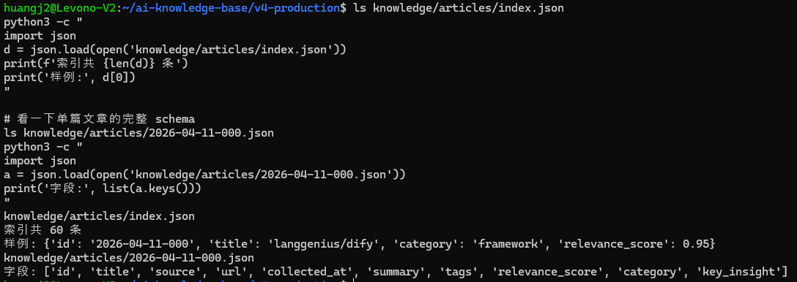
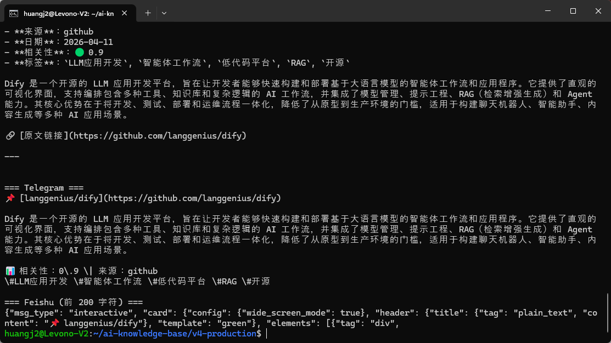
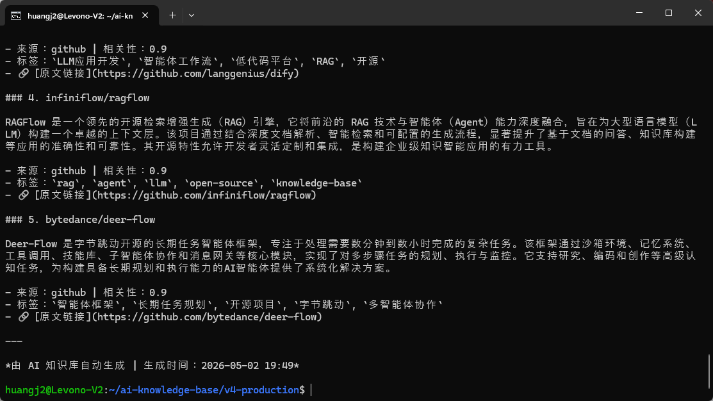

>**学习目标**：formatter.py 能加载 JSON 并输出 Markdown / Telegram 两种格式
>**说明**：佳哥只测试了Telegram，飞书等格式请大家自行开发。

---

## 背景

这一节我们的目标是要实现格式化的每日知识简报。那么我们先用Python来实现这个功能。

格式化层是分发三层架构的中间层：

```plain
数据层 (JSON) → 格式化层 (formatter.py) → 推送层 (publisher.py)
```
格式化层是**纯函数**——给文章列表，返回格式化字符串。没有网络请求，可以完全在本地测试。

以下代码可以用 **OpenCode**、**Claude Code**、**Cursor**、**Trae** 或**通义灵码**等任意 AI 编程工具生成。

## 步骤 1：确认真实知识库数据

13-2 步骤 1 你已经把 v3 的 `knowledge/` cp 到 v4-production，里面就有真实的文章 JSON。本节直接用它们测，不再造假数据。

```plain
cd ~/ai-knowledge-base/v4-production

# 看一下索引（每条 4 个字段：id / title / category / relevance_score）
ls knowledge/articles/index.json
python3 -c "
import json
d = json.load(open('knowledge/articles/index.json'))
print(f'索引共 {len(d)} 条')
print('样例:', d[0])
"

# 看一下单篇文章的完整 schema
ls knowledge/articles/2026-04-11-000.json
python3 -c "
import json
a = json.load(open('knowledge/articles/2026-04-11-000.json'))
print('字段:', list(a.keys()))
"
```
**期望输出：**



```plain
索引共 60 条
样例: {'id': '2026-04-11-000', 'title': 'langgenius/dify', 'category': 'framework', 'relevance_score': 0.95}
字段: ['id', 'title', 'source', 'url', 'collected_at', 'summary', 'tags', 'relevance_score', 'category', 'key_insight']
```
**数据分两层**：
`index.json` 是**索引**（slim：id / title / category / relevance_score），适合快速筛选。

`{id}.json` 是**全文**（fat：含 summary / url / tags / key_insight 等），格式化用。


13 节让 Bot 用过 index.json 做检索，本节 formatter 处理的是单篇 fat JSON，输入是文件 dict 而非索引行。


## 步骤 2：用 AI 编程工具生成 formatter.py

**提示词：**

```plain
请帮我编写 ~/ai-knowledge-base/v4-production/distribution/formatter.py 格式化模块。

输入数据 schema（单篇文章 JSON · v3 LangGraph Organizer 节点产出）：
{
  "id": "2026-04-11-000",
  "title": "langgenius/dify",
  "source": "github",
  "url": "https://github.com/langgenius/dify",
  "collected_at": "2026-04-11T16:03:47.946653+00:00",
  "summary": "Dify 是一个开源 LLM 应用开发平台...",
  "tags": ["LLM应用开发", "智能体工作流", "RAG"],
  "relevance_score": 0.9,
  "category": "framework",
  "key_insight": "Dify 通过一体化平台显著降低 AI 工作流开发门槛"
}

需求：
1. json_to_markdown(article) — 单篇 → Markdown
   - 标题、来源、日期（截 collected_at 前 10 位）、相关性评分（>= 0.8 🟢 / >= 0.6 🟟 / 否则 🔴）、标签、summary、原文链接
2. json_to_telegram(article) — 单篇 → Telegram MarkdownV2
   - 转义 _*[]()~`>#+-=|{}.! 这些特殊字符
   - 标题链接、summary、相关性、来源、tag(空格替换为下划线)
3. json_to_feishu(article) — 单篇 → 飞书 interactive 卡片 dict
   - msg_type=interactive, header.template 按 score 染色（green/yellow/red）
4. generate_daily_digest(knowledge_dir="knowledge/articles", date=None, top_n=5) — 当日简报
   - date=None 默认今天；用 Path.glob(f"{date}-*.json") 扫文件
   - 按 relevance_score 降序取 Top N
   - 返回 dict: {"markdown": ..., "telegram": ..., "feishu": ...}
   - 当日无文章时返回 "📭 {date} 暂无新增知识条目"

编码规范：PEP 8，Google 风格 docstring，类型注解。formatter 是纯函数，不发网络请求（网络归 publisher.py）。
```
**生成的代码**（参考实现）：
```plain
"""formatter.py — 多格式内容转换器。

将知识库 JSON 条目转换为 Markdown、Telegram、飞书等渠道格式。
纯函数设计，无外部依赖。
"""

import json
from datetime import datetime
from pathlib import Path


def json_to_markdown(article: dict) -> str:
    """将单篇文章 JSON 转换为可读的 Markdown 格式。"""
    tags_str = ", ".join(f"`{tag}`" for tag in article.get("tags", []))
    score = article.get("relevance_score", 0)
    score_bar = "🟢" if score >= 0.8 else "🟡" if score >= 0.6 else "🔴"

    return f"""## {article['title']}

- **来源**：{article.get('source', '未知')}
- **日期**：{article.get('collected_at', '未知')[:10]}
- **相关性**：{score_bar} {score:.1f}
- **标签**：{tags_str}

{article.get('summary', '暂无摘要')}

🔗 [原文链接]({article.get('url', '#')})

---
"""


def json_to_telegram(article: dict) -> str:
    """将单篇文章 JSON 转换为 Telegram MarkdownV2 格式。"""
    def escape_md(text: str) -> str:
        for char in r"_*[]()~`>#+-=|{}.!":
            text = text.replace(char, f"\\{char}")
        return text

    title = escape_md(article["title"])
    summary = escape_md(article.get("summary", "暂无摘要"))
    url = article.get("url", "#")
    tags = " ".join(f"\\#{escape_md(tag)}" for tag in article.get("tags", []))

    return f"""📌 [{title}]({url})

{summary}

📊 相关性：{article.get('relevance_score', 0):.1f} \\| 来源：{escape_md(article.get('source', '未知'))}
{tags}"""


def generate_daily_digest(knowledge_dir="knowledge/articles", date=None, top_n=5):
    """生成每日简报，输出 Markdown / Telegram / 飞书三种格式。"""
    if date is None:
        date = datetime.now().strftime("%Y-%m-%d")
    articles_path = Path(knowledge_dir)
    articles = []
    for json_file in articles_path.glob(f"{date}-*.json"):
        with open(json_file, "r", encoding="utf-8") as f:
            articles.append(json.load(f))
    articles.sort(key=lambda a: a.get("relevance_score", 0), reverse=True)
    top_articles = articles[:top_n]
    # 返回三种格式...
    return {"markdown": ..., "telegram": ..., "feishu": ...}
```


## 步骤 3：用真实数据验证

**测 1 · 单篇格式化**（拿索引第一条 = `2026-04-11-000` Dify）：

```plain
cd ~/ai-knowledge-base/v4-production
python3 -c "
import json
from distribution.formatter import json_to_markdown, json_to_telegram, json_to_feishu

article = json.load(open('knowledge/articles/2026-04-11-000.json'))

print('=== Markdown ===')
print(json_to_markdown(article))
print()
print('=== Telegram ===')
print(json_to_telegram(article))
print()
print('=== Feishu (前 200 字符) ===')
print(json.dumps(json_to_feishu(article), ensure_ascii=False)[:200])
"
```




**测 2 · 当日简报**（用知识库里真实有的日期 `2026-04-11`，那天 10 条）：

```plain
python3 -c "
from distribution.formatter import generate_daily_digest
result = generate_daily_digest(date='2026-04-11', top_n=5)
print('=== Markdown 简报 ===')
print(result['markdown'])
"
```




>把日期改成你知识库里实际有数据的日期。`ls knowledge/articles/2026-*.json | head -1` 可以看最早的一天。
**检查清单：**

|检查项|期望|
|:----|:----|
|json_to_markdown() 输出包含标题、来源、相关性、标签|[ ]|
|json_to_telegram() 输出包含 MarkdownV2 转义字符|[ ]|
|相关性评分正确显示（0-1 浮点数，带颜色指示）|[ ]|
|generate_daily_digest() 返回三种格式字典|[ ]|


## 步骤 4：提交到 Git

```plain
git add distribution/formatter.py
git commit -m "feat: add formatter with markdown / telegram / feishu output"
```


## 扩展（可选 · 跑通了再玩）

主线三种格式跑通后，让 AI 帮你加点花样：

* **用**`key_insight`**做摘要替代** 真实数据每条都有 `key_insight`（curated 一句话）。让 AI 把 digest 里的 `summary`（长）换成 `key_insight`（短），简报会瘦下来一半。

* **按 category 分组** 当前是平铺。让 AI 改成按 `category` 分组：framework / agent / rag / tool / mcp / ...，每组取 top N。category 的真实取值看 `python3 -c "import json; d=json.load(open('knowledge/articles/index.json')); print(set(a['category'] for a in d))"`。

* **超长摘要截断** Telegram 单条 4096 字限，超过就 `...` 截断 + 链接看完整。

* **基于 index.json 的快速预览** 做一个 `digest_from_index(date, top_n)` —— 只读 `index.json` 出 Top N 标题和 score，不读全文，秒级响应。要详情才回头读 `{id}.json`。这是 Bot 的"延迟加载"思路在 Python 端的复用。

提示：每加一种格式，让 AI 顺手写个 unit test。你看懂测试，就敢用代码。


**完成！** formatter.py 实现了两种格式输出，纯函数设计。进入实操 2 实现推送层。

