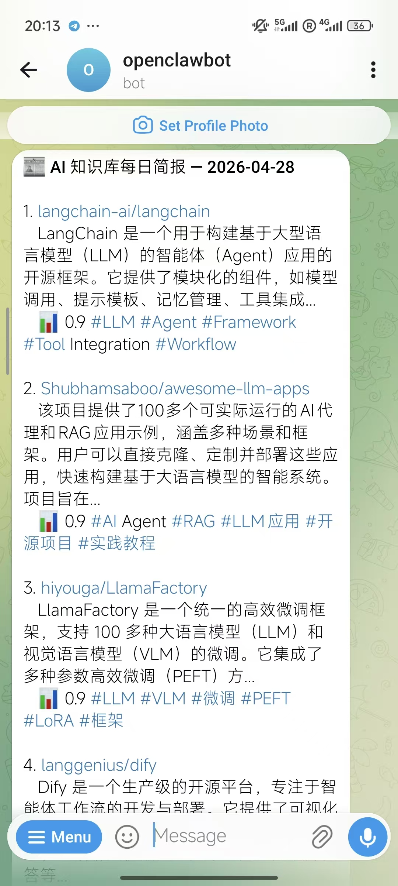

>学习目标：publisher.py 能推送到 Telegram + 飞书（异步架构，大家自己摸索） 
>前置要求：实操 1 的 formatter.py 已完成

---

## 背景

推送层负责把格式化内容发送到目标渠道：

```plain
formatter.py（已完成） → publisher.py（本实操） → Telegram / 飞书（异步并发）
```
推送层依赖网络（Telegram API / 飞书 webhook）。没配凭证的同学可以先跑 dry-run（步骤 3），有凭证再跑真实推送（步骤 4）。

以下代码可以用 **OpenCode**、**Claude Code**、**Cursor**、**Trae** 或**通义灵码**等任意 AI 编程工具生成。


## 步骤 1：用 AI 编程工具生成 publisher.py

**提示词：**

```plain
请帮我编写 ~/ai-knowledge-base/v4-production/distribution/publisher.py 推送模块：

需求：
1. OOP 架构：BasePublisher 抽象基类，定义 send_message() 和 send_digest() 接口
2. TelegramPublisher — 通过 Telegram Bot API 异步发送 MarkdownV2 消息
   - 读取环境变量 TELEGRAM_BOT_TOKEN 和 TELEGRAM_CHAT_ID
   - 使用 aiohttp 异步请求，超时 30 秒
3. FeishuPublisher — 通过飞书 Webhook 发送卡片消息
   - 读取环境变量 FEISHU_WEBHOOK_URL
4. PublishResult 数据类 — 记录每次发布结果（channel, success, message_id, error）
5. publish_daily_digest() — 统一异步入口
   - 调用 generate_daily_digest() 生成三种格式
   - 并发发布到所有渠道

编码规范：PEP 8，Google 风格 docstring
依赖：aiohttp
```
**生成的代码**（参考实现）：
```plain
"""publisher.py — 多渠道内容发布器。

异步发布知识库内容到 Telegram、飞书等渠道。
"""

import asyncio
import os
import logging
from abc import ABC, abstractmethod
from dataclasses import dataclass, field
from datetime import datetime

import aiohttp
from distribution.formatter import generate_daily_digest

logger = logging.getLogger(__name__)


@dataclass
class PublishResult:
    """单次发布的结果。"""
    channel: str
    success: bool
    message_id: str | None = None
    error: str | None = None
    timestamp: str = field(default_factory=lambda: datetime.now().isoformat())


class BasePublisher(ABC):
    """发布器抽象基类。"""
    @abstractmethod
    async def send_message(self, chat_id, content) -> PublishResult: ...
    @abstractmethod
    async def send_digest(self, chat_id, digest_content) -> PublishResult: ...


class TelegramPublisher(BasePublisher):
    """通过 Telegram Bot API 异步发送消息。"""
    def __init__(self):
        self.token = os.environ.get("TELEGRAM_BOT_TOKEN", "")
        self.default_chat_id = os.environ.get("TELEGRAM_CHAT_ID", "")

    async def send_message(self, chat_id=None, content="") -> PublishResult:
        target = chat_id or self.default_chat_id
        payload = {"chat_id": target, "text": content, "parse_mode": "MarkdownV2"}
        async with aiohttp.ClientSession() as session:
            async with session.post(
                f"https://api.telegram.org/bot{self.token}/sendMessage",
                json=payload, timeout=aiohttp.ClientTimeout(total=30),
            ) as resp:
                data = await resp.json()
                if data.get("ok"):
                    return PublishResult(channel="telegram", success=True,
                                        message_id=str(data["result"]["message_id"]))
                return PublishResult(channel="telegram", success=False,
                                    error=data.get("description"))
    # send_digest 同理...


async def publish_daily_digest(knowledge_dir="knowledge/articles", date=None,
                                channels=None) -> list[PublishResult]:
    """生成每日简报并发布到所有渠道。"""
    enabled_channels = channels or ["telegram", "feishu"]
    digest = generate_daily_digest(knowledge_dir=knowledge_dir, date=date)
    # 并发发布到所有渠道...
    return results
```


## 步骤 2：安装依赖

```plain
pip install aiohttp
```


## 步骤 3：Dry-run（验证模块导入 + 无凭证容错）

没配 `TELEGRAM_BOT_TOKEN` 也能先跑这一步 —— 验证 publisher 模块能 import、`generate_daily_digest` 能被调起来、网络失败时返回的是 `PublishResult(success=False)` 而不是 crash：

```plain
cd ~/ai-knowledge-base/v4-production
python3 -c "
import asyncio
from distribution.publisher import publish_daily_digest

async def test():
    results = await publish_daily_digest(
        knowledge_dir='knowledge/articles',
        date='2026-04-11',  # 改成你知识库里有数据的日期
        channels=['telegram']
    )
    for r in results:
        status = '✅' if r.success else '❌'
        print(f'{status} {r.channel}: {r.message_id or r.error}')

asyncio.run(test())
"
```
**期望输出**（无凭证时）：
```plain
❌ telegram: Unauthorized   ← 或 "Bad Request" / 类似 · 总之是 success=False 但模块没崩
```
**期望输出**（已配凭证时跳到步骤 4）：
```plain
✅ telegram: <message_id>
```


Dry-run 通过 = publisher 类型 / formatter 接入 / 异常处理都对，剩下的就是网络凭证问题。


## 步骤 4：测试 Telegram 推送（可选）

publisher 需要两个环境变量：

|变量|是啥|长啥样|
|:----|:----|:----|
|TELEGRAM_BOT_TOKEN|Bot 的"身份证"，调 Telegram API 必带|8708946551:AAG64-YBqXw...（46 字符 · 数字+冒号+字母数字）|
|TELEGRAM_CHAT_ID|推送目标聊天的 ID|私聊 = 正整数（如 8128730814），群 = 负整数，频道 = @channelname|

### 4.1 取 Bot Token（13-1 已配过，直接抽）

13-1 onboard 时你已经把 Token 填进 OpenClaw 了，从配置抽出来：

```plain
python3 -c "
import json
cfg = json.load(open('/home/$USER/.openclaw/openclaw.json'))
print(cfg['channels']['telegram']['botToken'])
"
```
输出就是 Token。如果你不放心，对照 `@BotFather` 私聊里 Bot 创建时给你的那串。
### 4.2 取 Chat ID（三选一）

**方法 A  从 OpenClaw 已有会话抽**（推荐 · 你已经跟 Bot 聊过几次的话最快）：

```plain
python3 -c "
import json
d = json.load(open('/home/$USER/.openclaw/agents/main/sessions/sessions.json'))
for k in d:
    if 'telegram:direct:' in k:
        print(f'  📩 私聊 chat_id = {k.split(\":\")[-1]}')
    elif 'telegram:group:' in k:
        print(f'  👥 群组 = {k}')
"
```
输出 `📩 私聊 chat_id = 8128730814` 这种，那个数字就是你的 DM chat ID（用于把简报推到你私聊）。
**方法 B**

`@userinfobot`**公共机器人**（最简单 · 拿你自己的 user_id）：

在 Telegram 里搜 `@userinfobot`，给它发一句话，它会回你 `Id: 8128730814` —— 这就是你的私聊 chat_id（私聊 chat_id 等于 user_id）。

**方法 C**

`getUpdates`**API**（适合首次使用 · 但要先停 OpenClaw daemon）：

```plain
# 先停 daemon · 让 getUpdates 能读到消息
openclaw daemon stop

# 给 Bot 发一条消息（任意内容），然后:
TOKEN=$(python3 -c "import json; print(json.load(open('/home/$USER/.openclaw/openclaw.json'))['channels']['telegram']['botToken'])")
curl -s "https://api.telegram.org/bot$TOKEN/getUpdates" | python3 -m json.tool | grep -E '"id"|"first_name"|"title"' | head -10

# 看完别忘了再启动
openclaw daemon start
```
### 4.3 写入 `.env`（不要 export 一次性变量）

`.env` 是项目级配置文件，pipeline / cron / Docker 都从它读。比 `export` 持久。

```plain
cd ~/ai-knowledge-base/v4-production

# 追加两行（替换成你 4.1 / 4.2 拿到的真实值）
cat >> .env <<EOF

# Telegram Bot
TELEGRAM_BOT_TOKEN=8708946551:AAG64-YBqXw...
TELEGRAM_CHAT_ID=8128730814
EOF

# 收紧权限 · 防止其他用户读
chmod 600 .env
```
>`.env`**已在**`.gitignore`**里**（13-2 步骤 1 copy 过来的），不会误提交。但 600 权限是额外保险，用机器或 root 之外的别人都不能读。
### 4.4 真实推送

```plain
cd ~/ai-knowledge-base/v4-production
python3 -c "
import asyncio
from dotenv import load_dotenv
load_dotenv()  # 读 .env

from distribution.publisher import publish_daily_digest

async def test():
    results = await publish_daily_digest(
        knowledge_dir='knowledge/articles',
        date='2026-04-11',  # 改成你知识库里有数据的日期
        channels=['telegram']
    )
    for r in results:
        status = '✅' if r.success else '❌'
        print(f'{status} {r.channel}: {r.message_id or r.error}')

asyncio.run(test())
"
```


去 Telegram 你的 Bot 私聊里看，应该刚到一条当日简报。



## 步骤 5：提交到 Git

```plain
git add distribution/publisher.py
git commit -m "feat: add async publisher with telegram + feishu support"
```


## 注意：Telegram MarkdownV2 转义

publisher.py 用 `parse_mode: MarkdownV2` 推消息——MarkdownV2 比标准 Markdown 严格得多，**所有**`.` `_` `(` `)` `[` `]` `*` `~` `-`**等保留字符必须转义为**`\.` `\_`**等**，否则 Telegram API 直接 400。


最常见漏转义的地方：

|文本|错误|正确|
|:----|:----|:----|
|评分 0.9|0.9|0\.9|
|日期 2026-04-24|2026-04-24|2026\-04\-24|
|句末 已完成.|已完成.|已完成\.|
|URL 内的字符|URL 在 [text](url) 的 (...) 里**不转义**|原样|

**典型 bug 现场**：

```plain
# 错(score:.1f 输出 "0.9",有 . 没转义)
return f"📊 相关性：{score:.1f}"

# 对(用 escape_md 包一下)
score_str = escape_md(f"{score:.1f}")
return f"📊 相关性：{score_str}"
```
**调试技巧**：推送报 `Bad Request: can't parse entities: Character 'X' is reserved`—— 错误信息直接告诉你哪个字符没转义，去 formatter 找对应的 f-string 加 `escape_md` 包一下。

## 扩展（可选 · 跑通了再玩）

主线 Telegram 一个渠道跑通就足够。还有其它玩法你可以继续探索。

* **加飞书 Webhook 推送**：飞书机器人有 `https://open.feishu.cn/open-apis/bot/v2/hook/<token>` 这种 webhook URL。提示 AI“仿照 publish_telegram 写 `publish_feishu`，POST 飞书 webhook，body 用实操 1 的 to_feishu_card 输出。”

* **加文件导出**：写一个 `publish_file(content, filename)`，把当日简报存到 `output/digest-YYYY-MM-DD.md`。好处是 Telegram 没配置，也能本地看。

* **并发推送** 当前一个渠道一个渠道发。改成 `asyncio.gather` 并发，3 个渠道同时发,失败的不影响其他。

* **失败重试** Telegram API 偶尔 429 限流。让 AI 加 `tenacity` 装饰器，3 次指数退避。


提示：每个新渠道加之前，**先搜一下官方文档的 webhook 限制**（消息长度 / 频率 / 鉴权方式），让 AI 一并写进 docstring 里。


**完成！** 推送层就位。进入实操 3 配置定时推送。

