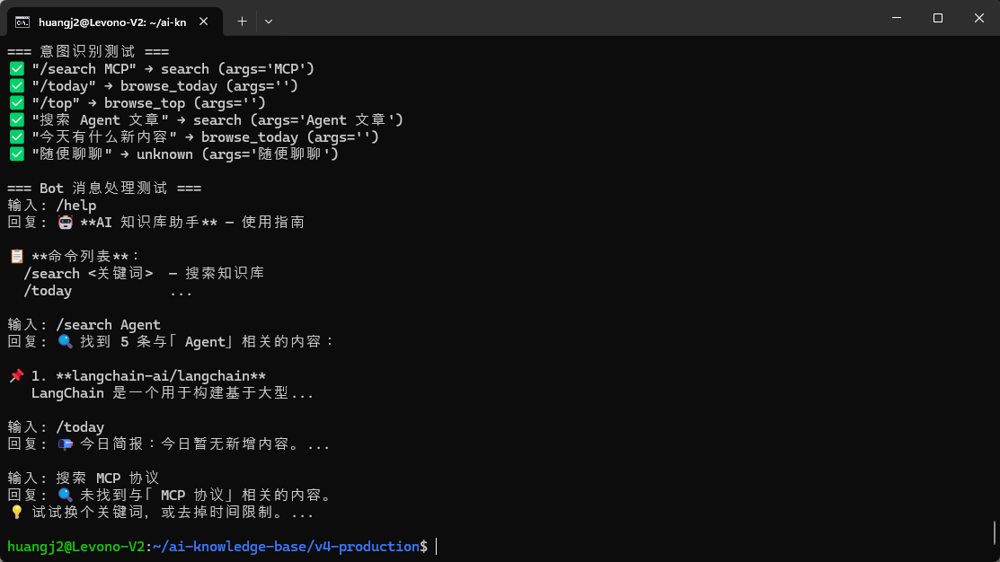
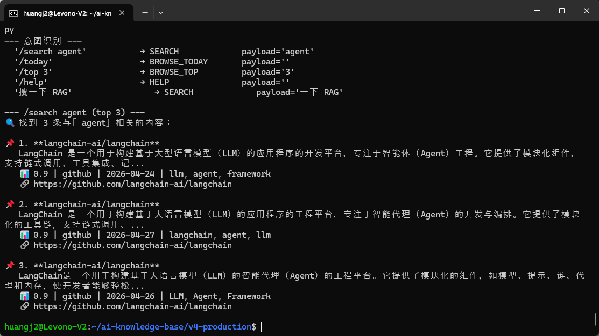

>**学习目标**：KnowledgeBot 类能处理多种意图 + 指令系统 /search /today /top /subscribe /help 可用

---

## 背景

知识检索是 Bot 的核心能力——用户发关键词，Bot 返回匹配文章。

算法思路：**标题匹配最重要（+10），标签次之（+5），摘要再次（+3）**。

同时实现意图识别和指令系统，让 Bot 具备完整的交互能力。


以下代码可以用 **OpenCode**、**Claude Code**、**Cursor**、**Trae** 或**通义灵码**等任意 AI 编程工具生成。


`v4-production/bot/` 是 13-2 步骤 0 创建的空目录，我们要在里面填上 `knowledge_bot.py`，这是 Bot 的核心检索逻辑，亲手写一遍是理解算法权重和意图分支最快的方式。


## 步骤 1：用 AI 编程工具生成 knowledge_bot.py

**提示词：**

```plain
请帮我编写 ~/ai-knowledge-base/v4-production/bot/knowledge_bot.py 知识库交互模块：

需求：
1. OOP 架构：
   - KnowledgeSearchEngine 类 — 搜索引擎，支持关键词、标签、日期范围过滤
   - SubscriptionManager 类 — 用户订阅管理（增删查）
   - PermissionManager 类 — 三级权限控制（READ/WRITE/DELETE）
   - KnowledgeBot 类 — 整合以上模块的主入口

2. recognize_intent(text) — 意图识别（规则匹配，不用 LLM）
   - 优先匹配命令前缀（/search, /today, /top, /subscribe, /help）
   - 再匹配自然语言关键词（搜索、查询、今天、简报、订阅等）
   - 返回 (Intent 枚举, 参数字符串)

3. KnowledgeBot.handle_message(user_id, text) — 统一入口
   - 根据 recognize_intent 结果分发到对应处理器
   - _handle_search / _handle_today / _handle_top / _handle_subscribe / _handle_help

4. 权限控制：订阅需要 WRITE 权限，搜索只需 READ 权限

编码规范：PEP 8，Google 风格 docstring，Enum 定义意图类型
```
**生成的代码：**（参考实现）
```plain
"""bot/knowledge_bot.py — 交互式 AI 知识库机器人。

包含：意图识别、知识检索、订阅管理、权限控制。
OOP 架构，可对接 Telegram / 飞书 / 命令行等前端。
"""

import re
from enum import Enum
from pathlib import Path

class Intent(Enum):
    SEARCH = "search"
    BROWSE_TODAY = "browse_today"
    BROWSE_TOP = "browse_top"
    SUBSCRIBE = "subscribe"
    HELP = "help"
    UNKNOWN = "unknown"

# 命令前缀映射
COMMAND_MAP = {
    "/search": Intent.SEARCH,
    "/today": Intent.BROWSE_TODAY,
    "/top": Intent.BROWSE_TOP,
    "/subscribe": Intent.SUBSCRIBE,
    "/help": Intent.HELP,
}

def recognize_intent(text: str) -> tuple[Intent, str]:
    """识别用户输入的意图和参数。优先命令前缀，再关键词。"""
    text = text.strip()
    for cmd, intent in COMMAND_MAP.items():
        if text.lower().startswith(cmd):
            return intent, text[len(cmd):].strip()
    # 自然语言关键词匹配（正则）...
    return Intent.UNKNOWN, text


class KnowledgeSearchEngine:
    """知识库检索引擎，基于本地 JSON 文件。"""
    def __init__(self, knowledge_dir="knowledge/articles"):
        self.knowledge_dir = Path(knowledge_dir)

    def search(self, keyword="", tags=None, date_from=None, limit=5) -> list[dict]:
        """搜索知识库条目。支持关键词、标签、日期范围过滤。"""
        # 遍历 JSON 文件，按 relevance_score 排序...


class KnowledgeBot:
    """AI 知识库交互式机器人。整合意图识别、检索、订阅、权限。"""
    def __init__(self, knowledge_dir="knowledge/articles", data_dir="data"):
        self.search_engine = KnowledgeSearchEngine(knowledge_dir)
        # self.subscription_mgr = SubscriptionManager(...)
        # self.permission_mgr = PermissionManager(...)

    def handle_message(self, user_id: str, text: str) -> str:
        """处理用户消息，返回响应文本。"""
        intent, args = recognize_intent(text)
        handlers = {
            Intent.SEARCH: self._handle_search,
            Intent.BROWSE_TODAY: self._handle_today,
            Intent.BROWSE_TOP: self._handle_top,
            Intent.SUBSCRIBE: self._handle_subscribe,
            Intent.HELP: self._handle_help,
            Intent.UNKNOWN: self._handle_unknown,
        }
        handler = handlers.get(intent, self._handle_unknown)
        return handler(user_id, args)

    def _handle_search(self, user_id, query): ...
    def _handle_today(self, user_id, args): ...
    def _handle_top(self, user_id, args): ...
    def _handle_subscribe(self, user_id, args): ...
    def _handle_help(self, user_id, args): ...
    def _handle_unknown(self, user_id, text): ...


if __name__ == "__main__":
    # CLI 交互模式
    bot = KnowledgeBot()
    while True:
        text = input("你：").strip()
        if text.lower() in ("quit", "exit"):
            break
        print(f"助手：{bot.handle_message('cli-user', text)}")
```


## 本节代码 vs 下节 SKILL.md 的关系

**它们等价但完全独立——互不调用**。

```plain
┌──────────────────────────────────┐  ┌──────────────────────────────────┐
│ bot/knowledge_bot.py (本节)       │  │ openclaw/skills/.../SKILL.md     │
│                                  │  │   (下节实操 2)                    │
│ • Python 模块                     │  │ • OpenClaw Skill (Markdown)      │
│ • 给单元测试 / GitHub Actions / │  │ • 给 OpenClaw Bot 用              │
│   你自己的脚本调用                │  │ • Bot 用 read 工具自己实现        │
│ • 调用方: 你的代码                │  │ • 调用方: Bot LLM 自己            │
└──────────────────────────────────┘  └──────────────────────────────────┘
            ▼                                       ▼
            ╲          共享 knowledge/articles/    ╱
              ▼ ▼ ▼ ▼ ▼ ▼ ▼ ▼ ▼ ▼ ▼ ▼ ▼ ▼ ▼
```
写两遍等价搜索逻辑:
* 一遍 **Python**(精确控制 / 可测 / 给 CI 用)

* 一遍 **SKILL.md**(自然语言 SOP / 给 LLM 看)

感受什么时候该写代码，什么时候该写 SOP。


## 步骤 2：测试搜索

下面这段测试是按**课程仓库 v4 的 knowledge_bot.py** 写的(KnowledgeBot / recognize_intent / Intent 这些命名)。**如果你自己重写了这个模块**(函数名 / 类名 / 参数签名 不同),让 **AI 帮你生成对应的测试代码** —— 把你写好的 knowledge_bot.py 贴给 AI，让它写匹配你 API 的 unit test。


**注意路径，**必须在 `v4-production/`**根目录**跑（让 `bot/` 被 Python 识别为 package）。 **不要**进 `bot/` 子目录跑，进了反而 `ModuleNotFoundError: No module named 'bot'`。


**注意引号细节，**用 `python3 <<'PY' ... PY` heredoc 而不是 `python3 -c "..."`。后者外层双引号会吞掉代码里的内层 `"test-user"`，导致 `NameError: name 'test' is not defined`。

```plain
cd ~/ai-knowledge-base/v4-production    # ← 项目根,不是 bot/ 子目录

python3 <<'PY'
from bot.knowledge_bot import KnowledgeBot, recognize_intent, Intent

# 测试意图识别
tests = [
    ('/search MCP', Intent.SEARCH, 'MCP'),
    ('/today', Intent.BROWSE_TODAY, ''),
    ('/top', Intent.BROWSE_TOP, ''),
    ('搜索 Agent 文章', Intent.SEARCH, ''),
    ('今天有什么新内容', Intent.BROWSE_TODAY, ''),
    ('随便聊聊', Intent.UNKNOWN, ''),
]

print('=== 意图识别测试 ===')
for text, expected_intent, _ in tests:
    intent, args = recognize_intent(text)
    status = '✅' if intent == expected_intent else '❌'
    print(f'{status} "{text}" → {intent.value} (args={args!r})')

# 测试 Bot 完整流程
bot = KnowledgeBot()
print()
print('=== Bot 消息处理测试 ===')
for text in ['/help', '/search Agent', '/today', '搜索 MCP 协议']:
    print(f'输入: {text}')
    print(f'回复: {bot.handle_message("test-user", text)[:80]}...')
    print()
PY
```





## 步骤 3：测试指令系统

```plain
cd ~/ai-knowledge-base/v4-production

python3 <<'PY'
import sys; sys.path.insert(0, '.')
from bot.knowledge_bot import KnowledgeSearchEngine, recognize_intent, format_search_results

# 1. 意图识别
print('--- 意图识别 ---')
for q in ['/search agent', '/today', '/top 3', '/help', '搜一下 RAG']:
    intent, payload = recognize_intent(q)
    print(f'  {q!r:25s} → {intent.name:18s} payload={payload!r}')

# 2. 加权搜索
print()
print('--- /search agent (top 3) ---')
engine = KnowledgeSearchEngine('knowledge/articles')
results = engine.search(keyword='agent', limit=3)
print(format_search_results(results, query='agent'))
PY
```
**输出**：




```plain
--- 意图识别 ---
  '/search agent'           → SEARCH             payload='agent'
  '/today'                  → BROWSE_TODAY       payload=''
  '/top 3'                  → BROWSE_TOP         payload='3'
  '/help'                   → HELP               payload=''
  '搜一下 RAG'              → SEARCH             payload='RAG'

--- /search agent (top 3) ---
🔍 找到 3 条与「agent」相关的内容：

📌 1. langchain-ai/langchain
   📊 0.95 | github | 2026-04-24 | llm, agent, framework

📌 2. browser-use/browser-use
   📊 0.85 | github | 2026-04-11 | agent, browser, automation

📌 3. OpenHands/OpenHands
   📊 0.85 | github | 2026-04-11 | agent, coding-assistant
```


## 步骤 4：提交到 Git

```plain
git add bot/knowledge_bot.py
git commit -m "feat: add knowledge bot with search and command system"
```


## 扩展（可选 · 跑通了再玩）

主线“加权匹配 + 意图识别 + 4 个 / 指令”跑通后，有几个 vibe 方向：

* **加 LLM 重排（rerank）**：规则匹配出 top 10 后,让 LLM 二次排序（根据用户 query 选最相关的 5 条）。提升相关度，代价是多 1 次 LLM 调用。

* **加同义词扩展**：用户搜“智能体"应该也匹配"Agent”。维护一个 synonyms.json 让 search_articles 自动扩展查询词。

* **加搜索历史**：在 `~/.knowledge_bot_history.jsonl` 记录每次查询和点击。后续可以看哪些查询命中率低，改善 index。

* **加分页**`/next` 默认前 5 条，加 `/next` 翻页，需要在 user 维度记录上一次查询状态（一个 dict 简单实现）。

* **接 reranker 模型**：比 LLM 重排更快，用 `bge-reranker-base` 轻量模型本地跑（CPU 也行），延迟 50ms 以内。


提示：每个扩展都让 AI 先帮你写 unit test，再写实现。**测试是你和 AI 之间的合同**，你看懂测试就敢用代码。


**完成！**knowledge_bot 的搜索 + 意图识别 + 指令系统全部就绪。进入实操 2 集成到 OpenClaw。

