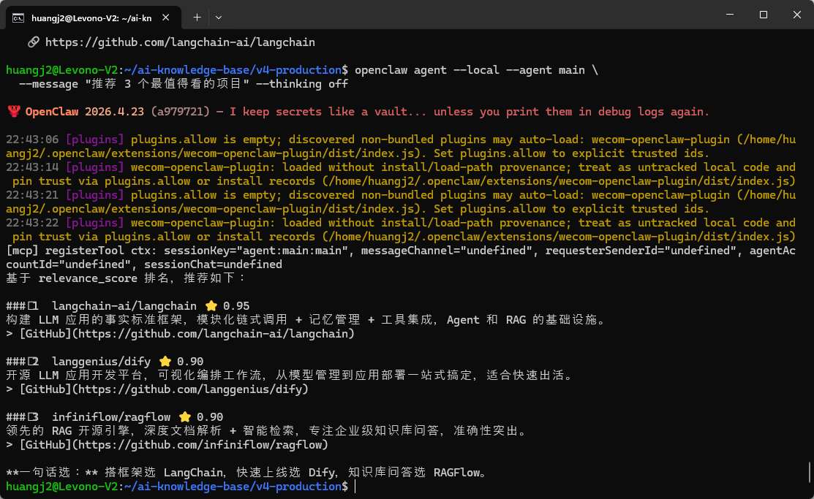
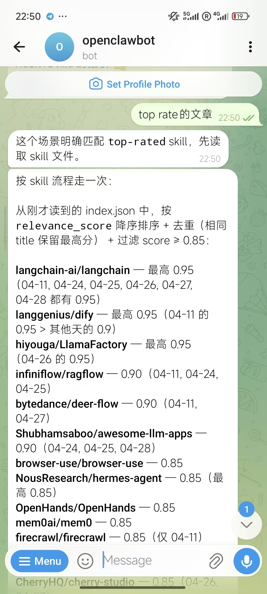

>学习目标：自己写的新 Skill（比如 `top-rated`）能在 Telegram 触发并返回准确结果 
>前置要求：实操 13-2 已完成（主 Agent + Read 直接答查询的模式跑通）+ 实操 14-3 已完成（自己写的 `daily-digest` Skill）

---

## 背景

到这一步，13-2 让 Bot 能用主 Agent + Read + index.json 直接答用户的搜索 / 计数查询（**无 Skill 介入**）；14-3 你写了第一个 Skill `daily-digest`（每日简报场景的精细化封装）。


**本节让你再写一个新 Skill**`top-rated`，这是 OpenClaw 工程化最重要的肌肉。


为什么要自己写？因为**写 Skill 是给 Bot 写 SOP**——你写的越精确，Bot 表现越稳定。


直接用现成 Skill，你只是用户；自己写过一次，你才理解为什么 description 这么写、为什么禁止做某些事。


以下文件可以用 **OpenCode**、**Claude Code**、**Cursor**、**Trae** 或**通义灵码**等任意 AI 编程工具辅助生成。


## 步骤 1：选一个新 Skill 主题

从下面 3 个挑一个（或自己想一个），我们以 `top-rated`**高分推荐**为例：

|Skill 名|触发场景|输出|
|:----|:----|:----|
|top-rated|推荐高分的几篇 / score 最高的|按 relevance_score 降序 top 5|
|category-summary|Framework 类有哪些 / "RAG 项目有哪些"|按 category 过滤 + 总数统计|
|weekly-digest|本周看到了啥"/ 最近 7 天|按日期范围筛选 + 简要列表|


## 步骤 2：创建 SKILL.md

```plain
mkdir -p ~/ai-knowledge-base/v4-production/openclaw/skills/top-rated

cat > ~/ai-knowledge-base/v4-production/openclaw/skills/top-rated/SKILL.md <<'EOF'
---
name: top-rated
description: 当用户要"推荐 / 高分 / 最佳 / score 最高"的知识库文章时触发。典型用语:推荐几个 xxx / score 最高的 / 最值得看的。基于本地 kb,不需要联网。
allowed-tools:
  - Read
---

# 高分推荐

## 触发词

- 推荐 / 推荐几个
- 最值得看的 / 最有价值的
- score 最高 / 评分最高
- top N / 前 N

## 做法

1. Read knowledge/articles/index.json
2. 按 relevance_score 降序排序
3. 默认取 top 5(用户给数字就用用户的)
4. 去重(同一个 title 只保留 score 最高的一条)
5. 回复格式:

   ⭐ 高分推荐 top N:

   1. <title> · score <score> · <category>
      id: <id>

## 禁止

- 别 read 目录(EISDIR)
- 别说"我没有 glob 工具",你只需要 read index.json 一个文件
- 别返回低于 0.85 score 的(不算高分)
EOF
```


## 步骤 3：本地验证

```plain
openclaw agent --local --agent main \
  --message "推荐 3 个最值得看的项目" --thinking off
```
**真实输出**应该类似：
```plain
⭐ 高分推荐 top 3:

1. langchain-ai/langchain · score 0.95 · framework
   id: 2026-04-24-001

2. langgenius/dify · score 0.90 · framework
   id: 2026-04-11-000

3. infiniflow/ragflow · score 0.90 · rag
   id: 2026-04-11-004
```
如果 Bot 没触发 `top-rated` 而是 fallback 到主 Agent 的“读 index.json”逻辑——说明 description 触发词不够明确，加更多关键词（高分、推荐"、top N"等）。



---

## 步骤 4：Telegram 端到端

```plain
推荐几个 score 最高的 framework
```
Bot 应该用 `top-rated` Skill 响应。



再发：

```plain
搜一下 agent 类的
```
这次应该 fallback 到主 Agent 的 `Read knowledge/articles/index.json` 路线（搜索 / 计数类查询主 Agent 直接答，没必要走 Skill）。

**同一个 Bot，应该可以按 description 触发不同处理路径，互不干扰。**


## 步骤 5：观察 description 的精度

**实验**：把 `top-rated` 的 description 改成 `高分知识库`，重启测试。你会发现：

* 推荐 5 个最值得看的 → 可能不触发了（没有高分关键词）

* 找一些高分的 → 触发了

**结论**：description 写得越具体（覆盖典型用语），Bot 触发越精确。这就是 Skill 路由的本质——**关键词匹配 + 模糊语义**。


## 完成检查清单

|步骤|验证|状态|
|:----|:----|:----|
|SKILL.md 已创建|ls ~/ai-knowledge-base/v4-production/openclaw/skills/top-rated/SKILL.md|[ ]|
|本地测试通过|agent --local 返回 top 3 高分文章|[ ]|
|Telegram 触发正确|"推荐高分项目" 触发 top-rated；"搜 agent" fallback 到主 Agent|[ ]|
|多 Skill 隔离|切换关键词能切换 Skill|[ ]|

## 扩展（可选 · 跑通主线再玩）

* **加**`score-threshold`**参数**：让 Bot 接受“只看 0.9 以上” 这种限定。Skill 里加“先 read，再按用户给的阈值过滤“。

* **加**`category-summary`**Skill**：用户问“framework 类多少？”返回总数 + top 5。这是聚合查询的雏形。

* **加**`subscribe-tag`**Skill**：用户说“订阅 RAG 标签”，写一个文件 `kb/subscriptions/<user_id>.json` 记录，下次 daily-digest 可以按订阅过滤。

* **加 evaluation case**：写 5-10 条 query + 期望触发的 Skill 名映射，每次改 description 跑一次回归（呼应和尚的 SDD eval 议题）。

>**现在 v4 一共 2 个 Skill**：14-3 自己写的 `daily-digest` + 本节写的 `top-rated`。其他查询（搜索 / 计数 / 按类别过滤）都走主 Agent 的 `Read knowledge/articles/index.json` 路线， **Skill 是精细化场景的“加挂模块”，不是必需品**。这就是"按需上下文加载 + 规约驱动"的工程化体现。

**写 Skill ≠ 写代码**——它是给 Bot 写 SOP（标准作业程序）。description 决定何时触发，流程决定怎么做，禁止决定不要做什么。**3 段式 + 30 行就够**。


**完成！** 第 15 节实操结束。Bot 现在能：聊天 + 看到 kb（13 节）+ 主动定时推送（14 节）+ 响应用户多种查询（15 节）。下一节上线生产。

