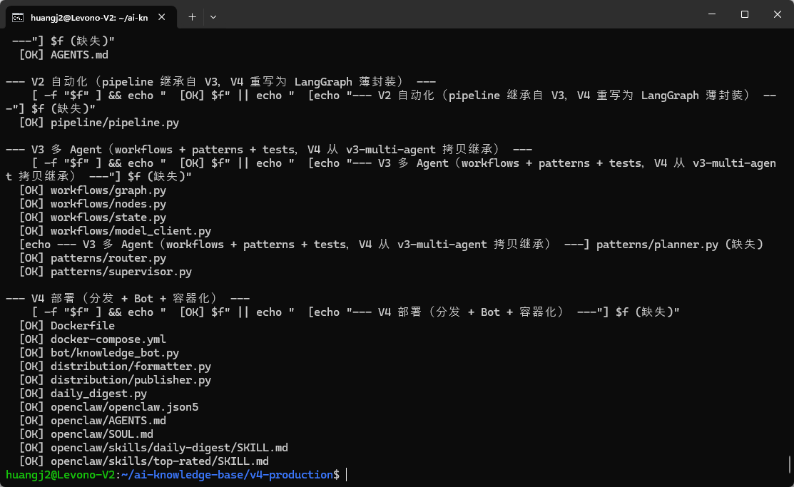
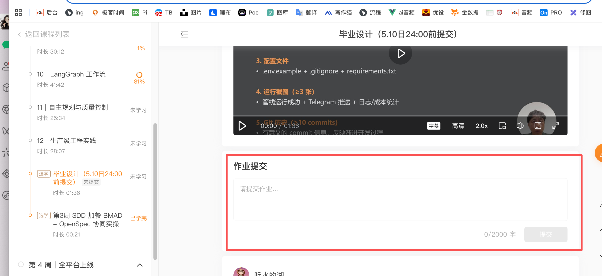

>完成标志：GitHub 仓库创建 + README 完成 + 截图提交 + git push 成功

## 背景

四周课程的最终交付：一个完整的 V4 AI 知识库系统 GitHub 仓库。


README 可以用 **OpenCode**、**Claude Code**、**Cursor**、**Trae** 或**通义灵码**等任意 AI 编程工具生成。


## 步骤 1：检查 V4 完整性

```plain
cd ~/ai-knowledge-base/v4-production

echo "=== V4 完整性检查 ==="
echo ""
echo "--- V1 基础（.opencode/agents 在 v1-skeleton 或 v2-automation 中） ---"
for f in AGENTS.md; do
    [ -f "$f" ] && echo "  [OK] $f" || echo "  [!!] $f (缺失)"
done

echo ""
echo "--- V2 自动化（pipeline 继承自 V3，V4 重写为 LangGraph 薄封装） ---"
for f in pipeline/pipeline.py; do
    [ -f "$f" ] && echo "  [OK] $f" || echo "  [!!] $f (缺失)"
done

echo ""
echo "--- V3 多 Agent（workflows + patterns + tests，V4 从 v3-multi-agent 拷贝继承） ---"
for f in workflows/graph.py workflows/nodes.py workflows/state.py workflows/model_client.py patterns/planner.py patterns/router.py patterns/supervisor.py; do
    [ -f "$f" ] && echo "  [OK] $f" || echo "  [!!] $f (缺失)"
done

echo ""
echo "--- V4 部署（分发 + Bot + 容器化） ---"
for f in Dockerfile docker-compose.yml bot/knowledge_bot.py distribution/formatter.py distribution/publisher.py daily_digest.py openclaw/openclaw.json5 openclaw/AGENTS.md openclaw/SOUL.md openclaw/skills/daily-digest/SKILL.md openclaw/skills/top-rated/SKILL.md; do
    [ -f "$f" ] && echo "  [OK] $f" || echo "  [!!] $f (缺失)"
done
```
**V4 完整性检查结果：**


## 步骤 2：用 AI 编程工具生成 README.md

**提示词：**

```plain
请帮我为 ~/ai-knowledge-base 项目生成 README.md：

项目名：AI 知识库系统
一句话描述：基于多 Agent 协作的 AI 技术知识库——自动采集、智能分析、定时推送

包含以下部分：
1. 架构概览（文本框图，4 层：Agent 层、Pipeline 层、工程层、分发层）
2. 快速开始（3 步：clone → 配置 .env → docker compose up）
3. 目录结构表格（目录 | 说明 | 版本）
4. 技术栈（OpenCode + LangGraph + DeepSeek + Docker + Telegram Bot API）
5. 版本历史（V1-V4 各阶段的核心能力）
6. 月度成本估算（大模型 + 服务器）
7. License: MIT
```
**生成的代码：**（参考实现）
```plain
# AI 知识库系统

> 基于多 Agent 协作的 AI 技术知识库——自动采集、智能分析、定时推送

## 架构概览

```
┌─────────────────────────────────────────────────────┐
│                   V4 AI 知识库系统                      │
├─────────────────────────────────────────────────────┤
│  ┌─────────┐    ┌──────────┐    ┌──────────┐        │
│  │ Planner │──> │ Analyzer │──> │ Reviewer │──┐     │
│  └─────────┘    └──────────┘    └──────────┘  │     │
│                       ^               | 打回   | 通过 │
│                       +───────────────+       v     │
│                                           [输出]    │
├─────────────────────────────────────────────────────┤
│  CostGuard | Security | Tests | Logger | Telegram   │
└─────────────────────────────────────────────────────┘
```

## 快速开始

```bash
git clone https://github.com/YOUR_USERNAME/ai-knowledge-base.git
cd ai-knowledge-base
cp .env.example .env   # 编辑 .env 填入 API Key
docker compose up -d
```

## 目录结构（v4-production）

| 目录 | 说明 | 继承自 |
|:-----|:-----|:-----|
| `patterns/` | Planner / Router / Supervisor 模式 | V3 |
| `workflows/` | LangGraph 6 节点工作流 + 审核循环 | V3 |
| `pipeline/pipeline.py` | LangGraph 薄封装 + 发布阶段 | V4 改写 |
| `distribution/` | formatter + publisher（多渠道发布） | V4 |
| `bot/` | Telegram 知识库 Bot | V4 |
| `openclaw/` | OpenClaw 网关配置 + Skills | V4 |
| `Dockerfile` + `docker-compose.yml` | 容器化 | V4 |
| `daily_digest.py` | 发布入口（独立 Cron 触发） | V4 |

## 技术栈

- **AI 框架**: OpenCode + LangGraph
- **大模型**: DeepSeek / Qwen（国产模型）
- **部署**: Docker + Cron
- **通信**: Telegram Bot API + OpenClaw
- **语言**: Python 3.12

## 版本历史

| 版本 | 阶段 | 核心能力 |
|:-----|:-----|:---------|
| V1 | 手动版 | Agent + Skill + 手动三步走 |
| V2 | 自动版 | Pipeline + Hooks + CI/CD |
| V3 | 生产版 | Multi-Agent + CostGuard + Security |
| V4 | 产品版 | Telegram Bot + Docker + Cron + 监控 |

## 月度成本

| 项目 | 成本 |
|:-----|:-----|
| 大模型 API | ¥0.5-2/月 (DeepSeek) |
| 云服务器 | ¥35-50/月 |
| **合计** | **¥35-52/月** |

## License

MIT
```


## 步骤 3：准备运行截图

至少 3 张运行截图。

**截图 1 — 管线运行成功**

```plain
cd ~/ai-knowledge-base/v4-production
python3 -m pipeline.pipeline --no-publish
```
**截图 2 — Telegram Bot 推送**
展示 Telegram 聊天界面收到的推送或搜索结果。

**截图 3 — 日志/成本统计**

```plain
cat logs/run_$(date +%Y%m%d).jsonl 2>/dev/null | head -5
mkdir -p screenshots
# 将截图保存到 screenshots/ 目录
```


## 步骤 4：提交所有文件

```plain
git add Dockerfile docker-compose.yml README.md
git add distribution/formatter.py distribution/publisher.py bot/knowledge_bot.py
git add screenshots/ 2>/dev/null
git add -u

git diff --staged --stat

git commit -m "feat: complete V4 - Docker deployment + Telegram Bot + README

- Add Dockerfile with slim image, non-root user, health check
- Add docker-compose.yml with resource limits and log rotation
- Add formatter/publish/knowledge_bot modules
- Add README.md with architecture and quick start"
```


## 步骤 5：推送到 GitHub

```plain
git push
```
如果还没有远程仓库：
```plain
# 使用 GitHub CLI
gh repo create ai-knowledge-base --public --source=. --push
```


## 步骤 6：V1 → V2 → V3 → V4 自查清单

```plain
Week 1 (V1) — 基础搭建:
[ ] AGENTS.md 编写完成
[ ] 3 个 Agent 角色文件编写完成
[ ] 2+ 个 Skill 封装完成
[ ] V1 手动流程跑通

Week 2 (V2) — 自动化:
[ ] model_client.py 统一模型客户端
[ ] pipeline.py 流水线
[ ] validate_json.py 格式校验
[ ] cost_tracker.py Token 消耗统计

Week 3 (V3) — 多 Agent 协作:
[ ] workflows/graph.py LangGraph 工作流
[ ] cost_guard.py 预算守卫 + 熔断器
[ ] security.py 安全防护三道防线
[ ] tests/test_eval.py 评估测试

Week 4 (V4) — 部署上线:
[ ] OpenClaw + Telegram 通过(13 节)
[ ] Bot 接入 v4 知识库(13-2 切 workspace)
[ ] formatter + publisher 推送测过(14 节)
[ ] knowledge_bot.py + 至少 1 个自写 Skill(15 节)
[ ] 上线 Checklist 10 项通过(16-2)
[ ] Dockerfile + docker-compose.yml(可选)
[ ] GitHub Actions daily-collect-v4 已配 secret 跑通
[ ] README.md 含架构图 + 快速开始
[ ] 运行截图 >= 3 张(Telegram 对话 / GitHub Actions success / Docker 健康检查)
[ ] 所有文件已提交 Git + push 到 GitHub
```


## 进阶交付（可选 · 加分项）

主线毕业产物达成后，几个可选方向让你的项目更产品化：

* **接 Cloudflare Tunnel 给一个公网域名：**这样别人也能访问你的 Bot，不只是你自己。`cloudflared tunnel --url http://localhost:18789`，5 分钟拿到 https 公网地址。

* **加一个产品落地页**：GitHub Pages 写一个 index.html 介绍你的 Bot，什么场景用、怎么订阅、有哪些命令。让 README 之外有一个面向终端用户的入口。

* **写一篇博客 / 知识星球分享**：讲你 Week 1-4 踩过的最大的坑。我们答疑直播经常引用学员博客。

* **做一份评估报告（呼应课代表和尚 SDD eval 议题）：**挑 10-20 个真实 query，记录每个 Skill 的触发率 / 准确率 / 用户满意度。这是把“做一个 Bot”升级为“做一个 Bot 产品”。


## 作业提交链接

[https://u.geekbang.org/lesson/861?article=973476](https://u.geekbang.org/lesson/861?article=973476)

将自己梳理好的GitHub链接贴到下图位置并于5.10 24:00前提交。




**恭喜完成全部 16 节课程！**

你的 V4 知识库系统特性：

* **多 Agent 协作** — Planner + Analyzer + Reviewer + Organizer

* **LangGraph 工作流** — 条件路由 + 审核循环

* **成本控制** — CostGuard + 模型分级路由

* **安全防护** — 三道防线 + 最小权限

* **用户触达** — Telegram Bot + OpenClaw 消息网关 + Skill 路由

* **自动采集** — GitHub Actions daily-collect-v4（每天 UTC 00:00）

* **容器化部署** — Docker + Cron + 监控（可选）


**佳哥发言：在短时间设计并跑通一套AI时代的前沿课程，很有挑战，一路上感谢大家的理解，支持，反馈以及陪伴。**


**我们课程中：**

1. **有一系列工具实操**

2. **有几套架构设计**

3. **有一系列工程思想（佳哥觉得最为重要）**

4. **一个可以运行的知识收集系统**

5. **以及一套基本的SDD工具实操内容（加餐）**


**希望大家都有那么一点点收获，工程上，技术上，AI学习上的任何反馈，随时和佳哥探讨。我们通过切磋共同进步。**


