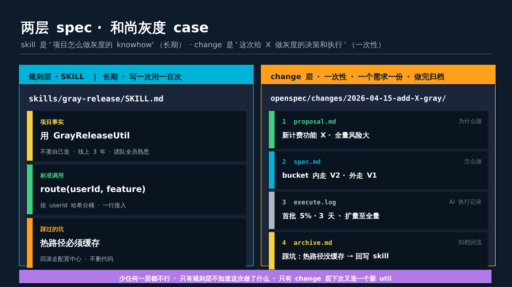
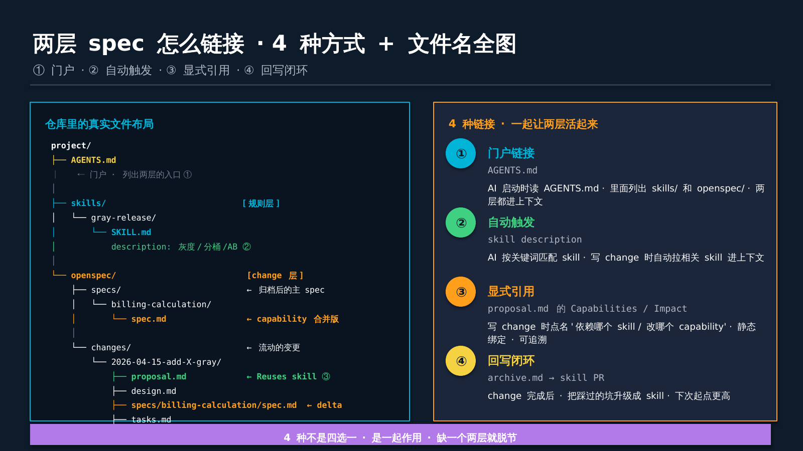
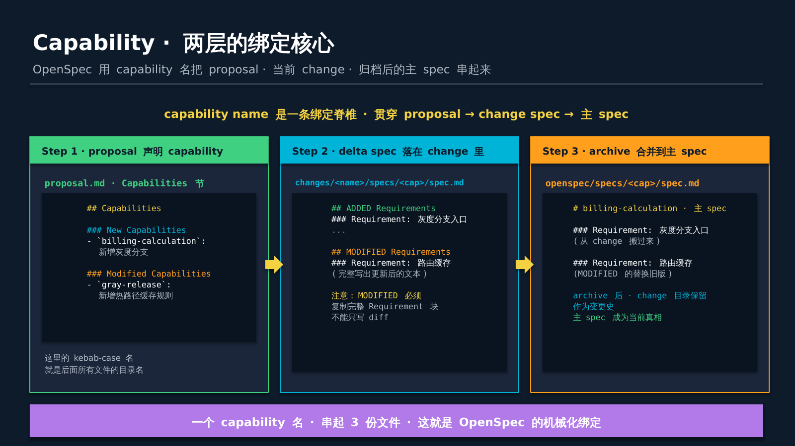
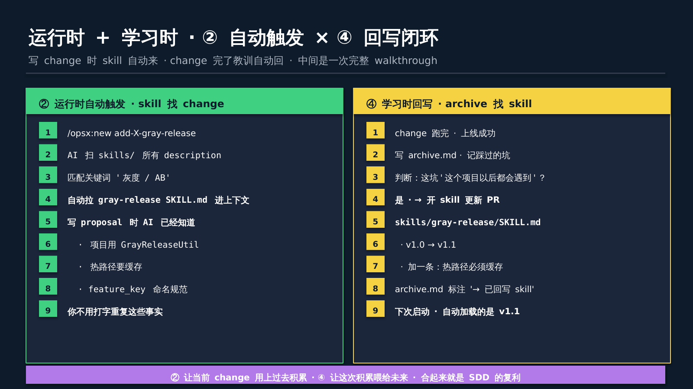
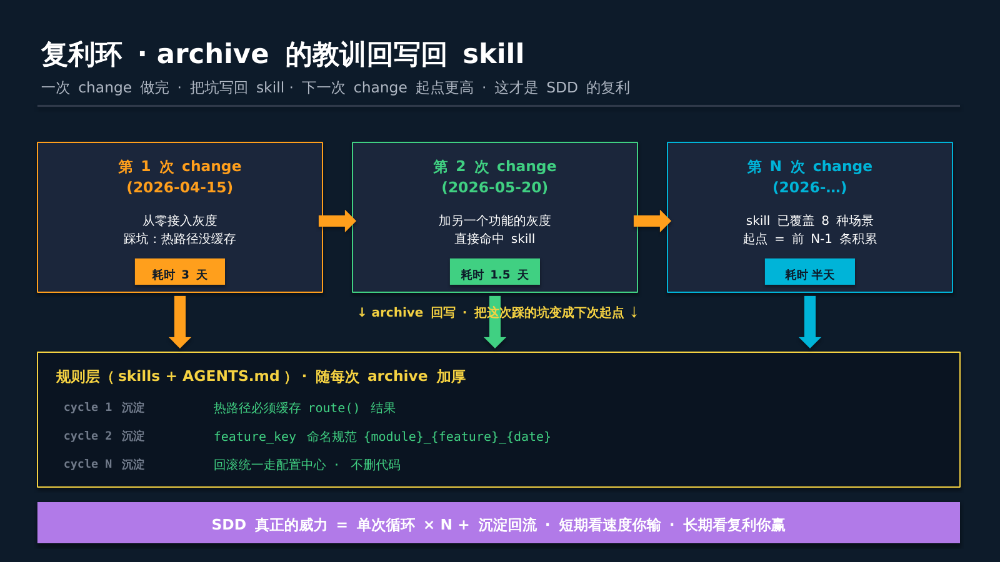

>作者 黄佳 + 和尚
>
>这篇文章是为那些“听说 SDD 好像很厉害、但一直没完全搞清楚它到底在做什么"的人写的。我把这件事从头到尾走一遍，用一个真实场景——**给一个新功能加灰度发布**——把每一个文件、每一步命令、每一次 AI 调用，全部讲透。

## Part 0 · 先把“灰度发布”说清楚

如果你是后端或运维出身，可以跳过这一节。如果不是，请看完再往下——后面的故事都围绕这件事。


**灰度发布**（Gray Release，也叫金丝雀发布 Canary Release）就是：你做了一个新功能，**不是一次性推给所有用户**，而是先让 5% 的用户用，观察 3 天没问题，再扩到 10%、50%、100%。


为什么要这样做？因为新代码可能有你没发现的 bug。100% 上线出问题，全部用户受影响，回滚还要改代码重发。灰度上线出问题，**只有 5% 用户受影响，而且不改代码——改个配置就切回老版本**。


灰度的核心技术手段是**分桶。**

* 每个用户有个 ID（userId）

* 对 userId 做哈希取模，比如 `hash(userId) % 100 < 5` 就进“灰度桶”

* 桶里的人看新代码，桶外的人看老代码

* 想扩量就改那个数字——从 5 改到 10，就是 10% 灰度


一个成熟的大厂项目，通常会有一个内部的灰度工具类，比如叫 `GrayReleaseUtil`。所有需要灰度的新功能都用这个类，不自己造。**这个约定本身就是一个“项目知识”**——新人入职第一周老员工会告诉他：“我们做灰度用 `GrayReleaseUtil`，别自己写”。


好，铺垫完了。下面进入故事。


## Part 1 · 场景设定 · 小李接了个活

主角：**小李**，超级大厂携鸟飞行网业务研发工程师，入职两年。


这周他接了个PRD（也就是需求）：**给计费服务加一个新的计费逻辑（暂且叫功能 X），要求灰度上线**。


听起来很简单。他打开 Claude Code，发了一段 prompt：

>给 BillingService 加一个新的 calculateV2 方法，对灰度用户走新逻辑，其他走老逻辑。
AI 很快给出了代码。代码能跑。小李提交 PR。


问题来了。Code review 时，组里的老王一眼看出不对劲：

>你这个灰度判断是自己写的？项目里有 `GrayReleaseUtil` 啊，用了 3 年了。你这么写两套灰度工具并存，以后会乱的。
>
小李懵了。他不知道项目里有这个类。AI 也不知道。**这个知识“藏在老王脑子里”**，不在代码的任何注释里、不在 README 里、不在 prompt 里，所以 AI 写不对。


返工、重写，一天半。


**这个故事就是和尚给我讲的原型**。虽然灰度工具是虚构的名字，但这类事在大厂每周都在发生——AI 写了漂亮的代码，但不符合项目的历史约定，code review 时被打回。


SDD 要解决的就是这个。


## Part 2 · 两层 spec —— 把老王脑子里的东西挪到文件里

问题的根源其实很清楚：**老王脑子里有两种知识**。


**第一种**：**这个项目怎么做灰度，这件事是长期稳定的**。不管今天做功能 X 还是明天做功能 Y，都用 `GrayReleaseUtil`。这是项目常量。


**第二种**：**这次给功能 X 加灰度是一次性的**。这是今天的工作——背景是什么、为什么做、怎么做、踩了什么坑、教训是什么。这是变更记录。


这两种东西都叫 spec，但是两种不同形态的 spec——这就是我们讲的两层。


看这张图。左边是**规则层**（skill），右边是**change 层**。


**规则层的文件叫**`skills/gray-release/SKILL.md`。它写的是“我们怎么做灰度”——用 `GrayReleaseUtil`、热路径要缓存、命名要规范。写一次，长期引用，偶尔修订。


**change 层的文件是一整个目录**，叫 `openspec/changes/2026-04-15-add-X-gray/`。里面有四份文件：

* `proposal.md` —— 为什么这次要做

* `spec.md` —— 怎么做

* `execute.log` —— AI 的执行过程

* `archive.md` —— 做完之后的归档、踩了什么坑


这四份文件描述的是“2026-04-15 这一天，给功能 X 加灰度这件事”。做完了归档，下次做另一个功能的灰度，再开一个新的 change 目录。


**两层分开存的关键原因**：稳定的东西和流动的东西不能混在一起。混在一起，做功能 X 时顺手改了灰度规则，影响了所有其他模块——这就是“规则漂移”。


**少任何一层都不行，只有规则层不知道这次做了什么，只有 change 层下次又造一个新 util**。


## Part 3 · 第一件事是写 skill —— 把老王的知识写下来

好，现在小李已经被老王骂过一次了。他痛定思痛，开始做正经的 SDD。


**第一步是补上规则层**。在项目根目录下创建 `skills/gray-release/SKILL.md`：

```plain
---
name: gray-release
description: 新功能需要灰度发布 / 流量分桶 / AB 测试时触发
allowed-tools: [Read, Edit, Bash, Grep]
---

# Gray Release · 本项目灰度接入规范

## 项目事实（不要违背）

- 本项目使用 **`GrayReleaseUtil`** 类做所有灰度发布
- 位于 `com.didi.business.gray.GrayReleaseUtil`
- 线上用了 3 年，团队全员熟悉
- **不要自己造新的灰度逻辑**

## 标准调用方式

boolean isInGray = GrayReleaseUtil.route(userId, "feature_key");
if (isInGray) {
    // 新逻辑
} else {
    // 老逻辑
}

## 开关配置位置

- 配置中心路径：`config-center://gray/{feature_key}`
- 运行期可切换，不需重启

## 踩过的坑（不要重踩）

- `feature_key` 必须全局唯一 · 用 `{module}_{feature}_{date}` 命名
- 不要在循环里调 `route()` · 一次请求缓存结果
- 回滚走配置中心，**不要靠删代码**
```
这就是一份 skill 文件。注意它的结构：
* 最上面是 YAML frontmatter，最关键的字段是 `description`——这是**自动触发的钥匙**

* 下面是内容：项目事实、标准调用、开关位置、踩过的坑


**这份文件写一次，就永久生效了。**以后项目里任何 AI 要做灰度相关的事，都会自动读到它。

为什么说"自动"？因为 AI 启动时会扫一遍 `skills/` 目录里所有 SKILL.md 的 `description` 字段。看到"新功能需要灰度"这几个字，发现和当前任务匹配——就**自动把整份 SKILL.md 加到上下文里**。


小李不用在 prompt 里说“请参考 GrayReleaseUtil”。AI 自己会读到。


## Part 4 · 启动一个 change —— 正式开干

Skill 写完了。现在小李要真正做这次的活：**给功能 X 加灰度**。

他在项目根目录下敲：

```plain
/opsx:new add-feature-x-gray-release
```
`/opsx:new` 是 OpenSpec 提供的一个 Claude Code slash command。按下回车后，它做了几件事。

**第一件**：运行 `openspec new change add-feature-x-gray-release`，在 `openspec/changes/` 下创建一个新目录：

```plain
openspec/changes/add-feature-x-gray-release/
└── .openspec.yaml      ← 只有一个元数据文件
```
**第二件**：查这个 change 有哪些 artifact 要生成：
```plain
$ openspec status --change add-feature-x-gray-release --json
{
  "applyRequires": ["tasks"],
  "artifacts": [
    {"id": "proposal", "status": "ready"},
    {"id": "design",   "status": "blocked", "missingDeps": ["proposal"]},
    {"id": "specs",    "status": "blocked", "missingDeps": ["proposal"]},
    {"id": "tasks",    "status": "blocked", "missingDeps": ["design", "specs"]}
  ]
}
```
我们来理解一下这里的逻辑。要按顺序生成 `proposal.md` → 然后 `design.md` 和 `specs/*/spec.md` → 最后 `tasks.md`。每一步都有依赖关系，前一步不完成下一步做不了。

**第三件**：AI 开始写第一份 artifact——`proposal.md`。


这里就是链接 ② 登场的时候——**自动触发**。


## Part 5 · AI 自动加载 skill —— 运行时链接发生了

小李这时候还没说一句话。

但 AI 已经在做事：

1. 读 `AGENTS.md` —— 项目入口（这就是链接 ①，门户）

2. 扫 `skills/` 目录所有 SKILL.md 的 description

3. 发现 `gray-release` skill 的 description 里有"灰度"两个字，当前任务名 `add-feature-x-gray-release` 也有"gray-release"

4. **匹配成功** —— 把整份 `skills/gray-release/SKILL.md` 加载进上下文

这张图你对照着看——左边那棵文件树就是真实仓库里的文件布局。`AGENTS.md` 边上标着 ①，是门户。`SKILL.md` 边上标着 ②，是自动触发。这两件事是 AI 启动就做的，不需要你写任何东西。

加载完 skill 之后，AI 已经"知道"这些事：

* 做灰度要用 `GrayReleaseUtil`

* 路径是 `com.didi.business.gray.GrayReleaseUtil`

* 热路径要缓存 `route()` 结果

* 命名规范是 `{module}_{feature}_{date}`

**这些知识现在和 AI 当前上下文合体了。**小李不用打字讲，AI 写代码时会自然遵守。


## Part 6 · 写 proposal —— 显式引用登场

AI 现在开始写 `proposal.md`。按 OpenSpec 官方 template，这份文件有四节：Why / What Changes / Capabilities / Impact。

AI 和小李一来一回（或者 AI 自己根据上下文）填完，最终的 `proposal.md` 长这样：

```plain
## Why

新计费功能 X 需要灰度上线。全量风险大（涉及核心计费链路），分桶灰度降低回滚成本。

## What Changes

- 在 `BillingService.calculate()` 入口接入 `GrayReleaseUtil.route()` 判断
- 配置中心新增 `billing_feature_x_20260415` 开关
- 新逻辑走新分支 `calculateV2()`，老逻辑保持不动
- 首批 5% 灰度 3 天 · 无异常后逐步扩量

## Capabilities

### Modified Capabilities
- `billing-calculation`: 入口新增 gray 判断分支

## Impact

- **代码**：`BillingService.java` + `BillingServiceV2.java`（新）
- **Reuses (unchanged)**: `skills/gray-release/SKILL.md` · `GrayReleaseUtil`
- **依赖**：GrayReleaseUtil（项目已有，遵循 skills/gray-release 规范）
- **风险**：中（核心链路，但有灰度兜底）
```
注意两个地方：
**第一，**`## Capabilities`**这一节**。这里写着 `billing-calculation` —— 这是一个 **capability 名**，kebab-case（小写字母 + 连字符）。**这个名字非常关键**，等会儿讲。

**第二，**`## Impact`**里的**`Reuses`：

```plain
- **Reuses (unchanged)**: skills/gray-release/SKILL.md
```
这就是**链接 ③ · 显式引用**。小李（或者 AI）明确写在 proposal 里："这次 change 依赖 gray-release 这份 skill"。半年后有人回头看这份 change，一眼就看到"哦，当时用了那份 skill"。
② 是运行时自动发生的（你不用写），③ 是静态写在文档里的（白纸黑字）。两种都重要，一种是让 AI 真的用到，一种是让人将来能追溯。


## Part 7 · Capability 名是脊椎 —— 三份文件怎么串起来

这里是最容易搞混的地方。我们深挖一下。


小李刚才在 proposal 里写了一个 capability 名 `billing-calculation`。


这个名字会在 **三个位置** 出现：

**位置 1 · proposal.md 里声明**（已经写了）：

```plain
## Capabilities
### Modified Capabilities
- `billing-calculation`: 入口新增 gray 判断分支
```
**位置 2 · change 里生成 delta spec**：
OpenSpec 会在 change 目录下自动创建：

```plain
openspec/changes/add-feature-x-gray-release/
└── specs/
    └── billing-calculation/        ← 目录名 = capability 名
        └── spec.md                  ← 这次变更的 delta
```
注意看路径—— `specs/billing-calculation/spec.md`。**这个目录名必须和 proposal 里写的 capability 名一字不差**。你要是 proposal 写 `billing_calculation`（下划线），目录写 `billing-calculation`（连字符），`openspec validate` 就会报错。
`spec.md` 里面写这次要加什么需求（ADDED）、改什么需求（MODIFIED）：

```plain
## MODIFIED Requirements

### Requirement: Billing Calculation Entry

`BillingService.calculate()` SHALL consult `GrayReleaseUtil.route(userId, "billing_feature_x_20260415")` 
and dispatch to `calculateV2()` or `calculateV1()` accordingly.

#### Scenario: User in gray bucket gets V2 logic
- **WHEN** userId 在灰度桶中
- **THEN** 调 calculateV2()

#### Scenario: User outside bucket keeps V1
- **WHEN** userId 不在桶中
- **THEN** 调 calculateV1() · 行为与改前完全一致
```
注意 OpenSpec 有一个死板规则：`MODIFIED`**的 Requirement 必须复制完整内容**，不能只写 diff。为什么？因为归档的时候要机械合并，不能靠"猜"。
**位置 3 · archive 后合并到主 spec**：

change 跑完、归档时，OpenSpec 会把 change 里的 delta spec 合并到：

```plain
openspec/specs/
└── billing-calculation/
    └── spec.md                  ← 主 spec · 当前真相
```
**这个目录名还是**`billing-calculation`——同一个 capability 名，第三次出现。
合并规则：ADDED 的直接追加进去、MODIFIED 的替换旧版、REMOVED 的删掉。合并完之后 change 目录保留（作为变更史），主 spec 代表“项目当前是什么样”。

**capability 名就是脊椎**。它把三个不同位置的文件串成一条时间线：

```plain
proposal.md 声明          →    change/specs/billing-calculation/spec.md (delta)
                                             ↓ archive
                                     specs/billing-calculation/spec.md (主 spec)
```
名字不对，全断。名字对，全通。这就是 OpenSpec 的机械化绑定。

## Part 8 · AI 按 spec 真的写代码 —— 执行阶段

Proposal 写完 → design.md 写完 → specs/billing-calculation/spec.md 写完 → tasks.md 写完。

Tasks.md 是一个 checklist，列出了这次 change 要做的所有具体代码工作：

```plain
## 1. 代码修改
- [ ] 1.1 在 BillingService.java 加 calculateV2() 方法
- [ ] 1.2 入口 calculate() 加 GrayReleaseUtil.route() 判断
- [ ] 1.3 每个请求只 route() 一次 · 缓存结果

## 2. 配置
- [ ] 2.1 在 config-center 申请 gray/billing_feature_x_20260415 键

## 3. 测试
- [ ] 3.1 单测：桶内用户走 V2
- [ ] 3.2 单测：桶外用户走 V1 · 行为与改前一致
- [ ] 3.3 集成测试：灰度开关切换生效
```
然后小李敲：
```plain
/opsx:apply
```
这个命令是 OpenSpec 的 apply 阶段——**让 AI 按 tasks.md 一条一条执行**。
AI 做的事：

1. 读 `BillingService.java` 了解现在长什么样

2. 按 skill 里的规范，在入口加 `GrayReleaseUtil.route()` 调用

3. 记得缓存 route 结果（skill 里写过"不要循环里调"，它遵守）

4. 加上 `calculateV2()` 方法

5. 写单元测试

6. 跑测试

7. 一条条打勾 tasks.md

这一步也是 skill 在持续起作用——AI 每写一行代码都参考着 skill 里的"项目事实"和"踩过的坑"。

假设一切顺利，代码提交。PR 进入 code review。


## Part 9 · Archive —— 回写闭环发生

代码合并到 master，配置中心申请了开关。小李上线 5% 灰度，观察 3 天。

发现一个问题：在某些高 QPS 场景，`GrayReleaseUtil.route()` 的内部锁出现竞争。小李本来就按 skill 的规范做了"一次请求缓存 route 结果"，但**发现还不够——某个循环里每次循环都 route 一次**。最终通过加"方法级缓存"解决。

3 天后扩量 50%、一周后扩量 100%。成功上线。

现在小李要做最后一步——**archive**。他敲：

```plain
/opsx:archive
```
这个命令做两件事：
**一件是机械合并**——把 change 里的 `specs/billing-calculation/spec.md` 合并到 `openspec/specs/billing-calculation/spec.md`（主 spec）。

**另一件是让小李写 archive.md**，记录教训：

```plain
# archive.md

## 结果
- 2026-04-15 上线 5% · 2026-04-18 扩量 50% · 2026-04-22 全量
- 无回滚事件

## 踩过的坑
- **热路径嵌套循环里调 route()** · QPS 高时 GrayReleaseUtil 内部锁竞争
  → 加了方法级缓存解决
  → **已更新 skills/gray-release/SKILL.md 第"踩过的坑"节**

## 教训给下一次
- 灰度接入前先搜一下配置中心是否有同名键
- 热路径调 route() 必须方法级缓存（不只是请求级）
```
看最后那句——**"已更新 skills/gray-release/SKILL.md"**。这就是**链接 ④ · 回写闭环**。
小李真的去打开了 `skills/gray-release/SKILL.md`，在"踩过的坑"那一节加了一行：

```plain
 ## 踩过的坑（不要重踩）
 - `feature_key` 必须全局唯一 · 用 `{module}_{feature}_{date}` 命名
 - 不要在循环里调 `route()` · 一次请求缓存结果
+ - 不只是请求级缓存 · 嵌套循环里要方法级缓存 · 否则 QPS 高时锁竞争
 - 回滚走配置中心，**不要靠删代码**
```
skill 从 v1.0 升到 v1.1。
**这就是复利的那一刻**。


## Part 10 · 下一次 change · 起点更高了

一个月后，组里又来了个新需求：**给订单服务加个灰度**。另一个同事接了活。

他敲 `/opsx:new add-order-service-gray-release`。


AI 启动，扫 `skills/` 目录，匹配到 `gray-release` skill——加载的是 v1.1 版本。这个 v1.1 比 v1.0 多了一条规则：**嵌套循环里要方法级缓存**。


那个同事写 proposal 时，AI 已经知道这条。它甚至会在 design.md 里主动建议考虑方法级缓存。代码里自然就这么写。这个坑（**小李上次踩过的坑）——这次直接没踩**。


这就是 Slide 2 画的事。第一次 change 耗时 3 天（要踩坑），第二次耗时 1.5 天（起点有积累），第 N 次耗时半天（起点有 N-1 条积累）。


每一次 archive 都在往规则层里添砖加瓦。规则层越踏实，下次起点越高。


**SDD 真正值钱的不是某一份 spec，是那个不断进化的规则层。**在工程师和AI共同呵护下，这个规则层中的业务和工程上“know-how”就不断积淀起来，变得越来越深，越来越广。


## Part 11 · 合成 · 两层 spec 的“呼吸”

现在把整件事合起来看一遍：

1. **先有规则层**。skill 把"老王脑子里的东西"写成文件（Part 3）

2. **启动 change**。`/opsx:new` 生成 change 目录（Part 4）

3. **AI 自动加载 skill**（链接 ②）。因为 description 匹配（Part 5）

4. **写 proposal**。里面用 `Reuses` 显式引用 skill（链接 ③）（Part 6）

5. **capability 名是脊椎**。proposal → delta spec → 主 spec 三个位置同名（Part 7）

6. **AI 按 tasks 写代码**。遵循 skill 的规范（Part 8）

7. **archive 回写 skill**（链接 ④）。把这次踩的坑变成 skill v1.1（Part 9）

8. **下次 change 起点更高**。这就是复利（Part 10）


四种链接方式各司其职：

|链接|方向|时机|什么文件|
|:----|:----|:----|:----|
|① 门户|AGENTS.md → 两层|项目启动|AGENTS.md 里列出 skills/ 和 openspec/|
|② 自动触发|skill → change|写 change 时|description 字段匹配|
|③ 显式引用|change → skill|写 proposal 时|"Reuses: skills/gray-release"|
|④ 回写|archive → skill|change 完成后|"→ 已更新 SKILL.md"|

**一句话总结**：

>链接 ② 让这次 change 用上过去积累的知识。 ④ 让这次学到的东西喂给未来。 合起来就是两层 spec 的"呼吸"——吸气、呼气、吸气、呼气。 呼吸不停，项目就活着。

## 最后 · 回到小李

故事开头那个小李，他被老王骂了一次之后，第二天开始建 `skills/gray-release/SKILL.md`。花了一个下午，把老王脑子里的东西、加上自己踩过的坑，都写了进去。

三个月后，组里来了个新人。新人要加个灰度。他完全不认识老王，也没听过 GrayReleaseUtil。


但他用了 Claude Code，`skill/gray-release` 自动触发——**新人第一次就把灰度接对了**。


新人当天下班时跟小李说：“你们这个项目 AI 真聪明，什么都知道……”


小李笑了一下。

